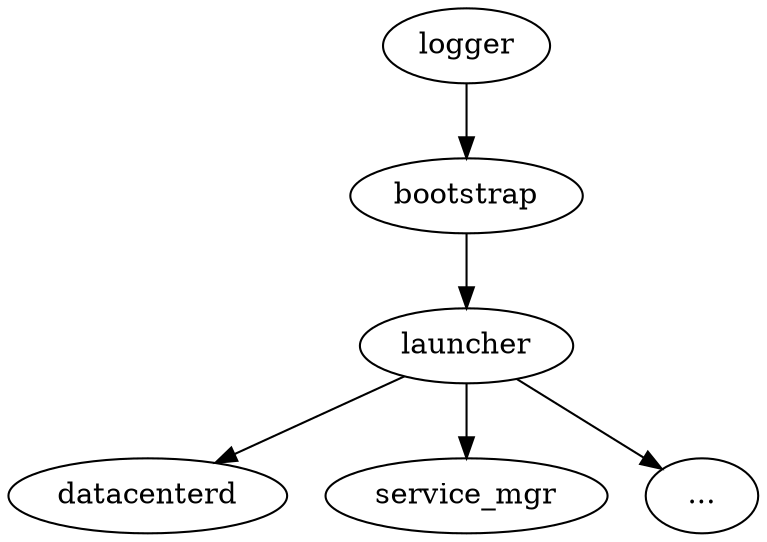
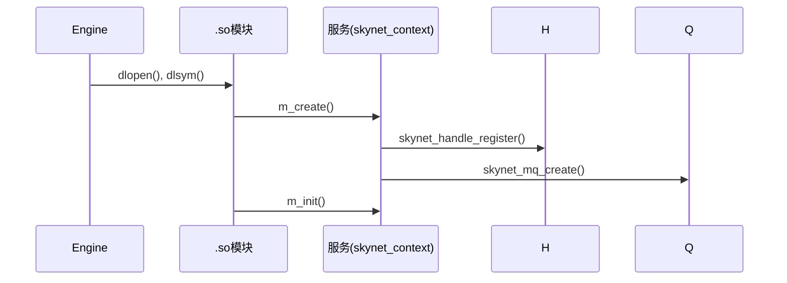
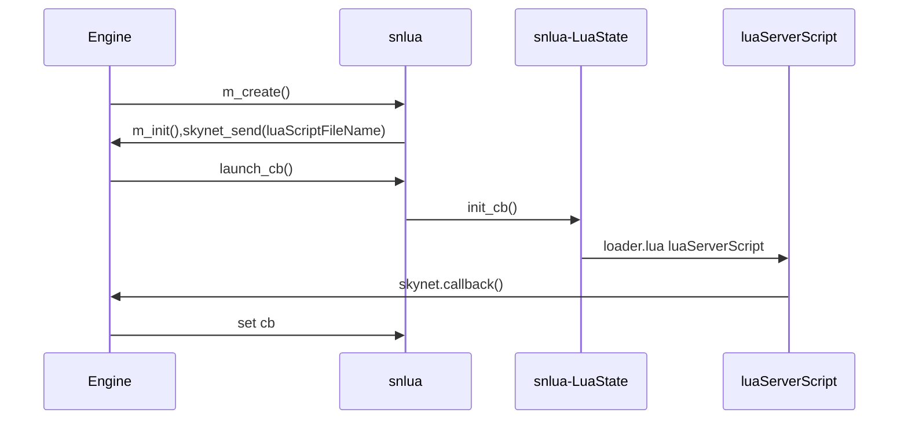

一直以来很喜欢玩游戏，却一直没有自己开发过游戏，主要是不知道怎么入手。以前接触过的一款游戏就是以 C++写程序，然后 Lua 做脚本和逻辑的。偶然间发现了 skynet 这个框架，作者居然是多年以前我就已经仰视已久的人物。用这个，加上客户端用 cocos2dx 的话，似乎确实能做出我自己想做的一些小游戏了。

<!--more-->

# 项目

这个项目在[github.com 开源](https://github.com/cloudwu/skynet)。是一个用于在线游戏服务器的框架，但是不仅仅用于游戏，很多其他服务端也能用到。其是基与 c 和 lua 的。其内部封装了**mysql, mongodb, socket**等库，用起来确实是很不错的。但是性能方面暂时不知道，但是看云风大大一直追求的性能和效率的话应该不会差。

# 简介

Skynet 的单机模型来说，只有一个进程。然后把用 Lua 编写的每个业务逻辑单元叫做*服务*。所有的数据，消息的传递只在进程内部，因此的话，效率是有保证的，唯一可能出现考量的地方，就是 Lua 的虚拟机是否依然高效。这比传统的多进程间的通信模型就简单了许多，不需要用到什么共享内存，消息队列等了。

事实上，上面的描述可能并不太准确，因为据作者描述，skynet 是基于 Actor 模式的，所谓 Actor 模式我就不表述了，我们只能从代码上面来研究一下其实现。对于 Skynet 的每个服务来说，实际上都是用 C 编写的 .so 库构建，将消息都分发到 .so 库中去进行处理，而对于 Lua 服务的支持，是构建了一个特殊的 snlua C 模块，其内部，将收到的消息丢给了其内的一个 luaState 来进行处理，仅此而已。

对于想启动一个服务，只需要调用`skynet.newservice(name)`，这将会返回一个服务地址，就可以了。*name*是脚本名。Skynet 会根据我们配置文件中的 _luaservice_ 目录去寻找对应的 _name.lua_ 文件。另外注意，类似 `.launcher` 这样的服务只是在本机可见， 在节点间是不可见的。同时我们可以用`skynet.name(name, addr)`把一个服务地址给绑定到一个别名，以后凡是用到服务地址的地方都可以使用名字。

# 服务的分类

skynet 其实有两种服务，一种是 C 服务，一种是 Lua 服务。这两者事实上没有本质的区别，止不过对于 C 服务其逻辑是用 C 中实现的，而 Lua 服务，则是用 Lua 实现了逻辑，同时，Lua 服务其实是一个承载 Lua 逻辑的 snlua 的 C 服务而已。

搭建一个 Lua 服务，只需要定义好其要处理的协议信息，其消息处理函数，其实就 OK 了。

就对于 skynet 引擎而言，任何服务，其都将其封装在一个 skynet_context 结构中：

```c
struct skynet_context {
        void * instance;
        struct skynet_module * mod;
        void * cb_ud;
        skynet_cb cb;
        struct message_queue *queue;
        FILE * logfile;
        uint64_t cpu_cost;      // in microsec
        uint64_t cpu_start;     // in microsec
        char result[32];
        uint32_t handle;
        int session_id;
        int ref;
        int message_count;
        bool init;
        bool endless;
        bool profile;

        CHECKCALLING_DECL
};
```

这个上下文结构中保留了此

- **instance** 服务实例的指针，实际上是一个 so 库中定义的结构。
- **mod** 模块地址，对应加载在 skynet 进程中的 so 库内存地址。
- **cb_ud** 回调是会使用到的一个数据结构，对于 Lua 服务，这将会是一个 lua_State
- **skynet_cb** 服务的回调 skynet_cb ，。
- **queue** 以及其消息队列

创建一个服务，其实质，就是创建一个 skynet_context 结构而已，然后根据消息，回调此结构内的对应函数。

对于一个 C 服务，多会在其实例化的时候即指定其回调，而对于 Lua 服务，一般是在 Lua 中通过注册回调来实现的。

# C 服务的建立过程

当想要开启一个服务的时候，会尝试查询对应的 .so 库是否已经加载到进程中，如果没有，那么就进行加载。所有的 C 服务模块都是按照一定的规范编写的，然后就调用此 .so 库中对应的构建服务的函数。（实际上就是构建一些数据结构了）`skynet_context_new(const char * name, const char *param)` 函数做了此件事情。事实上我们也可以来看一下此些代码是如何实现的。

.so 实际上是按照 skynet 定义的函数和数据的集合，一个 .so 模块的实例（服务）可能会有多个。

简单来说，分为以下几个步骤：

1. `skynet_module_query` 查询或加载 .so 模块。
2. 调用模块函数，建立服务的实例
3. 构造 skynet_context 结构，以此来封装隐藏不同服务间的差异。
4. `skynet_handle_register` skynet_context 注册到全局句柄表 **H** 中。
5. `skynet_mq_create` 创建服务的消息队列，并加入全局的消息队列中。
6. `skynet_module_instance_init` 初始化服务

```c
struct skynet_context *
skynet_context_new(const char * name, const char *param) {
	struct skynet_module * mod = skynet_module_query(name);

	if (mod == NULL)
		return NULL;

	void *inst = skynet_module_instance_create(mod);
	if (inst == NULL)
		return NULL;
	struct skynet_context * ctx = skynet_malloc(sizeof(*ctx));
	CHECKCALLING_INIT(ctx)

	ctx->mod = mod;
	ctx->instance = inst;
	ctx->ref = 2;
	ctx->cb = NULL;
	ctx->cb_ud = NULL;
	ctx->session_id = 0;
	ctx->logfile = NULL;

	ctx->init = false;
	ctx->endless = false;

	ctx->cpu_cost = 0;
	ctx->cpu_start = 0;
	ctx->message_count = 0;
	ctx->profile = G_NODE.profile;
	// Should set to 0 first to avoid skynet_handle_retireall get an uninitialized handle
	ctx->handle = 0;
	ctx->handle = skynet_handle_register(ctx);
	struct message_queue * queue = ctx->queue = skynet_mq_create(ctx->handle);
	// init function maybe use ctx->handle, so it must init at last
	context_inc();

	CHECKCALLING_BEGIN(ctx)
	int r = skynet_module_instance_init(mod, inst, ctx, param);
	CHECKCALLING_END(ctx)
	if (r == 0) {
		struct skynet_context * ret = skynet_context_release(ctx);
		if (ret) {
			ctx->init = true;
		}
		skynet_globalmq_push(queue);
		if (ret) {
			skynet_error(ret, "LAUNCH %s %s", name, param ? param : "");
		}
		return ret;
	} else {
		skynet_error(ctx, "FAILED launch %s", name);
		uint32_t handle = ctx->handle;
		skynet_context_release(ctx);
		skynet_handle_retire(handle);
		struct drop_t d = { handle };
		skynet_mq_release(queue, drop_message, &d);
		return NULL;
	}
}

```

##skynet_module_query

贴大段代码不是好习惯，所以直接给出源文件的地址：[https://github.com/cloudwu/skynet/blob/master/skynet-src/skynet_module.c](https://github.com/cloudwu/skynet/blob/master/skynet-src/skynet_module.c)

在其中：

- skynet_module_query 会查询相应的模块在全局模块表 **M** 中是否存在，如果不存在，调用 dlopen 进行打开
- 打开符号表，查询相应的规范要求的函数如：`snlua__create,snlua_init,snlua_release,snlua_singal`，构造模块。

## skynet_module_instance_create

这个函数，其实没有什么好说的，仅仅读调用相应的 `mod_create` 函数而已：

```c
void *
skynet_module_instance_create(struct skynet_module *m) {
	if (m->create) {
		return m->create();
	} else {
		return (void *)(intptr_t)(~0);
	}
}
```

## skynet_handle_register

[https://github.com/cloudwu/skynet/blob/master/skynet-src/skynet_handle.c](https://github.com/cloudwu/skynet/blob/master/skynet-src/skynet_handle.c) 中定义了相应的服务句柄（引用）的信息，其实全局 **H** 存储了所有的服务的句柄 `static struct handle_storage *H = NULL;`。

这个函数，实际是上将 skynet_context 由 **H** slot 表中进行引用。可以直接得到相关的 skynet_context 的地址进行使用。

这事，每个 skynet_context 都会拥有自己在 **H** 中的句柄索引。

## skynet_mq_create(ctx->handle)

[https://github.com/cloudwu/skynet/blob/master/skynet-src/skynet_mq.c](https://github.com/cloudwu/skynet/blob/master/skynet-src/skynet_mq.c) 是对消息队列的处理。会根据服务的 handle 来建立一个消息队列，

```c
struct message_queue *
skynet_mq_create(uint32_t handle) {
	struct message_queue *q = skynet_malloc(sizeof(*q));
	q->handle = handle;
	q->cap = DEFAULT_QUEUE_SIZE;
	q->head = 0;
	q->tail = 0;
	SPIN_INIT(q)
	// When the queue is create (always between service create and service init) ,
	// set in_global flag to avoid push it to global queue .
	// If the service init success, skynet_context_new will call skynet_mq_push to push it to global queue.
	q->in_global = MQ_IN_GLOBAL;
	q->release = 0;
	q->overload = 0;
	q->overload_threshold = MQ_OVERLOAD;
	q->queue = skynet_malloc(sizeof(struct skynet_message) * q->cap);
	q->next = NULL;

	return q;
}
```

## skynet_module_instance_init

这个函数只是会调用相应模块的 init 函数而已：

```c
int
skynet_module_instance_init(struct skynet_module *m, void * inst, struct skynet_context *ctx, const char * parm) {
	return m->init(inst, ctx, parm);
}
```

不同的模块，其初始化过程肯定是不同的。

## logger_init

对于我们启动的第一个服务，logger 服务其只是打开一个文件，然后设置一个回调

```c
int
logger_init(struct logger * inst, struct skynet_context *ctx, const char * parm) {
	if (parm) {
		inst->handle = fopen(parm,"w");
		if (inst->handle == NULL) {
			return 1;
		}
		inst->filename = skynet_malloc(strlen(parm)+1);
		strcpy(inst->filename, parm);
		inst->close = 1;
	} else {
		inst->handle = stdout;
	}
	if (inst->handle) {
		skynet_callback(ctx, inst, logger_cb);
		return 0;
	}
	return 1;
}
static int
logger_cb(struct skynet_context * context, void *ud, int type, int session, uint32_t source, const void * msg, size_t sz) {
	struct logger * inst = ud;
	switch (type) {
	case PTYPE_SYSTEM:
		if (inst->filename) {
			inst->handle = freopen(inst->filename, "a", inst->handle);
		}
		break;
	case PTYPE_TEXT:
		fprintf(inst->handle, "[:%08x] ",source);
		fwrite(msg, sz , 1, inst->handle);
		fprintf(inst->handle, "\n");
		fflush(inst->handle);
		break;
	}

	return 0;
}
```

事实上大多数的 C 服务都是这样工作的。

不过我们的 snlua 就有所不同了

## snlua_init

snlua 初始化的时候，会先执行 **REG** 命令，获取自身 handle 属值，然后再发送一个空消息给服务本身

```c
static int
init_cb(struct snlua *l, struct skynet_context *ctx, const char * args, size_t sz) {
	lua_State *L = l->L;
	l->ctx = ctx;
	lua_gc(L, LUA_GCSTOP, 0);
	lua_pushboolean(L, 1);  /* signal for libraries to ignore env. vars. */
	lua_setfield(L, LUA_REGISTRYINDEX, "LUA_NOENV");
	luaL_openlibs(L);
	lua_pushlightuserdata(L, ctx);
	lua_setfield(L, LUA_REGISTRYINDEX, "skynet_context"); // 将服务结构 skynet_context 保存到全局注册表内
	luaL_requiref(L, "skynet.codecache", codecache , 0);
	lua_pop(L,1);

	const char *path = optstring(ctx, "lua_path","./lualib/?.lua;./lualib/?/init.lua");
	lua_pushstring(L, path);
	lua_setglobal(L, "LUA_PATH");
	const char *cpath = optstring(ctx, "lua_cpath","./luaclib/?.so");
	lua_pushstring(L, cpath);
	lua_setglobal(L, "LUA_CPATH");
	const char *service = optstring(ctx, "luaservice", "./service/?.lua");
	lua_pushstring(L, service);
	lua_setglobal(L, "LUA_SERVICE");
	const char *preload = skynet_command(ctx, "GETENV", "preload");
	lua_pushstring(L, preload);
	lua_setglobal(L, "LUA_PRELOAD");

	lua_pushcfunction(L, traceback);
	assert(lua_gettop(L) == 1);

	const char * loader = optstring(ctx, "lualoader", "./lualib/loader.lua");

	int r = luaL_loadfile(L,loader); // 加载 loader.lua
	if (r != LUA_OK) {
		skynet_error(ctx, "Can't load %s : %s", loader, lua_tostring(L, -1));
		report_launcher_error(ctx);
		return 1;
	}
	lua_pushlstring(L, args, sz); // 通过 loader.lua 来加载我们指定的脚本
	r = lua_pcall(L,1,0,1); // 加载 我们的服务脚本
	if (r != LUA_OK) {
		skynet_error(ctx, "lua loader error : %s", lua_tostring(L, -1));
		report_launcher_error(ctx);
		return 1;
	}
	lua_settop(L,0);
	if (lua_getfield(L, LUA_REGISTRYINDEX, "memlimit") == LUA_TNUMBER) {
		size_t limit = lua_tointeger(L, -1);
		l->mem_limit = limit;
		skynet_error(ctx, "Set memory limit to %.2f M", (float)limit / (1024 * 1024));
		lua_pushnil(L);
		lua_setfield(L, LUA_REGISTRYINDEX, "memlimit");
	}
	lua_pop(L, 1);

	lua_gc(L, LUA_GCRESTART, 0);

	return 0;
}


static int
launch_cb(struct skynet_context * context, void *ud, int type, int session, uint32_t source , const void * msg, size_t sz) {
	assert(type == 0 && session == 0);
	struct snlua *l = ud;
	skynet_callback(context, NULL, NULL);
	int err = init_cb(l, context, msg, sz);
	if (err) {
		skynet_command(context, "EXIT", NULL);
	}

	return 0;
}


int
snlua_init(struct snlua *l, struct skynet_context *ctx, const char * args) {
	int sz = strlen(args);
	char * tmp = skynet_malloc(sz);
	memcpy(tmp, args, sz);
	skynet_callback(ctx, l , launch_cb);
	const char * self = skynet_command(ctx, "REG", NULL);
	uint32_t handle_id = strtoul(self+1, NULL, 16);
	// it must be first message
	skynet_send(ctx, 0, handle_id, PTYPE_TAG_DONTCOPY,0, tmp, sz);
	return 0;
}


```

在这里我们可以看到，实际上 snlua 的初始化分为两步：

1. C 层的初始化。会回调到 `launch_cb` 进行处理。在这个回调之后，实际上，此服务是还没有回调（消息处理函数）的。
2. Lua 层的初始化。具体就是 `init_cb` 函数，这个函数会初始化 snlua 中 luaState ，然后在此 luaState 中调用 `loader.lua` 来加载 我们的 Lua 服务脚本。而我们一般，都会在我们的 Lua 服务中，用 `skynet.start(function()end)` 来开始进行回调的注册。在 `init_cb` 中有个比较重要的地方就是

```c
	lua_pushlightuserdata(L, ctx);
	lua_setfield(L, LUA_REGISTRYINDEX, "skynet_context");
```

这将此服务的 skynet_context 结构，保存在了 luaState 中，在后面就会用到。

### skynet.start(function()end)

[https://github.com/cloudwu/skynet/blob/master/lualib/skynet.lua#L764](https://github.com/cloudwu/skynet/blob/master/lualib/skynet.lua#L764) Lua 函数中，其实我们能够看到，其设置了回调：

```lua
function skynet.start(start_func)
	c.callback(skynet.dispatch_message)
	init_thread = skynet.timeout(0, function()
		skynet.init_service(start_func)
		init_thread = nil
	end)
end
```

可以看到，所有的 Snlua 服务的回调都是同一个 Lua 函数 `skynet.dispatch_message`。而 skynet.core.callback 则会将 snlua 的消息处理器在 C 层设置为另外一个：

```c
// https://github.com/cloudwu/skynet/blob/master/lualib-src/lua-skynet.c#L109
static int
lcallback(lua_State *L) {
	struct skynet_context * context = lua_touserdata(L, lua_upvalueindex(1));
	int forward = lua_toboolean(L, 2);
	luaL_checktype(L,1,LUA_TFUNCTION);
	lua_settop(L,1);
	lua_rawsetp(L, LUA_REGISTRYINDEX, _cb);

	lua_rawgeti(L, LUA_REGISTRYINDEX, LUA_RIDX_MAINTHREAD);
	lua_State *gL = lua_tothread(L,-1);

	if (forward) {
		skynet_callback(context, gL, forward_cb);
	} else {
		skynet_callback(context, gL, _cb);
	}

	return 0;
}

_cb(struct skynet_context * context, void * ud, int type, int session, uint32_t source, const void * msg, size_t sz) {
	lua_State *L = ud;
	int trace = 1;
	int r;
	int top = lua_gettop(L);
	if (top == 0) {
		lua_pushcfunction(L, traceback);
		lua_rawgetp(L, LUA_REGISTRYINDEX, _cb);
	} else {
		assert(top == 2);
	}
	lua_pushvalue(L,2);

	lua_pushinteger(L, type);
	lua_pushlightuserdata(L, (void *)msg);
	lua_pushinteger(L,sz);
	lua_pushinteger(L, session);
	lua_pushinteger(L, source);

	r = lua_pcall(L, 5, 0 , trace);

	if (r == LUA_OK) {
		return 0;
	}
	const char * self = skynet_command(context, "REG", NULL);
 		switch (r) {
	case LUA_ERRRUN:
		skynet_error(context, "lua call [%x to %s : %d msgsz = %d] error : " KRED "%s" KNRM, source , self, session, sz, lua_tostring(L,-1));
		break;
	case LUA_ERRMEM:
		skynet_error(context, "lua memory error : [%x to %s : %d]", source , self, session);
		break;
	case LUA_ERRERR:
		skynet_error(context, "lua error in error : [%x to %s : %d]", source , self, session);
		break;
	case LUA_ERRGCMM:
		skynet_error(context, "lua gc error : [%x to %s : %d]", source , self, session);
		break;
	};

	lua_pop(L,1);

	return 0;
}
```

从 `callback` 的代码来看，我们还可以设置一个是否 forward 的参数，不过很少看到呢。

这里差点让我迷惑的代码是 `lua_settop(L,1); lua_rawsetp(L, LUA_REGISTRYINDEX, _cb);` 实际上，这句代码只是将 `_cb` 作为索引，而其值则是我们传递的 `skynet.dispatchmessage` 函数。后面会以 `lua_rawgetp` 的形式获取这个回调函数，进行执行。

不过这里为什么还有一个 `REG` 命令呢，这个命令到底是做啥的呢？

```c
static const char *
cmd_reg(struct skynet_context * context, const char * param) {
	if (param == NULL || param[0] == '\0') {
		sprintf(context->result, ":%x", context->handle);
		return context->result;
	} else if (param[0] == '.') {
		return skynet_handle_namehandle(context->handle, param + 1);
	} else {
		skynet_error(context, "Can't register global name %s in C", param);
		return NULL;
	}

```

看来这个命令，只是为了获取得到当前 skynet_context 中的 handle 的 16 进制的形式呢。是为了在出现错误的形式，打印出是哪个服务出了错。

# Lua 服务的引导

skynet 的主程序，通过类似：

```
./skynet config.lua
```

这样的命令行启动。然后主程序就会读入这个配置文件，进行启动各项服务。

我们先来看一下这个配置文件默认情况下是什么样的。

## config.lua

```lua
root = "./"
thread = 8
logger = nil
harbor = 1
address = "127.0.0.1:2526"
master = "127.0.0.1:2013"
start = "main"    -- main script
bootstrap = "snlua bootstrap"    -- The service for bootstrap
standalone = "0.0.0.0:2013"
luaservice = root.."service/?.lua;"..root.."test/?.lua;"..root.."examples/?.lua"
lualoader = "lualib/loader.lua"
snax = root.."examples/?.lua;"..root.."test/?.lua"
cpath = root.."cservice/?.so"
```

单机模型下，我们可以暂时忽略*address, master, standalone*三个字段。现在把重心放在启动的流程上面，暂时不要管多节点的情况。

- **thread**：线程数，一般设置为和 CPU 核心数量一致
- **bootstrap**：启动的第一个服务及参数。*snlua bootstrap*是默认配置，说明的是以*bootstrap*参数启动*snlua*服务（ snlua 是 lua 的沙盒服务，相当于开启一个 Lua 虚拟机了），之后的所有服务都直接或间接的由这个服务启动。默认情况下，*bootstrap*服务文件位于`service/bootstrap.lua`下。指定服务文件名不需要带上`.lua`扩展名。
- **cpath**： 用 C 编写的服务模块的位置，通常指 cservice 下那些 .so 文件。如果你的系统的动态库不是以 .so 为后缀，需要做相应的修改。这个路径可以配置多项，以 ; 分割。
- **luaservice**：lua 服务文件的位置。也就是说，当我们启动一个服务的时候，去哪里寻找并载入对应的文件。
- **loader**：用哪一段 lua 代码加载 lua 服务。通常配置为`lualib/loader.lua` ，再由这段代码解析服务名称，进一步加载 lua 代码。snlua 会将下面几个配置项取出，放在初始化好的 lua 虚拟机的全局变量中。具体可参考实现。
  SERVICE_NAME 第一个参数，通常是服务名。
  LUA_PATH config 文件中配置的 lua_path 。
  LUA_CPATH config 文件中配置的 lua_cpath 。
  LUA_PRELOAD config 文件中配置的 preload 。
  LUA_SERVICE config 文件中配置的 luaservice 。
- **lua_path**： 将添加到 package.path 中的路径，供 require 调用。
- **lua_cpath**： 将添加到 package.cpath 中的路径，供 require 调用

## logger

> 第一个启动的服务是 logger ，它负责记录之后的服务中的 log 输出。logger 是一个简单的 C 服务， skynet_error 这个 C API 会把字符串发送给它。在 config 文件中，logger 配置项可以配置 log 输出的文件名，默认是 nil ，表示输出到标准输出。

在  中我们可以看到 logger 服务的启动逻辑。

```c
struct skynet_context *ctx = skynet_context_new(config->logservice, config->logger);
if (ctx == NULL) {
	fprintf(stderr, "Can't launch %s service\n", config->logservice);
	exit(1);
}

skynet_handle_namehandle(skynet_context_handle(ctx), "logger");
```

logger.so 这个 C 服务模块会在初始化后，即将服务的回调指定为 C 来处理，同时将其回调时候的 **cb_ud** 指定为实例本身。

# skynet 导出到 Lua

skynet 本身所提供的 API 只有基础的几个，但是在其导出的 API 上在 Lua 中又进行了很多的封装，因此看起来会有点绕的样子。

而且对于服务的加载，也重写了 **loader.lua**

## skynet.core

其返回值是一个地址。这里我们看到，`skynet.core`是一个被导入的库，真实执行的就是这个库内导出的函数。在文件`lualib-src/lua-skynet.c`中，我们看到了这个函数的导出。

在  中我们说到，当我们以 `skynet.core` 尝试加载一个子模块的时候，如果找不到对应的 `core.lua`，也找不到对应的 `core.so`，那么加载 C 库的最后一个搜索器就会使用 `skynet` 名称进行查找，然后调用 `luaopen_skynet_core`。这就运行我们将子模块都放到一个库文件中进行加载了。

```c
// lua-skynet.c
LUAMOD_API int
luaopen_skynet_core(lua_State *L) {
        luaL_checkversion(L);

        luaL_Reg l[] = {
                { "send" , lsend },
                { "genid", lgenid },
                { "redirect", lredirect },
                { "command" , lcommand },
                { "intcommand", lintcommand },
                { "error", lerror },
                { "tostring", ltostring },
                { "harbor", lharbor },
                { "pack", luaseri_pack },
                { "unpack", luaseri_unpack },
                { "packstring", lpackstring },
                { "trash" , ltrash },
                { "callback", lcallback },
                { "now", lnow },
                { NULL, NULL },
        };

        luaL_newlibtable(L, l);

        lua_getfield(L, LUA_REGISTRYINDEX, "skynet_context");
        struct skynet_context *ctx = lua_touserdata(L,-1);
        if (ctx == NULL) {
                return luaL_error(L, "Init skynet context first");
        }

        luaL_setfuncs(L,l,1);

        return 1;
}

static int
lcommand(lua_State *L) {
        struct skynet_context * context = lua_touserdata(L, lua_upvalueindex(1));
        const char * cmd = luaL_checkstring(L,1);
        const char * result;
        const char * parm = NULL;
        if (lua_gettop(L) == 2) {
                parm = luaL_checkstring(L,2);
        }

        result = skynet_command(context, cmd, parm);
        if (result) {
                lua_pushstring(L, result);
                return 1;
        }
        return 0;
}
```

在`skynet-src/skynet_server.c`中，定义了`skynet_command`函数：

```lua
static struct command_func cmd_funcs[] = {
        { "TIMEOUT", cmd_timeout },
        { "REG", cmd_reg },
        { "QUERY", cmd_query },
        { "NAME", cmd_name },
        { "EXIT", cmd_exit },
        { "KILL", cmd_kill },
        { "LAUNCH", cmd_launch },
        { "GETENV", cmd_getenv },
        { "SETENV", cmd_setenv },
        { "STARTTIME", cmd_starttime },
        { "ABORT", cmd_abort },
        { "MONITOR", cmd_monitor },
        { "STAT", cmd_stat },
        { "LOGON", cmd_logon },
        { "LOGOFF", cmd_logoff },
        { "SIGNAL", cmd_signal },
        { NULL, NULL },
};

const char *
skynet_command(struct skynet_context * context, const char * cmd , const char * param) {
        struct command_func * method = &cmd_funcs[0];
        while(method->name) {
                if (strcmp(cmd, method->name) == 0) {
                        return method->func(context, param);
                }
                ++method;
        }

        return NULL;
}

static const char *
cmd_launch(struct skynet_context * context, const char * param) {
        size_t sz = strlen(param);
        char tmp[sz+1];
        strcpy(tmp,param);
        char * args = tmp;
        char * mod = strsep(&args, " \t\r\n");
        args = strsep(&args, "\r\n");
        struct skynet_context * inst = skynet_context_new(mod,args);
        if (inst == NULL) {
                return NULL;
        } else {
                id_to_hex(context->result, inst->handle);
                return context->result;
        }
}
```

## 导出库

在 `lualib-src` 目录中，导出了很多 C 库。在这些导出库之上，又用 Lua 进行了一些封装。

例如，在 `skynet.core` 库之上，还封装了 `lualib/skynet.lua, lualib/skyet/*` 这些库。

其中与服务相关的是 `skynet/manager.lua` 进行框架（各种服务）管理。`skynet.lua` 则是 Lua 中的服务构建。

# bootstrap

Skynet 运行的第二个服务是`snlua bootstrap`，表示启动一个**snlua**服务，以`bootstrap`作为参数进行初始化，**snlua**是 lua 的沙盒服务。同样，服务名*bootstrap*指定后，会根据`luaservice`配置的路径来寻找对应的`bootstrap.lua`文件并加载执行。

在 skynet 的源码文件`skynet-serc/skynet_start.c`中，有`bootstrap(ctx, config->bootstrap)`调用。

当前*bootstrap.lua*文件如下：

```lua
local skynet = require "skynet"
local harbor = require "skynet.harbor"

skynet.start(function()
    local standalone = skynet.getenv "standalone"

    local launcher = assert(skynet.launch("snlua","launcher"))
    skynet.name(".launcher", launcher)
        local harbor_id = tonumber(skynet.getenv "harbor")
    if harbor_id == 0 then
        assert(standalone ==  nil)
        standalone = true
        skynet.setenv("standalone", "true")

        local ok, slave = pcall(skynet.newservice, "cdummy")
        if not ok then
            skynet.abort()
        end
        skynet.name(".slave", slave)

    else
        if standalone then
            if not pcall(skynet.newservice,"cmaster") then
                skynet.abort()
            end
        end

        local ok, slave = pcall(skynet.newservice, "cslave")
        if not ok then
            skynet.abort()
        end
        skynet.name(".slave", slave)
    end

    if standalone then
        local datacenter = skynet.newservice "datacenterd"
        skynet.name("DATACENTER", datacenter)
    end
    skynet.newservice "service_mgr"
    pcall(skynet.newservice,skynet.getenv "start" or "main")
    skynet.exit()
end)
```

当 snlua 将 bootstrap 脚本加载到对应服务实例的 Lua 虚拟机中，就会以 loader.lua 来加载服务，然后进行执行：

```c
	const char * loader = optstring(ctx, "lualoader", "./lualib/loader.lua");

	int r = luaL_loadfile(L,loader);
	if (r != LUA_OK) {
		skynet_error(ctx, "Can't load %s : %s", loader, lua_tostring(L, -1));
		report_launcher_error(ctx);
		return 1;
	}
	lua_pushlstring(L, args, sz);
	r = lua_pcall(L,1,0,1);

```

## 服务的框架

这个函数，封装在 skynet.lua 中，感觉颇为复杂。参看 [API 列表来进行解释吧](https://github.com/cloudwu/skynet/wiki/APIList)

## skynet.start

我们通过前面的 snlua 初始化过程已经知道，这个时候， snlua 实例已经注册到了 skynet，但是其回调，协议都是没有进行定义的。这个函数，其实就是进行定义此 snlua 实例的协议及消息分发函数。

```lua
-- lualib/skynet.lua
function skynet.start(start_func)
	c.callback(skynet.dispatch_message) -- 简单直接的将 snlua 的回调设置为 skynet.dispatch_message
	init_thread = skynet.timeout(0, function()
		skynet.init_service(start_func)
		init_thread = nil
	end)
end

function skynet.dispatch_message(...)
	local succ, err = pcall(raw_dispatch_message,...)
	while true do
		local co = tremove(fork_queue,1)
		if co == nil then
			break
		end
		local fork_succ, fork_err = pcall(suspend,co,coroutine_resume(co))
		if not fork_succ then
			if succ then
				succ = false
				err = tostring(fork_err)
			else
				err = tostring(err) .. "\n" .. tostring(fork_err)
			end
		end
	end
	assert(succ, tostring(err))
end
```

## skynet.init_service

这个函数，来进行服务的初始化，实际上就是让 Lua 调用我们的 start 中定义的 Lua 函数。

```lua
function skynet.init_service(start)
	local ok, err = skynet.pcall(start)
	if not ok then
		skynet.error("init service failed: " .. tostring(err))
		skynet.send(".launcher","lua", "ERROR")
		skynet.exit()
	else
		skynet.send(".launcher","lua", "LAUNCHOK")
	end
end
```

这里我有个疑问，launcher 服务是在 bootstrap 中启动的，~~然后又在这里面发消息给 launcher 不会 GG 么~~。因为在 skynet.pcall(start) 的时候，可以保证，launcher 服务已经先启动了。

## .launcher 服务

代码中，首先就执行了:

```lua
 local launcher = assert(skynet.launch("snlua","launcher"))
 skynet.name(".launcher", launcher)
```

这个就是首先启动一个 C 服务模块 `snlua`，然后以 `launcher`进行初始化。

`skynet.launch`定义在`skynet/manager.lua`中：

```lua
local c = require "skynet.core"
function skynet.launch(...)
        local addr = c.command("LAUNCH", table.concat({...}," "))
        if addr then
                return tonumber("0x" .. string.sub(addr , 2))
        end
end
```

其即是通过核心 API 像引擎发送 **LAUNCH** 命令的意思。

其用处是用来启动一个 C 模块的（实例）服务，在这里，就会根据我们传入的 SNLUA 模块名，建立一个 snlua 服务，这个 snlua 服务，就会加载 launcher 所写的 Lua 服务。

最终返回的是一个服务地址。
`skynet.name(name, add)`则是将一个服务地址绑定为一个别名。

# 不同

可以看到，只有第一个服务 _launcher_ 是以`skynet.launch`启动，而其他服务都是以`pcall(skynet.newservice())`来启动的。如*.cslave, .cmaster, DATACENTER, service_mgr*。最后，`bootstrap.lua`服务会最后启动`start=`设置的值，默认情况下是`main`，当然我们可以设置为其他的。

我们看到，`skynet.launch`最终是调用的 C 代码进行了启动服务。而对于 `skynet.newservice`，其在`lualib/skynet.lua`中进行了定义：

```lua
-- lualib/skynet.lua

function skynet.newservice(name, ...)
        return skynet.call(".launcher", "lua" , "LAUNCH", "snlua", name, ...)
end

function skynet.call(addr, typename, ...)
        local p = proto[typename]
        local session = c.send(addr, p.id , nil , p.pack(...))
        if session == nil then
                error("call to invalid address " .. skynet.address(addr))
        end
        return p.unpack(yield_call(addr, session))
end
```

是通过向 **.launcher**发送消息来启动服务的。也即是说，.launcher 就是服务的启动器了。这所以这样做的原因：

是因为要在 launcher 服务中保存所有的服务信息。而 launcher 服务是直接调用 C 代码来启动的。

```lua
local function launch_service(service, ...)
	local param = table.concat({...}, " ")
	local inst = skynet.launch(service, param)
	local session = skynet.context()
	local response = skynet.response()
	if inst then
		services[inst] = service .. " " .. param
		instance[inst] = response
		launch_session[inst] = session
	else
		response(false)
		return
	end
	return inst
end

function command.LAUNCH(_, service, ...)
	launch_service(service, ...)
	return NORET
end
```

# skynet.call

此 Lua 函数原型是:

```lua
function skynet.call(addr, typename, ...)
	...
end
```

其接受*服务地址，消息类型*作为参数，调用 打包函数 `p.pack(...)`打包后调用`c.send(addr, p.id, nil, p.pack(...))`发送到对应的地址。同样我们在 `lualib/skynet.lua`，预先注册了几个协议类型：

```lua
-- lualib/skynet.lua
local skynet = {
        -- read skynet.h
        PTYPE_TEXT = 0,
        PTYPE_RESPONSE = 1,
        PTYPE_MULTICAST = 2,
        PTYPE_CLIENT = 3,
        PTYPE_SYSTEM = 4,
        PTYPE_HARBOR = 5,
        PTYPE_SOCKET = 6,
        PTYPE_ERROR = 7,
        PTYPE_QUEUE = 8,        -- used in deprecated mqueue, use skynet.queue instead
        PTYPE_DEBUG = 9,
        PTYPE_LUA = 10,
        PTYPE_SNAX = 11,
}

skynet.pack = assert(c.pack)
skynet.packstring = assert(c.packstring)
skynet.unpack = assert(c.unpack)
skynet.tostring = assert(c.tostring)
skynet.trash = assert(c.trash)

do
        local REG = skynet.register_protocol

        REG {
                name = "lua",
                id = skynet.PTYPE_LUA,
                pack = skynet.pack,
                unpack = skynet.unpack,
        }

        REG {
                name = "response",
                id = skynet.PTYPE_RESPONSE,
        }

        REG {
                name = "error",
                id = skynet.PTYPE_ERROR,
                unpack = function(...) return ... end,
                dispatch = _error_dispatch,
        }
end
```

分别是 _lua, response, error_ 三种协议已经是预注册的，同时其使用了对应的打包与解包函数。对于我们常用的 _lua_ 类型的消息，去使用的是 _c.pack, c.unpack_ 两个函数进行消息的打包与解包。

# launcher.lua

再来看看`launcher.lua`，其定义在 `service`目录下：

```lua
-- service/launcher.lua

skynet.dispatch("lua", function(session, address, cmd , ...)
        cmd = string.upper(cmd)
        local f = command[cmd]
        if f then
                local ret = f(address, ...)
                if ret ~= NORET then
                        skynet.ret(skynet.pack(ret))
                end
        else
                skynet.ret(skynet.pack {"Unknown command"} )
        end
end)

local function launch_service(service, ...)
        local param = table.concat({...}, " ")
        local inst = skynet.launch(service, param)
        local response = skynet.response()
        if inst then
                services[inst] = service .. " " .. param
                instance[inst] = response
        else
                response(false)
                return
        end
        return inst
end

function command.LAUNCH(_, service, ...)
        launch_service(service, ...)
        return NORET
end
```

其首先注册了一个消息分发函数，对于 `LAUNCH`的命令，最终还是通过 `skynet.launch`来启动对应的 C 服务。我们来完整的看一下这个过程：

```lua
	skynet.newservice("srv")
	skynet.call(".launcher", "lua" , "LAUNCH", "snlua", "srv", ...)
	c.send(".launcher", p.id , nil , p.pack("LAUNCH", "snlua", name, ...))
	command.LAUNCH(_, "snlua", "srv", ...)
	launch_service("snlua", "srv", ...)
	skynet.launch("snlua", table.concat({"srv", ...}, " "})
```

最终，还是调用了 skynet.launch 来进行启动服务。

# 初始化

我们可以看到，在`bootstrap.lua 和 main.lua`中，都有类似代码：

```lua
skynet.start(function()
        local sharestring = tonumber(skynet.getenv "sharestring" or 4096)
        memory.ssexpand(sharestring)
        ...
        end
        )
```

类似的代码，其实，任何一个服务都是以`skynet.start(function() ... end)`这样的形式进行初始化的。（设置 C 层的会回调，注册 Lua 层的协议）

当然，其实我们在`main.lua`中，也可以通过 `skynet.newservice(name, ...)`来启动新的服务。

# 消息分发与回应

当一个服务加载，初始化，然后就开始工作了。和大多数的服务一样，其实 skynet 中的服务做的事情也没有什么特别的。也就是接收消息，处理消息，给出响应这样的操作。

每个服务分三个运行阶段：

- 首先是服务加载阶段，当服务的源文件被加载时，就会按 lua 的运行规则被执行到。这个阶段不可以调用任何有可能阻塞住该服务的 skynet api 。因为，在这个阶段中，和服务配套的 skynet 设置并没有初始化完毕。

- 然后是服务初始化阶段，由 skynet.start 这个 api 注册的初始化函数执行。这个初始化函数理论上可以调用任何 skynet api 了，但启动该服务的 skynet.newservice 这个 api 会一直等待到初始化函数结束才会返回。

- 最后是服务工作阶段，当你在初始化阶段注册了消息处理函数的话，只要有消息输入，就会触发注册的消息处理函数。这些消息都是 skynet 内部消息，外部的网络数据，定时器也会通过内部消息的形式表达出来。

消息处理器，是通过函数`skynet.dispatch`来进行注册的，在多数的服务文件中都能看到类似代码：

```lua
local CMD = {}
        skynet.start(function()
                skynet.dispatch("lua", function (_, address, cmd, ...)
                        local f = CMD[cmd]
                        if f then
                                skynet.ret(skynet.pack(f(address, ...)))
                        else
                                skynet.ret(skynet.pack(handler.command(cmd, address, ...)))
                        end
                end)
        end)
```

如上所示代码中：

```lua
skynet.dispatch("lua", function (_, address, cmd, ...)
	...
	end)
```

就是将**lua**类型的消息，注册给后面的匿名函数处理，每次收到**lua**类型的函数时，就会调用这个函数。

**通常约定 lua 类消息的第一个元素是一个字符串，表示具体消息对应的操作**。我们会在脚本中创建一个 CMD 表，把对应的操作函数定义在表中。每条 lua 消息抵达后，从 CMD 表中查到处理函数，并把余下的参数传入。这个消息的 session 和　 source 可以不必传递给处理函数，因为除了主动向 source 发送类别为 "response" 的消息来回应它以外，还有更简单的方法。框架记忆了这两个值。

这仅仅是一个惯用法，你也可以用其它方法来处理消息。skynet 并未规定你必须怎样做。

每个服务最重要的功能就是处理收到的消息，并根据消息产生特定的动作。每个消息都由五个元素构成：

- **session**：大部分消息工作在请求回应模式下。即，一个服务向另一个服务发起一个请求，而后收到请求的服务在处理完请求消息后，回复一条消息。session 是由发起请求的服务生成的，对它自己唯一的消息标识。回应方在回应时，将 session 带回。这样发送方才能识别出哪条消息是针对哪条的回应。session 是一个非负整数，当一条消息不需要回应时，按惯例，使用 0 这个特殊的 session 号。session 由 skynet 框架生成管理，通常不需要使用者关心。
- **source**：消息源。每个服务都由一个 32bit 整数标识。这个整数可以看成是服务在 skynet 系统中的地址。即使在服务退出后，新启动的服务通常也不会使用已用过的地址（除非发生回绕，但一般间隔时间非常长）。每条收到的消息都携带有 source ，方便在回应的时候可以指定地址。但地址的管理通常由框架完成，用户不用关心。
- **type**：消息类别。每个服务可以接收 256 种不同类别的消息。每种类别可以有不同的消息编码格式。有十几种类别是框架保留的，通常也不建议用户定义新的消息类别。因为用户完全可以利用已有的类别，而用具体的消息内容来区分每条具体的含义。框架把这些 type 映射为字符串便于记忆。最常用的消息类别名为 "lua" 广泛用于用 lua 编写的 skynet 服务间的通讯。
- **messsage**：消息的 C 指针，在 Lua 层看来是一个 lightuserdata 。框架会隐藏这个细节，最终用户处理的是经过解码过的 lua 对象。只有极少情况，你才需要在 lua 层直接操作这个指针。
- **size**：消息的长度。通常和 message 一起结合起来使用。

# 消息发送

有两个 API 可以进行消息的发送：`skynet.call, skynet.send`。

`skynet.send(address, typename, ...)`这条 API 可以把一条类别为 typename 的消息发送给 address 。它会先经过事先注册的 pack 函数打包 ... 的内容。

skynet.send 是一条非阻塞 API ，发送完消息后，coroutine 会继续向下运行，这期间服务不会重入。

`skynet.call(address, typename, ...)` 这条 API 则不同，它会在内部生成一个唯一 session ，并向 address 提起请求，并阻塞等待对 session 的回应（可以不由 address 回应）。当消息回应后，还会通过之前注册的 unpack 函数解包。表面上看起来，就是发起了一次 RPC ，并阻塞等待回应。call 不支持超时。

尤其需要留意的是，skynet.call 仅仅阻塞住当前的 coroutine ，而没有阻塞整个服务。在等待回应期间，服务照样可以响应其他请求。**所以，尤其要注意，在 skynet.call 之前获得的服务内的状态，到返回后，很有可能改变。**

# 服务启动流程图

## 各种服务启动过程



## 服务建立过程



## snlua 启动过程



# 总结

在 snlua 内，与 skynet 引擎打交道的时候，都会带上 skynet_context 参数，来告诉引擎自己想干什么，这样 skynet 就能把消息分发到正确的地方。
