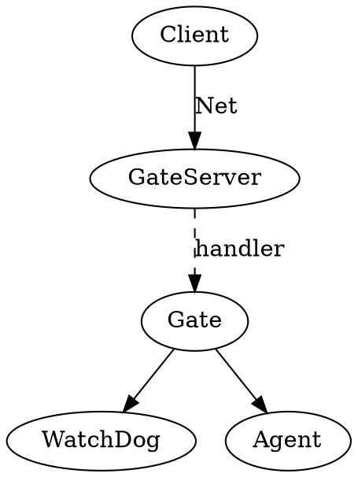
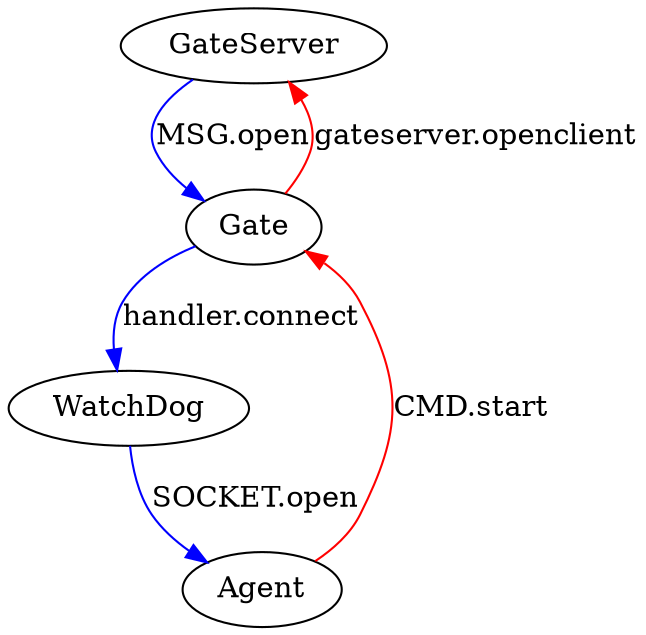

其实对于服务还是有些迷惑。比如在 skynet.wiki 中说到，*gate*服务，是*snax.gateserver*的一个实现，然后 watchdog 又是 gate 的一个使用。看了一下代码确实有点头疼，现在来从头分析一下。

<!--more-->

# 服务的三个阶段

1. 加载，常规的按 Lua 的工作方式来加载一个 Lua 服务脚本。
2. 初始化阶段。执行 `skynet.start.(function() end)` 指定的初始化函数。
3. 工作阶段，收发消息了。

# watchdog 初始化逻辑

服务的加载内容先不看了，我们主要看一下服务的初始化过程。

通过 `skynet.start()` API 来初始化和注册消息处理函数

```lua
skynet.start(function()
	skynet.dispatch("lua", function(session, source, cmd, subcmd, ...)
		if cmd == "socket" then
			local f = SOCKET[subcmd]
			f(...)
			-- socket api don't need return
		else
			local f = assert(CMD[cmd])
			skynet.ret(skynet.pack(f(subcmd, ...)))
		end
	end)

	gate = skynet.newservice("gate")
end)

```

我们看到，它注册了一类消息 `lua` 的处理逻辑，但是这类消息里面，又有两组消息（这里把它叫做指令），每组指令下还有子指令，分别进行处理。

```lua
SOCKET ={open, close,error, warning, data}
CMD = { start, close}
```

它在初始化的完后，就启动了 `gate` 服务

## 启动 watchdog

*main.lua*中：

```lua
-- examples/main.lua
		local watchdog = skynet.newservice("watchdog")
        skynet.call(watchdog, "lua", "start", {
                port = 8888,
                maxclient = max_client,
                nodelay = true,
        })
```

这里先，启动了 _watchdog_ 服务，然后随即对 _watchdog_ 发送了一个 `lua`  类型的的消息，消息包含指令为 `start`。

在初始化后，收到 `start` 指令，那么就会让 _gate_ 服务，来启动网络服务。

```lua
function CMD.start(conf)
	skynet.call(gate, "lua", "open" , conf)
end
```

# gate

watchdog 初始化后，即启动了 `gate`  服务；在收到 `main`  中的 `start`  指令后，它也会向 `gate`  发送一个 `lua`  消息，指令 `open`。

```lua
-- service/gate.lua
local gateserver = require "snax.gateserver"
gateserver.start(handler)
```

其本质，是把 *snax.gateserver.lua*加载到了 *gate*服务的虚拟机内，然后执行。

那么，背后的意义就是，*wathchdog*服务启动了一个*gate*服务，而且两者之间建立了联系。

`gate` 只是 `gateserver` 的一个使用，定义了对于 `gateserver` 处理的哪些消息要发到 `gate` 来进行处理。服务真正的启动，还是在 `gateserver` 模块内。`gate` 只是 `gateserver` 的消息处理器。

这样，消息在 *snax.gateserver.lua*代码中的 `open`处执行，开始监听端口。

在这里，*snax.gateserver.lua*中的代码已经加载到了 *gate*服务中，由其进行执行对应的代码。

_gate_ 大概代码如下：

1. 在加载阶段即注册了 `socket` 消息的处理逻辑。
2. 在初始化阶段，注册了 `lua`  类消息的处理逻辑。

```lua
-- lualib/snax/gateserver.lua
	skynet.register_protocol {
		name = "socket",
		id = skynet.PTYPE_SOCKET,	-- PTYPE_SOCKET = 6
		unpack = function ( msg, sz )
			return netpack.filter( queue, msg, sz)
		end,
		dispatch = function (_, _, q, type, ...)
			queue = q
			if type then
				MSG[type](...)
			end
		end
	}

	skynet.start(function()
		skynet.dispatch("lua", function (_, address, cmd, ...)
			local f = CMD[cmd]
			if f then
				skynet.ret(skynet.pack(f(address, ...)))
			else
				skynet.ret(skynet.pack(handler.command(cmd, address, ...)))
			end
		end)
	end)

```

## handler

我们知道，对于 _gateserver_，实际上是一个为了方便我们使用的封装，我们只需要对特定的消息定义相关的 _handler_，就能使用网络服务了。
具体参考[https://github.com/cloudwu/skynet/wiki/GateServer](https://github.com/cloudwu/skynet/wiki/GateServer)

`gateserver` 实际是上只要求它的消息处理器，只定义两个方法：

```lua
	assert(handler.message)
	assert(handler.connect)
```

在*gate.lua*中，我们定义了操作不止这两个：

```lua
local handler = {}

function handler.open(source, conf)
        watchdog = conf.watchdog or source
end

function handler.message(fd, msg, sz)
        -- recv a package, forward it
        local c = connection[fd]
        local agent = c.agent
        if agent then
                skynet.redirect(agent, c.client, "client", 1, msg, sz)
        else
                skynet.send(watchdog, "lua", "socket", "data", fd, netpack.tostring(msg, sz))
        end
end

function handler.connect(fd, addr)
	local c = {
		fd = fd,
		ip = addr,
	}
	connection[fd] = c
	skynet.send(watchdog, "lua", "socket", "open", fd, addr)
end
```

其在连接打开的时候，会把 watchdog 设置为消息来源，或者指定的服务。

这也就是，当我们的*watchdog*启动了*gate*服务后，以后 *gate*收到常规的消息，都会转发到 *watchdog*服务去。如果是用单独的 agent 进行消息处理的话，就转发到对应的 agent。

事实上我还有一个疑问的就是，对于网络信息，框架底层到底是怎么处理的？

请查看 [skynet 中的网络服务与消息处理](/Lua/skynet中的网络服务与消息处理.html)一节

# 消息处理流程

我们把*gate* 服务注册到了 skynet 中去后，在收到了对应的套接字消息后就会调用对应的回调函数进行处理。

一个典型服务器端流程是：

    bind() -> listen() -> accept() -> read() -> response -> write() -> close()

客户端：

    connect -> read()/write() -> close()

当我们注册了服务后，其实 _gate_ 服务应该是处于 `accept()`状态，但这个工作由 skynet 完成。

_gate_ 服务注册了两种消息类型的处理机制：

```lua
        skynet.register_protocol {
                name = "socket",
                id = skynet.PTYPE_SOCKET,       -- PTYPE_SOCKET = 6
                unpack = function ( msg, sz )
                        return netpack.filter( queue, msg, sz)
                end,
                dispatch = function (_, _, q, type, ...)
                        queue = q
                        if type then
                                MSG[type](...)
                        end
                end
        }

        skynet.start(function()
                skynet.dispatch("lua", function (_, address, cmd, ...)
                        local f = CMD[cmd]
                        if f then
                                skynet.ret(skynet.pack(f(address, ...)))
                        else
                                skynet.ret(skynet.pack(handler.command(cmd, address, ...)))
                        end
                end)
        end)
```

对于网络消息，定义在 *MSG{}*内，用来处理数据；而对于 lua 类型的消息，则定义在 *CMD{}*内，主要用来控制服务的启停。

## 处理方法

下面是 MSG 的定义：

```lua
local MSG = {
	open,  -- new connect
	close, -- client close
	error, -- error
	warning,
	more = dispatch_queue(),
	data = dispatch_msg(fd, msg, sz), -- message
	}
```

我们在一个监听套接字上可能出现的事件有：连接建立，数据到达，出错，关闭，甚至还有 shutdown 半开状态。

其实对应的事件中都是调用我们自己定义的函数来处理的：

```lua
local handler = {
		open,  -- serivce start
		message, -- data
		connect, -- new connect
		disconnect, -- client close
		error, -- 错误
		warning,
		command, -- 自定义命令
}
```

完全不用关注 `gateserver.lua`中定义的那些函数，我们只关注一下我们自己定义的。

```lua
local handler = {}

function handler.open(source, conf)
        watchdog = conf.watchdog or source
end


function handler.connect(fd, addr)
        local c = {
                fd = fd,
                ip = addr,
        }
        connection[fd] = c
        skynet.send(watchdog, "lua", "socket", "open", fd, addr)
end

function handler.message(fd, msg, sz)
        -- recv a package, forward it
        local c = connection[fd]
        local agent = c.agent
        if agent then
                skynet.redirect(agent, c.client, "client", 1, msg, sz)
        else
                skynet.send(watchdog, "lua", "socket", "data", fd, netpack.tostring(msg, sz))
        end
end


function handler.disconnect(fd)
        close_fd(fd)
        skynet.send(watchdog, "lua", "socket", "close", fd)
end

function handler.error(fd, msg)
        close_fd(fd)
        skynet.send(watchdog, "lua", "socket", "error", fd, msg)
end

function handler.warning(fd, size)
        skynet.send(watchdog, "lua", "socket", "warning", fd, size)
end
```

看来这个*wathchdog*只是一个接收各种事件的服务而已，并没有干什么卵事。

其还有一个重要的功能，就是每当一个新连接到来时开启一个 agent 服务。之后的消息 _gate_ 就会全部都丢给 agent 处理了。

```lua
function SOCKET.open(fd, addr)
        skynet.error("New client from : " .. addr)
        agent[fd] = skynet.newservice("agent")
        skynet.call(agent[fd], "lua", "start", { gate = gate, client = fd, watchdog = skynet.self() })
end
```

整个服务流程就是如下：

    client connect() -> gate.connect() -> watchdog.open() -> new agent。
    client data -> gate.data -> agent.dispatch()

# agent

当我们为每个连接启动一个 agent 的时候，实际上每个 agent 服务都会注册一个对于 `client` 类消息的处理机制，注意 `socket` 指的监听来的，而 `client` 指的是 `accept` 后的客户端哦。

```lua
skynet.register_protocol {
	name = "client",
	id = skynet.PTYPE_CLIENT,
	unpack = function (msg, sz)
		return host:dispatch(msg, sz)
	end,
	dispatch = function (fd, _, type, ...)
		assert(fd == client_fd)	-- You can use fd to reply message
		skynet.ignoreret()	-- session is fd, don't call skynet.ret
		skynet.trace()
		if type == "REQUEST" then
			local ok, result  = pcall(request, ...)
			if ok then
				if result then
					send_package(result)
				end
			else
				skynet.error(result)
			end
		else
			assert(type == "RESPONSE")
			error "This example doesn't support request client"
		end
	end
}
```

# 架构图

事实上，Gate 只是作为 GateServer 的 Handler 而存在，两者共同提供服务。
然后 GateServer 收到 `open` 命令的时候，会将其指令来源，传递给 _gate_，我们这里是 WatchDog



因此，当有新客户端进行连接的时候



之后，如果是有消息到达，都会由 Gate 重定向到 Agent 去。

# 需要注意的问题

在 [官方文档中](https://github.com/cloudwu/skynet/wiki/GateServer) 有说明，所有发送过来的数据，都应该是用大端字节序来序列化后的数据。2 字节的大小，加上内容。如果我们自己写一个客户端的话，那么就需要按这样的格式进行操作，否则不合法的包会被丢弃的。
