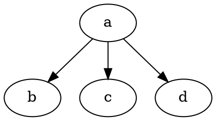
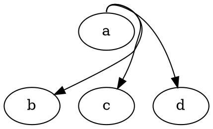

之前在 Windows 画图一般都是用的 Visio ，但是切换到了 macOS，说实话还没有找到能够与其匹敌的软件。之前虽然看过 EdrawMax ，画出来的效果也不错，但是感觉有的时候画一个流程图用这么庞大的软件有点过分了嗷。不知道是在哪天看到了了 Grapviz 这个东东。顿时觉得这就是我想要的。

<!--more-->

# 基本概念

[Graphviz 的官方网站在这](https://graphviz.gitlab.io/download/)。在开始使用之前我们可以不用了解具体的语法，但是我们先要了解几个基本的概念。（实话，Graphviz 的文档组织有够差的）。

> Graphviz 是一个开源的图形可视化软件。图形可视化用由抽象图和网络组成的图表来表示结构化信息的方式。
> Graphviz 布局程序使用简单的文本描述的图作为输入，然后输出各种格式的图标。如：svg, pdf 等。

## graph

一个图，可以时有向的，也可以是无向的。用一系列的语句来描述一个图。

```
graph	:	[ strict ] (graph | digraph) [ ID ] '{' stmt_list '}'
stmt_list	:	[ stmt [ ';' ] stmt_list ]
stmt	:	node_stmt
|	edge_stmt
|	attr_stmt
|	ID '=' ID
|	subgraph
attr_stmt	:	(graph | node | edge) attr_list
attr_list	:	'[' [ a_list ] ']' [ attr_list ]
a_list	:	ID '=' ID [ (';' | ',') ] [ a_list ]
edge_stmt	:	(node_id | subgraph) edgeRHS [ attr_list ]
edgeRHS	:	edgeop (node_id | subgraph) [ edgeRHS ]
node_stmt	:	node_id [ attr_list ]
node_id	:	ID [ port ]
port	:	':' ID [ ':' compass_pt ]
|	':' compass_pt
subgraph	:	[ subgraph [ ID ] ] '{' stmt_list '}'
compass_pt	:	(n | ne | e | se | s | sw | w | nw | c | _)
```

stmt_list 表示语句列表的意思。

图即是由节点，边来组成的，同时一个图中，也可以包含多个子图。

## stmt_list

```
stmt_list	:	[ stmt [ ';' ] stmt_list ]
```

每个语句间可以有分号，也可以没有，但是空格是必须的。

## stmt

```
stmt	:	node_stmt
|	edge_stmt
|	attr_stmt
|	ID '=' ID
|	subgraph
```

每个语句，要么就是描述一个节点，或者描述一个边，或者指定一个ID，或者指定一个子图。

## attr_stmt

```
attr_stmt	:	(graph | node | edge) attr_list
```

这个一般是用来指定一些全局的属性。或者是某些节点公共的属性

## node

node 节点，是图的基本元素。每个节点都可以指定多个属性及一个 ID。

```
node_stmt	:	node_id [ attr_list ]
node_id	:	ID [ port ]
port	:	':' ID [ ':' compass_pt ]
|	':' compass_pt
```
## edge

边也是 图中的基本元素，用来连接两个 Node 。

```
edge_stmt	:	(node_id | subgraph) edgeRHS [ attr_list ]
edgeRHS	:	edgeop (node_id | subgraph) [ edgeRHS ]
```

每个边，也可以指定多个属性。

## Subgraphs and Clusters

子图在 Graphviz 中扮演了三个角色。

1. 表示图结构，表示特定的 Node 和 Edge 应该被分组在一起。这是最常规的角色，通常指定有关图组件的语义信息。它还可以为 Edge 提供方便的简写。Edge 语句允许在其运算符的左侧和右侧都有子图。如 ` A -> {B C}` 与 ` A -> B; A -> C;` 是一样的。
2. 第二个角色，提供对于设置属性的上下文。例如，一个子图可以定义在其内定义的所有节点的默认颜色是蓝色。在图形绘制的上下文中，一个更有趣的例子是:`subgraph { rank = same; A; B; C;}`。这个语句表明在进行 dot 绘制的时候  A, B, C 应该有相同的等级。
3. 第三个角色。直接涉及某些布局引擎如何布置图。如果子图的名称以 **cluster** 开头，Graphviz 会将这样的一个子图标记为特殊的 **cluster** 图。如果布局引擎支持，那么就会将这个 **cluster** 内的节点都绘制在一起，在其外部包裹一个矩形。 cluster 并不是 DOT 语言的一部分，不过被特定的布局引擎支持。


## Roadmap

不是很明白 Roadmap 是表达了什么东西。不过按照描述，看起来应该是布局逻辑的意思。

- **dot**：分等级或层级来绘制有向图。当边有是有方向的时候，就默认就会使用这个。布局算法的目标是**在同一个方向绘制 Edge （从上至下，从左至右）然后会尽量的减少 Edge 的交错和长度**。
- **neato** **spring model** 布局模型。当图并不大（大概 100 节点）同时我们对图什么都不知道时会默认使用。 Neato 会尝试尽量最小化 **全局能量函数（等效于统计多维标度）**。尽管也可以使用使用最速下降的较早的Kamada-Kawai算法，但也可以通过应力最大化实现该解决方案。
- **fdp** **spring model** 模型，与 neato 类似，但这是通过减少力量而不是消耗能量来实现的。Fdp实现了Fruchterman-Reingold启发式算法，其中包括一个多网格求解器，该求解器可以处理较大的图和集群的无向图
- **sfdp** fdp的多尺度版本，用于大图的布局
- **twopi** 在Graham Wills 97之后进行径向布局。根据其距给定根节点的距离，将节点放置在同心圆上。您可以设置根节点，也可以让twopi完成。
- **circo** 圆形布局，紧接在Six and Tollis 99，Kauffman和Wiese 02之后。这适用于多个循环结构的某些图，例如某些电信网络。

## 命令
我们一般用如下这样的命令来进行渲染：

```sh
dot  -K 布局引擎 -T 输出格式 -O(-ofile)  <dot files>
```

如 

```sh
dot -K dot -T png -O 1.dot
```

# 常用属性

## Node 属性

|Type|Name|default|Minium|Notes|说明|
|---|---|---|---|---|---|
|URL|escString|<none>|svg, postscript, map only|||
|area|double|1|>0|patchwork only||
|color|color/colorList|black|||绘制时使用的基本颜色，不包括文本。字体使用的是 fontcolor 属性|
|colorscheme|string|||||
|comment|string|||||
|distortion|double|0|-100|||
|fillcolor|color/colorList|lightgrey(nodes)/black(clusters)||||
|fixedsize|bool/string|FALSE||||
|fontcolor|color|black||||
|fontname|string|Times-Roman||||
|fontsize|double|14|1|||
|gradientangle|int|||||
|group|string||dot only|||
|height|double|0.5|0.02|||
|href|escString||svg, postscript, map only|||
|id|escString||svg, postscript, map only|||
|image|string|||||
|imagepos|string|mc||||
|imagescale|bool/string|FALSE||||
|label|lblString||N (nodes)/""(otherwise)|||
|labelloc|string|t(clusters)/"b"(root graphs)/"c"(nodes)|||指定标签的位置，如在用将文字显示在图片下方|
|layer|layerRange|||||
|margin|double/point|<device-dependent>||||
|nojustify|bool|FALSE||||
|ordering|string||dot only|||
|orientation|double|0|360|||
|penwidth|double|1|0|||
|peripheries|int|shape default(nodes)/1(clusters)|0|||
|pin|bool|FALSE|fdp, neato only|||
|pos|point/splineType|||||
|rects|rect||write only|||
|regular|bool|FALSE||||
|root|string/bool|<none>(graphs)/false(nodes)|circo, twopi only|||
|samplepoints|int|8(output)/20(overlap and image maps)||||
|shape|shape|ellipse||||
|shapefile|string|||||
|showboxes|int|0|0|dot only|
|sides|int|4|0|
|skew|double|0|-100|
|sortv|int|0|0|
|style|style|||
|target|escString/string|<none>|svg, map only|
|tooltip|escString||svg, cmap only|
|vertices|pointList||write only|
|width|double|0.75|0.01|
|xlabel|lblString|||
|xlp|point||write only|
|z|double|0|#NAME?|

## Edge 属性

|Type|Name|default|Minium|Notes|
|---|---|---|---|---|
|URL|escString|<none>|svg, postscript, map only||
|arrowhead|arrowType|normal|||
|arrowsize|double|1|0||
|arrowtail|arrowType|normal|||
|color|color/colorList|black|||
|colorscheme|string||||
|comment|string||||
|constraint|bool|TRUE|dot only||
|decorate|bool|FALSE|||
|dir|dirType|forward(directed)/none(undirected)|||
|edgeURL|escString||svg, map only||
|edgehref|escString||svg, map only||
|edgetarget|escString|<none>|svg, map only||
|edgetooltip|escString||svg, cmap only||
|fillcolor|color/colorList|lightgrey(nodes)/black(clusters)|||
|fontcolor|color|black|||
|fontname|string|Times-Roman|||
|fontsize|double|14|1||
|headURL|escString||svg, map only||
|head_lp|point||write only||
|headclip|bool|TRUE|||
|headhref|escString||svg, map only||
|headlabel|lblString||||
|headport|portPos|center|||
|headtarget|escString|<none>|svg, map only||
|headtooltip|escString||svg, cmap only||
|href|escString||svg, postscript, map only||
|id|escString||svg, postscript, map only||
|label|lblString|\N (nodes)/""(otherwise)|||
|labelURL|escString||svg, map only||
|labelangle|double|-25|-180||
|labeldistance|double|1|0||
|labelfloat|bool|FALSE|||
|labelfontcolor|color|black|||
|labelfontname|string|Times-Roman|||
|labelfontsize|double|14|1||
|labelhref|escString||svg, map only||
|labeltarget|escString|<none>|svg, map only||
|labeltooltip|escString||svg, cmap only||
|layer|layerRange||||
|len|double|1.0(neato)/0.3(fdp)|fdp, neato only||
|lhead|string||dot only||
|lp|point||write only||
|ltail|string||dot only||
|minlen|int|1|0|dot only|
|nojustify|bool|FALSE|||
|penwidth|double|1|0|指定边的宽度|
|pos|point/splineType||||
|samehead|string||dot only||
|sametail|string||dot only||
|showboxes|int|0|0|dot only|
|style|style||||
|tailURL|escString||svg, map only||
|tail_lp|point||write only||
|tailclip|bool|TRUE|||
|tailhref|escString||svg, map only||
|taillabel|lblString||||
|tailport|portPos|center|||
|tailtarget|escString|<none>|svg, map only||
|tailtooltip|escString||svg, cmap only||
|target|escString/string|<none>|svg, map only||
|tooltip|escString||svg, cmap only||
|weight|int/double|1|0(dot,twopi)/1(neato,fdp)||
|xlabel|lblString||||
|xlp|point||write only||
## Root Graph 属性

|Type|Name|default|Minium|Notes|
|---|---|---|---|---|
|Damping|double|0.99|0|neato only|
|K|double|0.3|0|sfdp, fdp only|
|URL|escString|<none>|svg, postscript, map only||
|_background|string|<none>|||
|bb|rect||write only||
|bgcolor|color/colorList|<none>|||
|center|bool|FALSE|||
|charset|string|UTF-8|||
|clusterrank|clusterMode|local|dot only||
|colorscheme|string||||
|comment|string||||
|compound|bool|FALSE|dot only||
|concentrate|bool|FALSE|||
|defaultdist|double|1+(avg. len)*sqrt(|V|)|epsilon|neato only|
|dim|int|2|2|sfdp, fdp, neato only|
|dimen|int|2|2|sfdp, fdp, neato only|
|diredgeconstraints|string/bool|FALSE|neato only||
|dpi|double|96.0/0.0|svg, bitmap output only||
|epsilon|double|.0001 * # nodes(mode == KK)/.0001(mode == major)|neato only||
|esep|addDouble/addPoint|3|not dot||
|fontcolor|color|black|||
|fontname|string|Times-Roman|||
|fontnames|string||svg only||
|fontpath|string|system-dependent|||
|fontsize|double|14|1||
|forcelabels|bool|TRUE|||
|gradientangle|int||||
|href|escString||svg, postscript, map only||
|id|escString||svg, postscript, map only||
|imagepath|string||||
|inputscale|double|<none>|fdp, neato only||
|label|lblString|\N (nodes)/""(otherwise)|||
|label_scheme|int|0|0|sfdp only|
|labeljust|string|c|||
|labelloc|string|t(clusters)/"b"(root graphs)/"c"(nodes)|||
|landscape|bool|FALSE|||
|layerlistsep|string|,|||
|layers|layerList||||
|layerselect|layerRange||||
|layersep|string| :\t|||
|layout|string||||
|levels|int|MAXINT|0|sfdp only|
|levelsgap|double|0|neato only||
|lheight|double||write only||
|lp|point||write only||
|lwidth|double||write only||
|margin|double/point|<device-dependent>|||
|maxiter|int|100 * # nodes(mode == KK)/200(mode == major)/600(fdp)|fdp, neato only||
|mclimit|double|1|dot only||
|mindist|double|1|0|circo only|
|mode|string|major|neato only||
|model|string|shortpath|neato only||
|mosek|bool|FALSE|neato only||
|newrank|bool|FALSE|dot only||
|nodesep|double|0.25|0.02||
|nojustify|bool|FALSE|||
|normalize|double/bool|FALSE|not dot||
|notranslate|bool|FALSE|neato only||
|nslimit/nslimit1|double||dot only||
|ordering|string||dot only||
|orientation|string||||
|outputorder|outputMode|breadthfirst|||
|overlap|string/bool|TRUE|not dot||
|overlap_scaling|double|-4|-1.00E+10|prism only|
|overlap_shrink|bool|TRUE|prism only||
|pack|bool/int|FALSE|||
|packmode|packMode|node|||
|pad|double/point|0.0555 (4 points)|||
|page|double/point||||
|pagedir|pagedir|BL|||
|quadtree|quadType/bool|normal|sfdp only||
|quantum|double|0|0||
|rankdir|rankdir|TB|dot only||
|ranksep|double/doubleList|0.5(dot)/1.0(twopi)|0.02|twopi, dot only|
|ratio|double/string||||
|remincross|bool|TRUE|dot only||
|repulsiveforce|double|1|0|sfdp only|
|resolution|double|96.0/0.0|svg, bitmap output only||
|root|string/bool|<none>(graphs)/false(nodes)|circo, twopi only||
|rotate|int|0|||
|rotation|double|0|sfdp only||
|scale|double/point||not dot||
|searchsize|int|30|dot only||
|sep|addDouble/addPoint|4|not dot||
|showboxes|int|0|0|dot only|
|size|double/point||||
|smoothing|smoothType|none|sfdp only||
|sortv|int|0|0||
|splines|bool/string||||
|start|startType||fdp, neato only||
|style|style||||
|stylesheet|string||svg only||
|target|escString/string|<none>|svg, map only||
|truecolor|bool||bitmap output only||
|viewport|viewPort||||
|voro_margin|double|0.05|0|not dot|
|xdotversion|string||xdot only||

## Subgraph 属性

|Type|Name|default|Minium|Notes|
|---|---|---|---|---|
|rank|rankType||dot only||

## Cluster Subgraph 属性

|Type|Name|default|Minium|Notes|
|---|---|---|---|---|
|K|double|0.3|0|sfdp, fdp only|
|URL|escString|<none>|svg, postscript, map only||
|area|double|1|>0|patchwork only|
|bgcolor|color/colorList|<none>|||
|color|color/colorList|black|||
|colorscheme|string||||
|fillcolor|color/colorList|lightgrey(nodes)/black(clusters)|||
|fontcolor|color|black|||
|fontname|string|Times-Roman|||
|fontsize|double|14|1||
|gradientangle|int||||
|href|escString||svg, postscript, map only||
|id|escString||svg, postscript, map only||
|label|lblString|\N (nodes)/""(otherwise)|||
|labeljust|string|c|||
|labelloc|string|t(clusters)/"b"(root graphs)/"c"(nodes)|||
|layer|layerRange||||
|lheight|double||write only||
|lp|point||write only||
|lwidth|double||write only||
|margin|double/point|<device-dependent>|||
|nojustify|bool|FALSE|||
|pencolor|color|black|||
|penwidth|double|1|0||
|peripheries|int|shape default(nodes)/1(clusters)|0||
|sortv|int|0|0||
|style|style||||
|target|escString/string|<none>|svg, map only||
|tooltip|escString||svg, cmap only||

# Node 罗盘
一般情况下，我们用两个节点间进行连线的时候，连线的位置是不固定的如：


我们可以使用 `e w s n en wn ws es` 八个方向代表了 `东 西 南 北 东北 西北 西南 东南` 来进行连线：




# plantUML

这是一个基于 [plantUML](https://plantuml.com/) 是一个基于 Grapviz 的前端，其使用 UML 语法进行工作。我们用 UML 来描述的图，最终都会转换为 Grapviz 内的内容来进行绘制。不过其封装了一些内部的图形，所以说在画时序图，类图，活动图等的时候会更加的简单，不过灵活性也要差一些。


