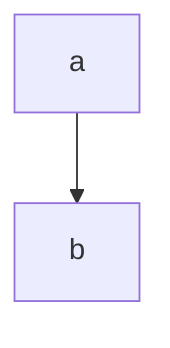

根据 mermaid 官方文档的说明， mermaid 实际上分成两个部分。[mermaid.js](https://github.com/mermaid-js/mermaid/blob/develop/src/mermaid.js) 是作为网页集成模块，[mermaidAPI](https://github.com/mermaid-js/mermaid/blob/develop/src/mermaidAPI.js) 是用来进行定制更多细节的，事实上 mermaid.js 就使用了 mermaidAPI 来进行一些默认的设置。最核心的，其实还是 mermaidAPI 的 `render()` 方法，其会将我们定义的图表渲染成 svg 代码。

<!--more-->

# mermaid.cli

[mermaid.cli](https://github.com/mermaidjs/mermaid.cli) 是 mermaid.js 的一个命令行接口，其原理是利用了一个 headless 的 Chrome node.js API [puppeteer](https://github.com/puppeteer/puppeteer) 来进行模拟的浏览器操作。

其本质上是用模拟的浏览器  pupeteer 来加载 mermaid.min.js ，对定义的图形进行渲染成 svg 代码在浏览器中。不过是有 bug 存在的.

```js
  const browser = yield puppeteer.launch(puppeteerConfig);
  const page = yield browser.newPage();
  page.setViewport({ width, height });
  yield page.goto(`file://${path.join(__dirname, 'index.html')}`);
  yield page.evaluate(`document.body.style.background = '${backgroundColor}'`);
  const definition = fs.readFileSync(input, 'utf-8');

  yield page.$eval('#container', function (container, definition, mermaidConfig, myCSS) {
    container.innerHTML = definition;
    window.mermaid.initialize(mermaidConfig);

    if (myCSS) {
      const head = window.document.head || window.document.getElementsByTagName('head')[0];
      const style = document.createElement('style');
      style.type = 'text/css';
      if (style.styleSheet) {
        style.styleSheet.cssText = myCSS;
      } else {
        style.appendChild(document.createTextNode(myCSS));
      }
      head.appendChild(style);
    }

    window.mermaid.init(undefined, container); // 真正进行渲染是在这里
  }, definition, mermaidConfig, myCSS);
```

然后，根据我们的想要的格式，进行转换：

```js
  if (output.endsWith('svg')) {
    const svg = yield page.$eval('#container', function (container) {
      return container.innerHTML;
    });
    fs.writeFileSync(output, svg);
  } else if (output.endsWith('png')) {
    const clip = yield page.$eval('svg', function (svg) {
      const react = svg.getBoundingClientRect();
      return { x: react.left, y: react.top, width: react.width, height: react.height };
    });
    yield page.screenshot({ path: output, clip, omitBackground: backgroundColor === 'transparent' });
  } else {
    // pdf
    yield page.pdf({ path: output, printBackground: backgroundColor !== 'transparent' });
  }
```

- 如果是需要的 svg 格式，直接输出网页中的 svg 代码即可
- 如果需要的是 png 格式，那么就利用了 模拟浏览器的截图功能
- 如果是 pdf 格式，就利用了浏览器的保存为 pdf 功能。

# Bug

我将一个 图想要渲染成 svg 的格式，然后用 pandoc 来进行转换，结果就会出现很蛋疼的问题：

我想要的是如下效果



但是渲染的结果却是 两个框都是黑的，箭头只剩下了尾部，找了一下谷歌上面看到很多。

基本上可以确实是 mermadi.cli 的问题：

- [https://github.com/mermaid-js/mermaid/issues/664](https://github.com/mermaid-js/mermaid/issues/664)
- [https://github.com/jgm/pandoc/issues/5126](https://github.com/jgm/pandoc/issues/5126)
- [https://gitlab.gnome.org/GNOME/librsvg/issues/428](https://gitlab.gnome.org/GNOME/librsvg/issues/428) 提供的解决办法

究其原因，可能是因为 mermaid.cli 输出的 svg 格式并不是很规范的，所以无法支持。其将 style 写在 svg 标签内，但是并不会被识别。

pandoc 最开始使用的是 rsvg2pdf 来进行转换， rsvg-convert (installed with librsvg) 来进行转换，当前最新的使用的是 rsvg-convert 来进行转换，都不OK。

按照第三个连接中提供的解决方法，把所有 svg 内的 style 中的针对  svg 的 ID 给干掉就得行了：

```svg
<svg id="mermaid-1578839518522" width="100%" xmlns="http://www.w3.org/2000/svg" height="100%" viewBox="0 0 784 148">
<style>
#mermaid-1578839518522 label{font-family:trebuchet ms,verdana,arial;color:#333}
#mermaid-1578839518522 node circle,
#mermaid-1578839518522 node ellipse,
#mermaid-1578839518522 node polygon,
#mermaid-1578839518522 node rect{fill:#ececff;stroke:#9370db;stroke-width:1px}
#mermaid-1578839518522 node.clickable{cursor:pointer}
#mermaid-1578839518522 arrowheadPath{fill:#333}
  <g></g><g class="grid" transform="translate(75, 98)" fill="none" font-size="10" font-family="sans-serif" text-anchor="middle"><path class="domain" stroke="#000" d="M0.5,-63V0.5H634.5V-63"></path><g class="tick" opacity="1" transform="translate(0.5,0)"><line stroke="#000" y2="-63"></line><text fill="#000" y="3" dy="1em" stroke="none" font-size="10" style="text-anchor: middle;">2019-12-09</text></g><g class="tick" opacity="1" transform="translate(79.5,0)"><line stroke="#000" y2="-63"></line><text fill="#000" y="3" dy="1em" stroke="none" font-size="10" style="text-anchor: middle;">2019-12-09</text></g><g class="tick" opacity="1" transform="translate(159.5,0)"><line stroke="#000" y2="-63"></line><text fill="#000" y="3" dy="1em" stroke="none" font-size="10" style="text-anchor: middle;">2019-12-10</text></g><g class="tick" opacity="1" transform="translate(238.5,0)"><line stroke="#000" y2="-63"></line><text fill="#000" y="3" dy="1em" stroke="none" font-size="10" style="text-anchor: middle;">2019-12-10</text></g><g class="tick" opacity="1" transform="translate(317.5,0)"><line stroke="#000" y2="-63"></line><text fill="#000" y="3" dy="1em" stroke="none" font-size="10" style="text-anchor: middle;">2019-12-11</text></g><g class="tick" opacity="1" transform="translate(396.5,0)"><line stroke="#000" y2="-63"></line><text fill="#000" y="3" dy="1em" stroke="none" font-size="10" style="text-anchor: middle;">2019-12-11</text></g><g class="tick" opacity="1" transform="translate(476.5,0)"><line stroke="#000" y2="-63"></line><text fill="#000" y="3" dy="1em" stroke="none" font-size="10" style="text-anchor: middle;">2019-12-12</text></g><g class="tick" opacity="1" transform="translate(555.5,0)"><line stroke="#000" y2="-63"></line><text fill="#000" y="3" dy="1em" stroke="none" font-size="10" style="text-anchor: middle;">2019-12-12</text></g><g class="tick" opacity="1" transform="translate(634.5,0)"><line stroke="#000" y2="-63"></line><text fill="#000" y="3" dy="1em" stroke="none" font-size="10" style="text-anchor: middle;">2019-12-13</text></g></g><g><rect x="0" y="48" width="746.5" height="24" class="section section0"></rect><rect x="0" y="72" width="746.5" height="24" class="section section0"></rect></g><g><rect rx="3" ry="3" x="75" y="50" width="159" height="20" class="task  done0"></rect><rect rx="3" ry="3" x="234" y="74" width="475" height="20" class="task  done0"></rect><text font-size="11" x="154.5" y="63.5" text-height="20" class="taskText taskText0  doneText0">A </text><text font-size="11" x="471.5" y="87.5" text-height="20" class="taskText taskText0  doneText0">B </text></g><g><text x="10" y="74" class="sectionTitle sectionTitle0">one</text></g><g class="today"><line x1="5613" x2="5613" y1="25" y2="123" class="today"></line></g><text x="392" y="25" class="titleText">title</text></svg>
```

改为

```svg
<svg id="mermaid-1578839518522" width="100%" xmlns="http://www.w3.org/2000/svg" height="100%" viewBox="0 0 784 148">
<style>
.label{font-family:trebuchet ms,verdana,arial;color:#333}
.node circle,
.node ellipse,
.node polygon,
.node rect{fill:#ececff;stroke:#9370db;stroke-width:1px}
.node.clickable{cursor:pointer}
.arrowheadPath{fill:#333}
.edgePath .path{stroke:#333;stroke-width:1.5px}
.edgeLabel{background-color:#e8e8e8}
.cluster rect{fill:#ffffde!important;stroke:#aa3!important;stroke-width:1px!important}
.cluster text{fill:#333}
div.mermaidTooltip{position:absolute;text-align:center;max-width:200px;padding:2px;font-family:trebuchet ms,verdana,arial;font-size:12px;background:#ffffde;border:1px solid #aa3;border-radius:2px;pointer-events:none;z-index:100}
.actor{stroke:#ccf;fill:#ececff}
text.actor{fill:#000;stroke:none}
  <g></g><g class="grid" transform="translate(75, 98)" fill="none" font-size="10" font-family="sans-serif" text-anchor="middle"><path class="domain" stroke="#000" d="M0.5,-63V0.5H634.5V-63"></path><g class="tick" opacity="1" transform="translate(0.5,0)"><line stroke="#000" y2="-63"></line><text fill="#000" y="3" dy="1em" stroke="none" font-size="10" style="text-anchor: middle;">2019-12-09</text></g><g class="tick" opacity="1" transform="translate(79.5,0)"><line stroke="#000" y2="-63"></line><text fill="#000" y="3" dy="1em" stroke="none" font-size="10" style="text-anchor: middle;">2019-12-09</text></g><g class="tick" opacity="1" transform="translate(159.5,0)"><line stroke="#000" y2="-63"></line><text fill="#000" y="3" dy="1em" stroke="none" font-size="10" style="text-anchor: middle;">2019-12-10</text></g><g class="tick" opacity="1" transform="translate(238.5,0)"><line stroke="#000" y2="-63"></line><text fill="#000" y="3" dy="1em" stroke="none" font-size="10" style="text-anchor: middle;">2019-12-10</text></g><g class="tick" opacity="1" transform="translate(317.5,0)"><line stroke="#000" y2="-63"></line><text fill="#000" y="3" dy="1em" stroke="none" font-size="10" style="text-anchor: middle;">2019-12-11</text></g><g class="tick" opacity="1" transform="translate(396.5,0)"><line stroke="#000" y2="-63"></line><text fill="#000" y="3" dy="1em" stroke="none" font-size="10" style="text-anchor: middle;">2019-12-11</text></g><g class="tick" opacity="1" transform="translate(476.5,0)"><line stroke="#000" y2="-63"></line><text fill="#000" y="3" dy="1em" stroke="none" font-size="10" style="text-anchor: middle;">2019-12-12</text></g><g class="tick" opacity="1" transform="translate(555.5,0)"><line stroke="#000" y2="-63"></line><text fill="#000" y="3" dy="1em" stroke="none" font-size="10" style="text-anchor: middle;">2019-12-12</text></g><g class="tick" opacity="1" transform="translate(634.5,0)"><line stroke="#000" y2="-63"></line><text fill="#000" y="3" dy="1em" stroke="none" font-size="10" style="text-anchor: middle;">2019-12-13</text></g></g><g><rect x="0" y="48" width="746.5" height="24" class="section section0"></rect><rect x="0" y="72" width="746.5" height="24" class="section section0"></rect></g><g><rect rx="3" ry="3" x="75" y="50" width="159" height="20" class="task  done0"></rect><rect rx="3" ry="3" x="234" y="74" width="475" height="20" class="task  done0"></rect><text font-size="11" x="154.5" y="63.5" text-height="20" class="taskText taskText0  doneText0">A </text><text font-size="11" x="471.5" y="87.5" text-height="20" class="taskText taskText0  doneText0">B </text></g><g><text x="10" y="74" class="sectionTitle sectionTitle0">one</text></g><g class="today"><line x1="5613" x2="5613" y1="25" y2="123" class="today"></line></g><text x="392" y="25" class="titleText">title</text></svg>
```

那么，就OK了。

# 最终的解决办法

在 mermaidjs 的源代码中将 [mermaidAPI 的 522 行改成](https://github.com/mermaid-js/mermaid/blob/develop/src/mermaidAPI.js#L522)

```js
  style1.innerHTML = style
```

然后自己重新打包一个 mermaid.min.js 给  mermaid.cli 使用就行了。

# 后续BUG

甘特图是没有问题了，但是渲染 graph 的时候，依然无法转换，报的错误是：

CSS parse error

这个应该就是 rsvg-convert 的锅了，应该是不支持很多的 CSS 属性或者写法。
