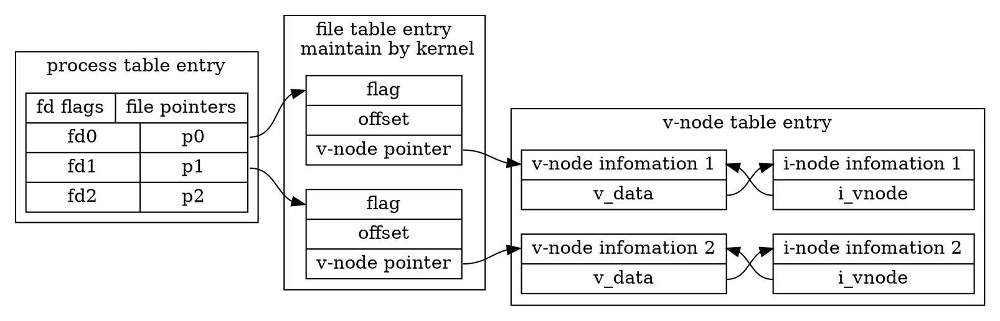
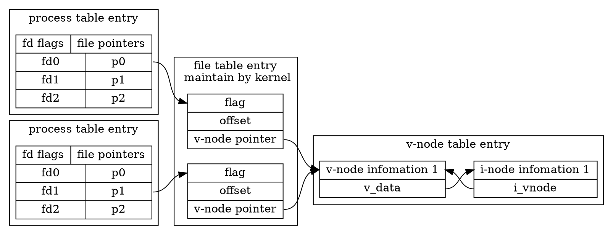
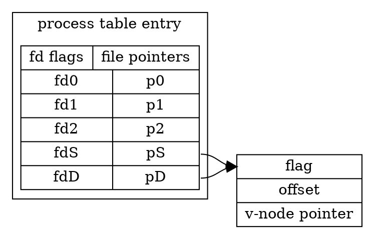
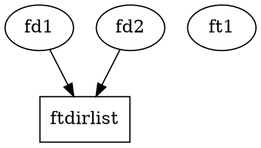
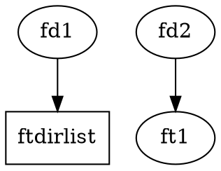

我们知道，进程在打开的时候，就默认已经打开了三个文件描述符 **0, 1, 2** 方便大不了 标准输入，标准输出，标准错误。而我们要进行重定向的时候，比如到一个文件的时候，实际上进程不会关心他到底是被重定向到什么地方了，他只需要依然向这三个描述符进行相关的 IO 操作就行了。所以，我们需要来了解一下文件描述符背后的一些内容。

<!--more-->

# File Descriptor

从 **APUE** 中我们可以看到，对于打开的文件其实上有三个数据结构：



对于上面这个图做简单的解释：

- **Process table entry 进程表项**。在 **进程表中**，每个进程都会有一个记录项。每个进程表中的记录都会有已经打开的文件描述符表。每个文件描述符都于一个指向打开的文件表项指针。
- **File table entry 文件表项** 对于所有打开的文件，内核将其维护在一个表内。每个表项都有一个指向 v-node 信息的指针。
- **V-node V 节点信息** 包含了此类型文件的信息，以及在此文件上进行操作的函数指针。
  - V-node 信息由打开文件的时候从磁盘读入
  - V-node 也包含了此文件的 i-node 节点信息
  - Linux 没有 v-node，而是用了一个通用的 i-node 结构。其使用了一个文件系统无关的 i-node和一个文件系统相关的 i-node

所以呢，对于一个文件，是否是同一个文件，要看 v-node/i-node 是一样的，才能说明打开的是同一个文件。
而如果同一个文件被不同的进程打开两次，那么在内核维护的打开文件表中就会有两项。




# BASH 的特殊文件

在进行重定向的时候，BASH 内部会使用几个特殊的文件

- /dev/fd/*fd* 如果 *fd* 是一个有效的数字，那么 *fd* 将被复制
- /dev/stdin 文件描述符 *0* 被复制
- /dev/stdout 文件描述符 *1* 被复制
- /dev/stderr 文件描述符 *2* 被复制
- /dev/tcp/*host*/*port*  BASH 会尝试打开到 *host:port* 的 TCP 连接
- /dev/udp/*host*/*port* BASH 会尝试打开到 *host:port* 的 UDP 连接。


# 重定向

bash 中的重定向操作符有两类三个：

- 输入重定向 `<, <<, <<<`
- 输出重定向 `>, >>, >>>`

其本质上是对文件描述符的复制。

## 文件描述符复制

在一个进程中，所谓的文件描述符的复制，说的是，为一个 **文件表项** 在 **在进程表项** 中添加一个指针。
当我们进行重定向的时候，需要重定向的那个文件描述符 S，将成为定向到的文件描述符 D 的副本，也即是说，将文件描述符 D 复制到了 文件描述符 S。



就是感官上有点怪异，我需要的是重定向是S，结果却是将要定向到的 D 复制给了 S。

实际上换个思路，我们将文件描述符 S 重新定向到了 D 所指向的文件表项。

## dup 系统调用

有两个底层函数来完成文件描述符的复制：

```c
     #include <unistd.h>

     int
     dup(int fildes);

     int
     dup2(int fildes, int fildes2);
```

- dup() 会返回文件描述符表中最小的那个整数，让此整数也指向 *fildes* 的文件表项。
- dup2() 就有所不同，当 *fildes2* 在使用的话，那么就会先关闭 *fildes2*，然后再进行复制。

所以我猜想，对于输入输出的重定向，要么是利用：

```c
close(1);
dup(fildes)
```

或者是

```c
dup2(fd, 1)
```

这样的形式来实现的。

## 重定向的顺序

经常这谈到的一个区别就是：

```sh
ls  > dirlist  2>&1
```



与 

```sh
ls 2>&1 > dirlist
```



的区别。

这是再于，对于第二种情况，标准错误只是使用了标准输出的文件表项，而标准输出使用了 dirlist 的文件表项。

这是因为：**重定向是定向到文件描述符所指向的文件表项，而不是定向到文件描述符本身（这本来就说不通）**

## < 输入

```sh
[n]<word
```

这会让名为 *word* 经过扩展后的文件在描述符 *n* 上打开，如果省略了 *n*，那么就会在标准输入 *0* 上打开

## > 输出

```sh
[n]>[|]word
```

这会让名为 *word* 经过扩展后的文件在描述符 *n* 上打开，*如果省略了n* 那么就在标准输出 *1* 上打开。文件不存在则会创建，文件存在则会被截短。

> 注意：如果用 `>` 进行重定向，而 `noclobber` 选项已设置，在文件存在的时候就会失败。
>
> 而 `>|` 无论文件是否存在都会成功。

## >> 追加

```sh
[n] >> word
```

## >&word

这个描述符允许我们同时将标准输出，标准错误都重定向到同一个文件。

```sh
&>word # ==== >word 2>&1
>&word
```

推荐用第一种形式。

用第二中形式的时候，注意，*word* 不能扩展成一个数字或者是 `-`，因为这时候会有特殊的意义。

## >>&word

```sh
>>&word
>>word 2>&1
```

## << here-document

```
[n] <<[-]word
    here-document
delimiter
```

这个类型的用法让 SHELL 从当前的源读取输入，直到一个包含 *word* 的行出现（没有拖尾的空白）。期间读取的所有行都会作为一个命令的标准输入。

对于 **word**，不会进行变量扩展，命令替换，算数运算或者文件名扩展进行。也就是其是一个字面意义的字符串。

如果 *word* 中有任意部分加了引号，那么 *delimiter* 是去除引号的结果，并且，在 *here-document* 中的所有内容都不会进行各种扩展。

```sh
echo<<"F"F
$VVVVV
`expr 1 + 1`
FF
```

将会输出：

```
 cat<<"F"F
$VVVVV
`expr 1 + 1`
FF
$VVVVV
`expr 1 + 1`
```

如果 *word* 中没有引号出现，那么 *here-document* 中就会进行各种扩展。字符序列 `\newline` 将会被忽略，

```
\, $, `
```

必须用 `\` 进行反引。

```
 cat<<FF
$PATH
`expr 1 + 1`
\`
FF
/Users/gowa/venv/bin:
2
`
```

如果重定向符是 `<<-`，那么所有开头的 `Tab` 都会被去除。

```
 cat<<-FF
$PATH
	`expr 1 + 1`
\`
FF
/Users/gowa/venv/bin:
2
`
```


## <<< 立即字符

here-document 的变种。

```sh
[n] <<< word
```

直接就是长串文本的搞法了：

```sh
cat <<< "FF
    $VVVV
`expr 1 + 2`
FF"
```


## [>]>&digit

这个操作符实际上是用来进行表示复制文件描述符的意思的，我们可以用 `>` 重定向到文件，但是如果是要重定向描述符的时候就只能用这个。

我们可以把 `&` 理解为，取**文件描述符的文件表项的意思**。

```sh
[n]<&word
```

- 当 Word 不是数字就会出错。
- 如果 word 是 `-`，那么会关闭描述符 `n`
- 如果 `n` 未指定，那么就会使用  *0*

```sh
[n]>&word
```

- 当 Word 不是数字就会出错。
- 如果 word 是 `-`，那么会关闭描述符 `n`
- 如果 `n` 未指定，那么就会使用  *1*
- **特殊情况**：如果 `n` 未指定，*word* 不是数字，也不是 `-`（它是个文件名），那么标准输出，标准错误都会被重定向到 *word* 代表的文件。

## {<|>}&digit- 移动文件描述符

```sh
[n]<&digit-
[n]>&digit-
```

会将 digit 表示的文件表项移动（复制后，关闭 digit）到文件描述符 n。

## <>读写打开文件描述符

```
[n]<>word
```

如果 *word* 指定的文件不存在，那么就会建立他。


# 套接字

BASH 可以连接套套接字，这来源于其内部使用的 `/dev/{tcp|udp}/host/port` 特殊文件。我们可以利用  `<>` 与此结合来连接套接字：

```sh
 exec 3<> /dev/tcp/www.baidu.com/80
```

为什么要用 `exec`？

[参考一下这篇文章把](https://www.computerhope.com/unix/bash/exec.htm)

# exec

```sh
exec [-cl] [-a name] [command [arguments]]
```

如果指定了命令，那么其就会替换当前的SHELL，不会建立新的进程。参数会传递给指定的命令去。

-c 以空环境执行命令

-l 传递给命令代第 0 个位置参数前加上横线，就和 login api做的一样。

-a name ，将 `name` 作为第 0 个位置参数。

当我们不指定任何命令执行 exec 时，所有的输出都会重定向到文件去：

```sh
bash-3.2$ bash
bash-3.2$ exec > file
bash-3.2$ date
bash-3.2$ exit
bash-3.2$ cat file
Thu 18 Sep 2014 23:56:25 CEST
```

