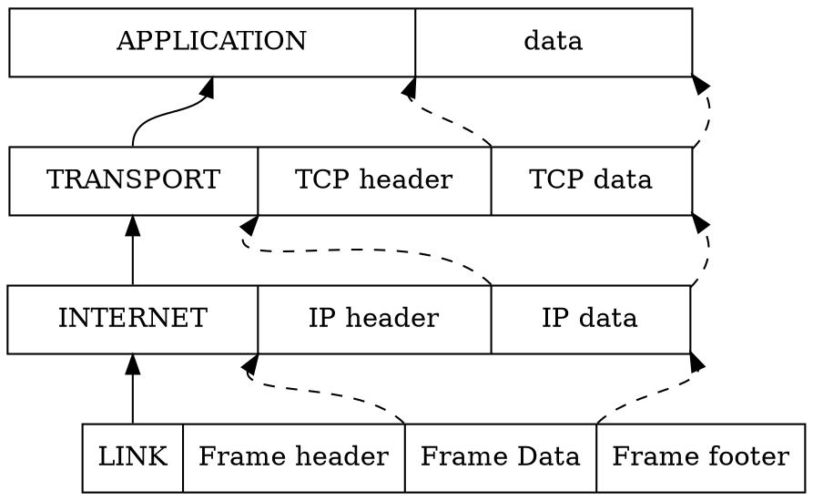
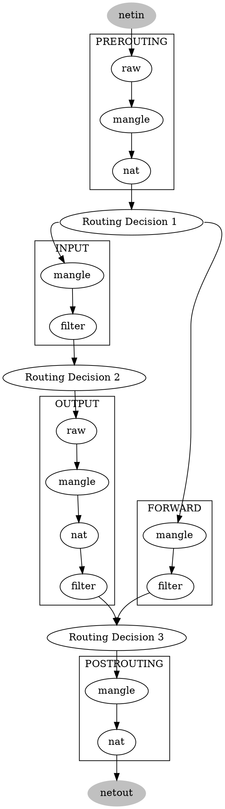
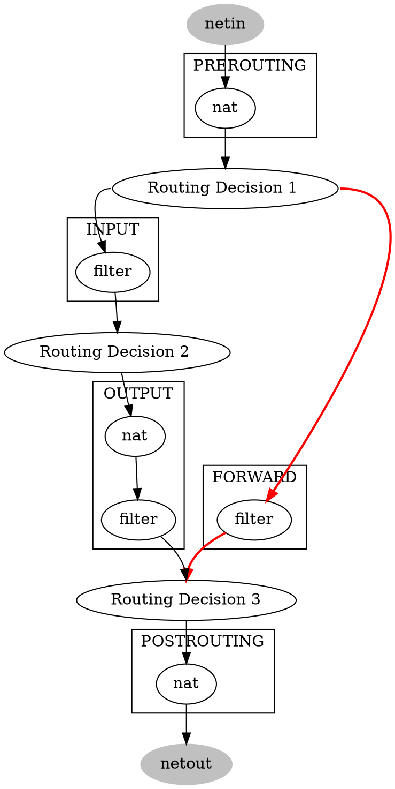

很早以前就用过了，不过再细一点不是更好嘛。如果能和 TCP/IP 的协议栈来统一起来，那就更加的直观明白了。

<!--more-->

都说 iptables 的核心是 **三表，五链**，但是数据是如何在这几个表链中进行流动的，匹配的规则又是如何的呢。我们先来看一下 TCP 协议栈。

# TCP/IP



从上至下，将应用层数据，层层加上自己层的头部，传递到链路上去。

# Iptables

- Chain 由一系列的规则有序组成。
- Table 由 Chain 组成
先看流程图：



iptables 有五个表

- raw 只是为了用来设置包是否不需要跟踪
- nat 为了 NAT 使用
- filter 默认表，防火墙一般就在此生效
- mangle 特殊的包修改
- securite(新增) 如 selinux 相关的规则

一般我们常用到的就是 **filter, nat** 其他的用得少。当然实际上 raw 表也会用到，

那么把我们的流程图简化一下：



所以我们现在就可以很明确的知道这个转发过程了：

1. **PREROUTING** 协议栈收到包后，路由前，查看一下 nat 表，看是否有需要做 nat 操作的。
2. 路由决策，看发往本机，还是进行转发。
3. **FORWARD**：转发前查一下 filter 表，是否要进行过滤。
4. 路由决策。
5. **POSTROUTING** 路由后，看是否还需要进行 nat 操作。

而针对本机所做的操作就更多了：

1. **PREROUTING** 协议栈收到包后，路由前，查看一下 nat 表，看是否有需要做 nat 操作的。
2. 路由决策，看发往本机，还是进行转发。
3. **INPUT**：转发前查一下 filter 表，是否要进行过滤，不发往对应的进程。
4. 进程处理后，准备发送回包
5. 路由决策。
6. **OUTPUT** 由本机发出的包，进行 nat 或者 过滤操作。
7. 路由决策。
8. **POSTROUTING** 路由后，看是否还需要进行 nat 操作。

# 规则的定义

所以我们的定义 iptable 规则的时候，需要明确我们是要在哪个阶段进行定义规则，进行什么操作（filter or nat）。

或者更好想一些，我们先要进行什么操作，是在什么时候进行执行。

```sh
iptables -t nat -I POSTROUTING -s  -p 
```
