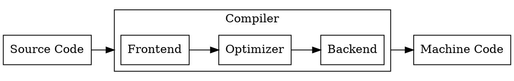
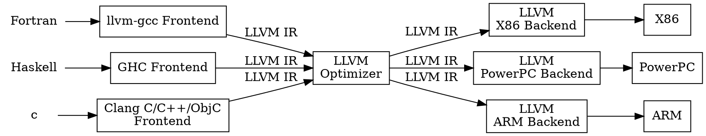
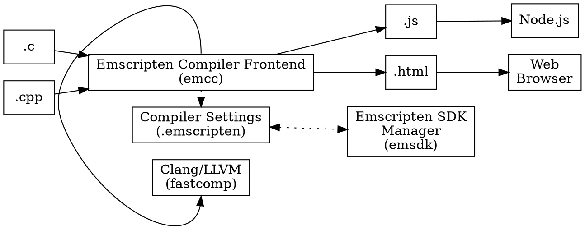

常听人说的 WebAssembly，还有  asm.js 其实我是不擅长这些的，不过是在使用  [viz.js][1] 的时候，看到就是用了这个玩意来将 graphviz 编译为 js 实现，所以来看一下具体是个什么意思。

<!--more-->

# Emscripten

[emscripten][2]  的网站上就空宗明义的说了 **emscripten** 是做什么的：

>Emscripten is a toolchain for compiling to asm.js and WebAssembly, built using LLVM, that lets you run C and C++ on the web at near-native speed without plugins.
>Emscripten 是一个用来编译出 asm.js 和 WebAssembly 的工具链，其使用 LLVM 来构建，这样就使我们可以在 web 上以接近原生的速度来运行 C/C++ 代码，且不需要任何插件。

也就是说，我们使用 Emscripten 可以将 C/C++ 代码编译成可以在 Web 上跑的 JS （Asm.js） 代码。这是如何实现的呢？

所以有几个关键的概念需要先明白一下：

- WebAssembly
- Asm.js
- LLVM

# LLVM

[LLVM][3] 是一个编译器架构，其包含的东西是比较多的，一言半语，一时半会也解释不清楚。
>The LLVM Project is a collection of modular and reusable compiler and toolchain technologies
>LLVM 项目一个模块化和可复用的编译器和工具链技术集合。

LLVM 的核心库 **LLVM Core** 提供了一个 源代码和目标代码无关的 **优化器**，加上一下平对流行CPU的代码生成支持。这些库围绕一个良好定义的代码表达（常被程我 **LLVM IR**）来构建。有了这个库，我们就能很容易的将 LLVM 作为优化器和代码生成器。 

想要了解一下这个 LLVM就得先了解一下传统的编译器是怎么样设计的。

## 传统编译器设计
传统的编译器设计都是三步式的（如大多数 C 编译器）：Front end(前端)，Optimizer（优化器），Back end(后端)。

- **Frontend** ：源代码解析，错误检查，然后构建一个语言相关的抽象语法树(AST)来表示输入的代码。这个 AST 也有可能被转换一个新的表示来进行优化。
- **Optimizer**：优化器会做很多的转换来减少代码的运行时间，比如说减少冗余的计算，其多少都会与语言和目标代码无关。
- **Backend（也被叫做代码生成器）**：将优化后的代码映射到目标的指令集。

对于我们常知的 [Clang][4] 其实其只是一个 Frontend，其主要的目的是为了提高编译速度，更实用的错误和警告信息及为构建出色的源代码级工具提供平台。

## LLVM 编译器实现
在一个基于 LLVM 的编译器中，一个 Frontend  的责任是对源代码进行 **代码解析、错误诊断**，然后将解析后的的代码转换为 **LLVM IR(通常，是通过构建一个 AST ，然后将 AST 进行转换成 LLVM IR)**。然后 IR 会经过一系列的（可选）分析和优化以便提高代码，然后将这些代码传递给 **代码生成器** 来生成相应的机器代码

因此，在这里，我们的 Emscripten 也只是一个前端而已了。

# Emscripten 工具链

[Emscripten About][5] 一文中介绍了其工具链：

emcc 是整个工具链中最主要的工具。其使用 Clang 和 LLVM 来编译到 wasm 和 asm.js。
emsdk 用来管理整个sdk中的工具，同时会对配置文件进行写入和修改。

到第 Emscripten 的工作过程就是很明确的了。先转换成 IR ，然后再由 LLVM 编译成 Javascript。

# WebAssembly
[WebAssembly][6] （Wasm）是一个二进制指令格式，其在基于栈的虚拟机上运行。其能在 web 的客户端或者服务端运行。

# Asm.js

[Asm.js][7] 是一个极端优化过的，JavaScript的低级子集。

[1]: https://github.com/mdaines/viz.js
[2]: https://emscripten.org/index.html
[3]: https://llvm.org/
[4]: http://clang.llvm.org/
[5]: https://emscripten.org/docs/introducing_emscripten/about_emscripten.html
[6]:https://webassembly.org/
[7]: http://asmjs.org/
