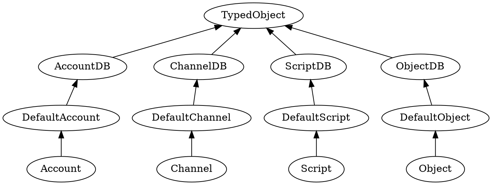
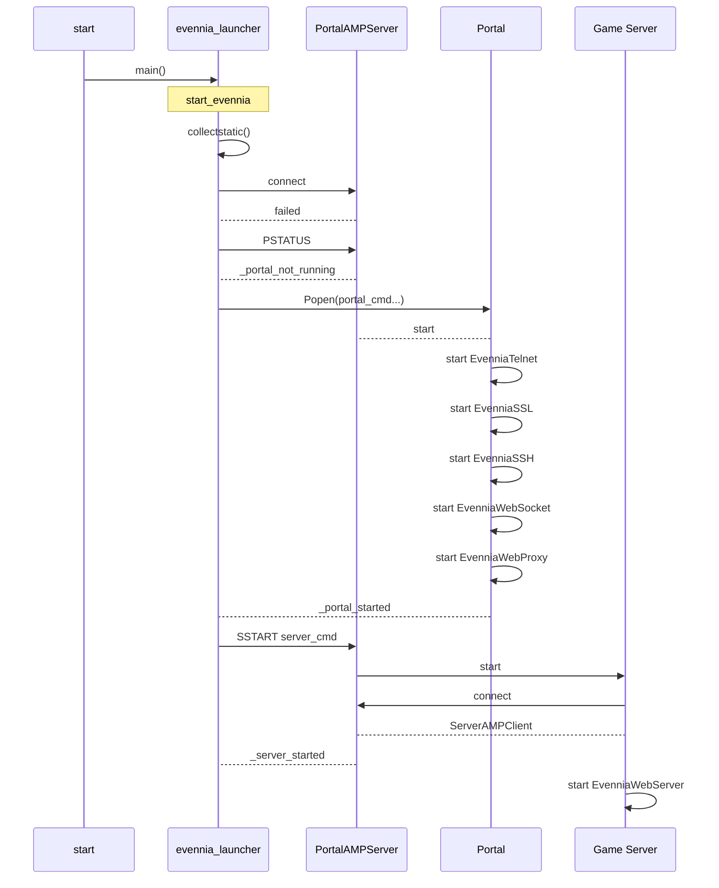
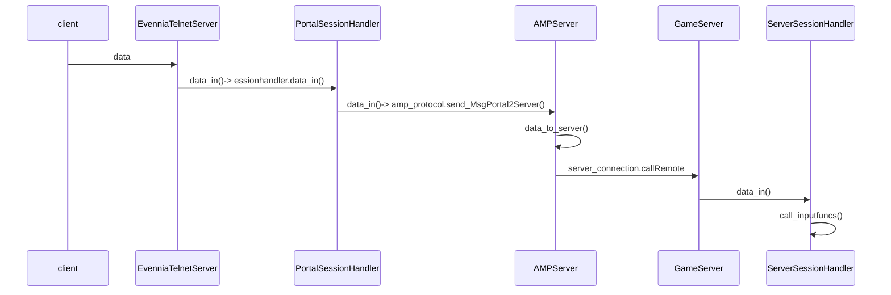
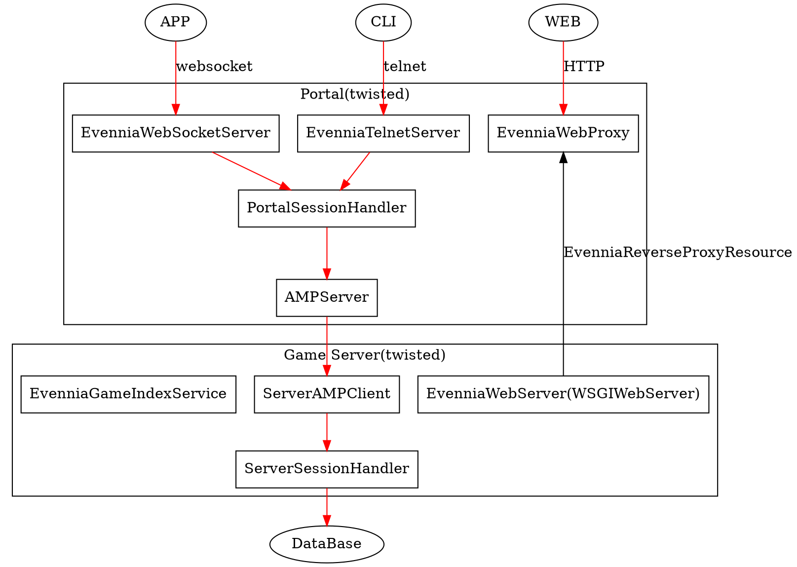

[Evennia][evennia] 是一个用来进行在线多人文字游戏的库，我就是要用他来玩一些小东西所以我想要了解其架构是怎么样的。其实用 Django 来进行数据库访问和 Web 集成。

<!--more-->

# 关键的组件与术语

## 组件
- [twisted](https://github.com/evennia/evennia/wiki/Glossary#twisted) - 网络引擎，负责 Evennia 中的事件循环和通信
- [django](https://github.com/evennia/evennia/wiki/Glossary#django) - Evennia 使用的网络框架，用来进行数据库访问和Web 集成。

## 术语

- account -玩家的账号
- admin-site - 用来操作数据库的 Django 网页。
- attribute - 持久化的，存储在 typeclasses 上的自定义数据。
- channel - 游戏的通信通道。
- character - 玩家的头像，受 account 控制。
- core -用于附带Evennia固有代码的术语
- field - 用来表示一个数据库列的 typeclass 属性
- migrate - 更新数据库元信息
- multisession mode` - 用来用户如何连接到 Evennia 的设置
- **object - Python实例，通用术语或游戏中的 typeclass**
- player - 用客户端连接到游戏的人
- puppet - 木偶，当一个账号控制一个游戏内的对象时
- property - 一个python 属性
- script - 一段代码，用来进行自定义存储，系统和时间保持 
- session - 代表一个客户端连接
- ticker - 允许以稳定的“tick”运行事件
- **[typeclass](https://github.com/evennia/evennia/wiki/Glossary#typeclass) - Evennia 中连接数据库的 Python 类 **
- **[Object](https://github.com/evennia/evennia/wiki/Objects) - 注意是大写的，代表了游戏中的一个 typeclass，包括 Characters，Room, trees, 武器等**

## TypeClass
**typeclass** 是一个 Evennia 特有的术语。typeclass 使开发人员可以像对待普通的Python对象一样使用数据库持久对象。它利用特定的Django功能将Python类链接到数据库表。有时我们将此类代码实体叫做 **being typeclassed**。

Evennia 中的主要 typeclass 是 **Account, Object, Script, Channel**。这些基类的子类（如 Character）会和它的父类使用同样的数据库表，但却能通过 **Attributes, Tags** 拥有更多不同的 Python 功能和持久性功能。可以对 typeclass 进行编码和处理，就像对待其他任何Python类一样，不同的是它必须继承（不论继承的层级）基本 typeclass 中的一个。同样，创建 Typeclass 的新实例会将新行添加到链接到它的数据库表中。

Evennia 的核心 typeclass 全部被命名为 **DefaultAccount, DefaultObject** 等等。当您初始化您的[游戏目录]时，您会自动获得其中的空子类，称为Account，Object等，您可以开始使用这些子类。

可以看到，事实上都是围绕 typeclass 来进行工作。他有一些基本上都会具有的字段：

- `db_key`(str)。实体的主要标识，就如一个 "Rose","myscript" 这样。`name` 是一个别名
- `db_date_created`(datetime) 时间戳
- `db_typeclass_path`(str) 指向 (type)class 路径

访问字段的时候我们可以使用 `obj.db.db_key` 的形式，或者是 `obj.key` 这样的形式，后面这种形式是一个包装后的访问方法。

### attribute 与 property， field
这两个概念非常的容易模糊，在语义上，都相似，差别很细微。但是在这个上下文中的话差异是非常大的。

- Property Python对象上下文中使用。有些时候也被当做是 [Python3中的内建函数 `property`](https://www.python-course.eu/python3_properties.php)
- Field 一个字段，或者是数据库字段在 Evennia 上下文中表示的一个 TypeClass 中链接到数据库中一个列的 property。TypeClasses 只有很少的几个 property 是数据库的 field。
- Attribute 在 Evennia 上下文中代表了任意可以附加到 typeclass 上的数据。它允许我们持久化新的数据而不用改变 typeclass 的底层数据库结构。

[更多关于 typeclass 属性的可以看这里](https://github.com/evennia/evennia/wiki/Typeclasses#about-typeclass-properties)
###  handlers

每个 typeclass 还会有几个处理器：

- `tags` - TagHandler 处理标签
- `locks` - LockHandler 处理访问限制
- `attributes` - [AttributeHandler](https://github.com/evennia/evennia/wiki/Attributes#the-attributehandler)  处理 **附加属性(attr)**。
- `db` - 上面的简写。
- `naattributes` - Non-persistent AttributeHandler  非持久化属性的处理。
- `ndb` 上面的简写


## Object

**Object** 有三个特殊的子类：*Characters, Rooms and Exits.* 之所以他们比较特殊是因为这几个是基础。

- Characters 由 Accounts 控制的对象当一个新  Account 登录游戏的时候，就会建立一个新的 `Character` 对象，然后此新对象的 account 属性就会被设置为 Account 对象。一个 `Character` 在创建的时候必须有默认的命令集，否则的话这个账号将不能执行任何命令。如果您只是从evennia.DefaultCharacter继承了自己的类，并确保使用super（）调用父方法，那应该没问题。在game / typeclasses / characters.py中，有一个空的Character类可供您修改。
- Rooms 所有其他对象的根容器。真正将 Room 与其他任何对象分隔开的唯一事情是它们没有自己的位置，并且@dig之类的默认命令会创建此类的对象。因此，如果您想扩展房间以提供更多功能，只需继承ev.DefaultRoom。
- [Exits](https://github.com/evennia/evennia/wiki/Objects#exits) Exits是将其他对象（通常是 Room）连接在一起的对象。Exits 具有将它们与其他对象分开的两个地方。首先，其 **destination** 属性已设置并指向有效对象，这个事实使得在数据库中定位 Exits 变得容易和快速。其次，Exits 在创建时会在其自身上定义特殊的“[Transit Command](https://github.com/evennia/evennia/wiki/Commands)”。此命令的名称与 Exits 对象的名称相同，并且在调用时将处理将角色移至出口的目的地的实际操作，允许您仅输入 Exit 的名称即可四处走动。

基本上来说，游戏内的所有内容都会用对象来表示，然后存在在数据库中。



# 安装与使用 MySQL

## 安装

安装非常的简单了：

```sh
mkdir muddev && cd muddev
git clone https://github.com/evennia/evennia.git
pip install -e evennia
evennia --init game
cd game
```
就这么简单就安装好了，且初始化完毕一个 game 项目，现在我们已经在 game 项目中了。

在[选择一个数据库中][setdb]，我们可以看到是如何设置使用 MySQL 的.

## 设置 MySQL

先在Mysql内建立库：

```sh
mysql -uroot -p
```

```sql
CREATE USER 'evennia'@'localhost' IDENTIFIED BY 'somepassword';
CREATE DATABASE evennia;
ALTER DATABASE `evennia` CHARACTER SET utf8;      # note that it's `evennia` not 'evennia'!
GRANT ALL PRIVILEGES ON evennia.* TO 'evennia'@'localhost';
FLUSH PRIVILEGES;
exit
```
接着我们可以编辑我们项目下的 *server/conf/settings.py* 或者 *server/conf/secret_settings.py*（这个文件不会出现在 git 项目中）

>Note: The Django documentation suggests using an external db.cnf or other external conf-formatted file. Evennia users have however found that this leads to problems (see e.g. issue #1184). To avoid trouble we recommend you simply put the configuration in your settings as below.

```py
    #
    # MySQL Database Configuration
    #
    DATABASES = {
       'default': {
           'ENGINE': 'django.db.backends.mysql',
           'NAME': 'evennia', 
           'USER': 'evennia', 
           'PASSWORD': 'somepassword', 
           'HOST': 'localhost',  # or an IP Address that your DB is hosted on
           'PORT': '', # use default port
       }
    }
```
接着我们安装  MySQL 的 Python 驱动：

```sh
pip install mysqlclient
```

接着执行：

```sh
evennia migrate
perations to perform:
  Apply all migrations: accounts, admin, auth, comms, contenttypes, flatpages, help, objects, scripts, server, sessions, sites, typeclasses
Running migrations:
  Applying typeclasses.0001_initial... OK
  Applying contenttypes.0001_initial... OK
  Applying auth.0001_initial... OK
  Applying accounts.0001_initial... OK
  Applying accounts.0002_move_defaults... OK
  Applying accounts.0003_auto_20150209_2234... OK
  Applying accounts.0004_auto_20150403_2339... OK
  Applying accounts.0005_auto_20160905_0902... OK
  Applying accounts.0006_auto_20170606_1731... OK
  Applying accounts.0007_copy_player_to_account... OK
  Applying accounts.0008_auto_20190128_1820... OK
  Applying accounts.0009_auto_20191025_0831... OK
  Applying admin.0001_initial... OK
  Applying admin.0002_logentry_remove_auto_add... OK
  Applying admin.0003_logentry_add_action_flag_choices... OK
  Applying contenttypes.0002_remove_content_type_name... OK
  Applying auth.0002_alter_permission_name_max_length... OK
  Applying auth.0003_alter_user_email_max_length... OK
  Applying auth.0004_alter_user_username_opts... OK
  Applying auth.0005_alter_user_last_login_null... OK
  Applying auth.0006_require_contenttypes_0002... OK
  Applying auth.0007_alter_validators_add_error_messages... OK
  Applying auth.0008_alter_user_username_max_length... OK
  Applying auth.0009_alter_user_last_name_max_length... OK
  Applying auth.0010_alter_group_name_max_length... OK
  Applying auth.0011_update_proxy_permissions... OK
  Applying typeclasses.0002_auto_20150109_0913... OK
  Applying objects.0001_initial... OK
  Applying scripts.0001_initial... OK
  Applying scripts.0002_auto_20150118_1625... OK
  Applying scripts.0003_checksessions_defaultscript_donothing_scriptbase_store_validatechannelhandler_validateidmappercache_... OK
  Applying scripts.0004_auto_20150306_1354... OK
  Applying scripts.0005_auto_20150306_1441... OK
  Applying scripts.0006_auto_20150310_2249... OK
  Applying scripts.0007_auto_20150403_2339... OK
  Applying objects.0002_auto_20140917_0756... OK
  Applying objects.0003_defaultcharacter_defaultexit_defaultobject_defaultroom... OK
  Applying objects.0004_auto_20150118_1622... OK
  Applying objects.0005_auto_20150403_2339... OK
  Applying typeclasses.0003_defaultcharacter_defaultexit_defaultguest_defaultobject_defaultplayer_defaultroom_defaultscript_dono... OK
  Applying typeclasses.0004_auto_20151101_1759... OK
  Applying comms.0001_initial... OK
  Applying comms.0002_msg_db_hide_from_objects... OK
  Applying comms.0003_auto_20140917_0756... OK
  Applying comms.0004_auto_20150118_1631... OK
  Applying comms.0005_auto_20150223_1517... OK
  Applying comms.0006_channeldb_db_object_subscriptions... OK
  Applying comms.0007_msg_db_tags... OK
  Applying comms.0008_auto_20160905_0902... OK
  Applying comms.0009_auto_20160921_1731... OK
  Applying comms.0010_auto_20161206_1912... OK
  Applying comms.0011_auto_20170606_1731... OK
  Applying comms.0011_auto_20170217_2039... OK
  Applying comms.0012_merge_20170617_2017... OK
  Applying comms.0013_auto_20170705_1726... OK
  Applying comms.0014_auto_20170705_1736... OK
  Applying comms.0015_auto_20170706_2041... OK
  Applying comms.0016_auto_20180925_1735... OK
  Applying comms.0017_auto_20190128_1820... OK
  Applying comms.0018_auto_20191025_0831... OK
  Applying sites.0001_initial... OK
  Applying flatpages.0001_initial... OK
  Applying help.0001_initial... OK
  Applying help.0002_auto_20170606_1731... OK
  Applying help.0003_auto_20190128_1820... OK
  Applying objects.0006_auto_20170606_1731... OK
  Applying objects.0007_objectdb_db_account... OK
  Applying objects.0008_auto_20170705_1736... OK
  Applying objects.0009_remove_objectdb_db_player... OK
  Applying objects.0010_auto_20190128_1820... OK
  Applying objects.0011_auto_20191025_0831... OK
  Applying scripts.0008_auto_20170606_1731... OK
  Applying scripts.0009_scriptdb_db_account... OK
  Applying scripts.0010_auto_20170705_1736... OK
  Applying scripts.0011_remove_scriptdb_db_player... OK
  Applying scripts.0012_auto_20190128_1820... OK
  Applying scripts.0013_auto_20191025_0831... OK
  Applying server.0001_initial... OK
  Applying server.0002_auto_20190128_2311... OK
  Applying sessions.0001_initial... OK
  Applying sites.0002_alter_domain_unique... OK
  Applying typeclasses.0005_auto_20160625_1812... OK
  Applying typeclasses.0006_auto_add_dbmodel_value_for_tags_attributes... OK
  Applying typeclasses.0007_tag_migrations_may_be_slow... OK
  Applying typeclasses.0008_lock_and_perm_rename... OK
  Applying typeclasses.0009_rename_player_cmdsets_typeclasses... OK
  Applying typeclasses.0010_delete_old_player_tables... OK
  Applying typeclasses.0011_auto_20190128_1820... OK
  Applying typeclasses.0012_attrs_to_picklev4_may_be_slow... OK
  Applying typeclasses.0013_auto_20191015_1922... OK
```
实际上他是利用了 ，然后建立了 **accounts, admin, auth, comms, contenttypes, flatpages, help, objects, scripts, server, sessions, sites, typeclasses** 这几个模型的表。

因此我们可以看到， Evennia 中的对象是依赖于 Django 来完成与数据库的映射的。

# 目录结构

在 [这里](https://github.com/evennia/evennia/wiki/Directory-Overview#the-game-directory) 有对目录的介绍

```sh
ls -1 game
README.md
__init__.py
commands
server
typeclasses
web
world
```

- commands/ - 在此处重载默认的命令或者添加我们自己的命令集。
- server/ - 这个目录咋不应该被改变，因为 Evennia 期望其结构如此。
- conf/ - 所有的配置文件。最重要的是 **settings.py**A
- logs/ - Portal log 存在在此 (Server 默认输出到 terminal）
- typeclasses/ - 包含了空的模板来进行重载默认的游戏实体。Evennia 会自动的使用这个模板变化，创建不同的实体。
- web/ - 网页功能。
- world/ - 一个杂项目录，用来放和 世界相关的任何东西，比如不能放到其他目录的脚本和规则模块。

# 数据库

我们知道，相当重要的两个概念就是：`TypeClass, Object`，同时对于不同的东西，又是如何区分 的呢？对于一个基本类的子类与其父类使用的同一个表，那么又是如何实现不同的功能的呢？

查看我们的数据库表，来看一下数据：

```sh
evennia dbshell
```
```
mysql> show tables;
+------------------------------------------+
| Tables_in_evennia                        |
+------------------------------------------+
| accounts_accountdb                       |
| accounts_accountdb_db_attributes         |
| accounts_accountdb_db_tags               |
| accounts_accountdb_groups                |
| accounts_accountdb_user_permissions      |
| auth_group                               |
| auth_group_permissions                   |
| auth_permission                          |
| comms_channeldb                          |
| comms_channeldb_db_account_subscriptions |
| comms_channeldb_db_attributes            |
| comms_channeldb_db_object_subscriptions  |
| comms_channeldb_db_tags                  |
| comms_msg                                |
| comms_msg_db_hide_from_accounts          |
| comms_msg_db_hide_from_channels          |
| comms_msg_db_hide_from_objects           |
| comms_msg_db_receivers_accounts          |
| comms_msg_db_receivers_channels          |
| comms_msg_db_receivers_objects           |
| comms_msg_db_receivers_scripts           |
| comms_msg_db_sender_accounts             |
| comms_msg_db_sender_objects              |
| comms_msg_db_sender_scripts              |
| comms_msg_db_tags                        |
| django_admin_log                         |
| django_content_type                      |
| django_flatpage                          |
| django_flatpage_sites                    |
| django_migrations                        |
| django_session                           |
| django_site                              |
| help_helpentry                           |
| help_helpentry_db_tags                   |
| objects_objectdb                         |
| objects_objectdb_db_attributes           |
| objects_objectdb_db_tags                 |
| scripts_scriptdb                         |
| scripts_scriptdb_db_attributes           |
| scripts_scriptdb_db_tags                 |
| server_serverconfig                      |
| typeclasses_attribute                    |
| typeclasses_tag                          |
+------------------------------------------+
43 rows in set (0.02 sec)
```

有 43 个表，与 typeclass 和 Object 相关的就 5 个：

```
| objects_objectdb                         |
| objects_objectdb_db_attributes           |
| objects_objectdb_db_tags                 |
| typeclasses_attribute                    |
| typeclasses_tag                          |
```
在根据  tutorial 建立一个基本的世界后，我们的表内会出现很多的数据，然后建立了第一个账号（管理员账号），其实能看到一些端倪的：

```
SELECT id,db_key,a.`db_typeclass_path` FROM objects_objectdb a LIMIT 5;
+----+------------------+------------------------------------------------+
| id | db_key           | db_typeclass_path                              |
+----+------------------+------------------------------------------------+
|  1 | gowa             | typeclasses.characters.Character               |
|  2 | Limbo            | typeclasses.rooms.Room                         |
|  3 | Intro            | evennia.contrib.tutorial_world.rooms.IntroRoom |
|  4 | tutorial         | typeclasses.exits.Exit                         |
|  5 | Leaving Tutorial | evennia.contrib.tutorial_world.rooms.OutroRoom |
+----+------------------+------------------------------------------------+
```
所有对象都在这个表内，但是呢，就用了 `db_typeclass_path` 来区别对象的不同。**我猜测， Evennia 在启动的时候从数据库读取数据，然后根据其 typeclass 来构造 object，并根据数据库字段来设置属性**。

所以基本的概念就能明白了。

# 引擎探索

## twisted

[twisted](https://github.com/twisted/twisted) 是一个异步网络引擎，其负责控制  Evennia 的事件循环。Twisted还具有构建网络协议和与外界通信所需的构建块。例如我们的MUD自定义版本的Telnet，Telnet + SSL，SSH，webclient-websockets等。Twisted还运行我们的集成Web服务器，为您的游戏提供基于Django的网站。

Evennia 使用到了几个模块：

```py
from twisted.protocols import amp
from twisted.internet import reactor, endpoints
```

- AMP:Asynchronous Messaging Protocol 异步消息协议
- reactor： twisted 的事件循环，这个循环会使用  Twisted 来驱动应用。 reactor 提供了网络，线程，分发事件等的 API。
- enpoint: L{IStreamServerEndpoint} and L{IStreamClientEndpoint}  的实现，这两个包装了 L{IReactorTCP}, L{IReactorSSL}, and L{IReactorUNIX} 接口。


# 命令的执行
当我们启动的时候，会启动几个服务：

```
evennia start

Portal starting ...
... Portal started.
Server starting  ...
... Server started.
Evennia running.
---------------------- Evennia ---
game Portal 0.9.0 (rev ec415eaf)
    external ports:
        telnet: 4000
        webserver-proxy: 4001
        webclient-websocket: 4002
    internal_ports (to Server):
        webserver: 4005
        amp: 4006

game Server 0.9.0 (rev ec415eaf)
    internal ports (to Portal):
        webserver: 4005
        amp : 4006
----------------------------------
```

这个服务中，其实核心的是那个叫做 AMP的服务。为什么呢？

## 启动命令

当我们执行 `evennia start` 的时候，实际上代码会执行过程是：



当用 telnet 传输数据的时候流动过程：



命令则在 server/inputfuncs 里面。

# 架构图




[evennia]: https://github.com/Evennia/evennia
[setdb]: https://github.com/evennia/evennia/wiki/Choosing-An-SQL-Server#mysql--mariadb

