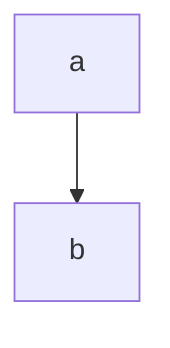

由于我是一个重度的 Graphviz 和 mermaid 用户，在我所使用的 markdown 编辑器，pandoc 转换成 pdf 及 gitbook 中都会经常用到，同时要得到一致的体验效果的话，就必须都加上支持。对于 graphviz 而言，博客上的 hexo 使用了一个过滤器的形式来进行实现。同时我使用的主题，我搜索了一下，据说是对于 mermaid 是默认有支持的，只需要开启两个变量就行了。

<!--more-->

# next 对 mermaid 的支持

在 [next 官方文档中](https://theme-next.org/docs/tag-plugins/mermaid) 确实有对支持的说明，但是我研究了一下，其使用的形式有点不对头。

他要求我们以 `{ % memriad type % }` 的形式来定义一个 mermaid 图形，但我在 markdown 呢是不会这样做的，这样的结果，就导致我不会得到一致性，同时在写作的时候也会增加更多的事情，因此，还是自己来手动进行一下才行。

# 问题

当我以简单的 `'''mermaid`  的形式来指定的时候，hexo 不会将这段代码渲染成我想要的东西，而是分隔开来的，我必须要告诉 hexo 这段代码，渲染成我们 mermaid.js 能使用的形式，事实上 viz.js 对 graphviz 的支持也是如此，是添加了一个过滤器的形式，来对这段代码添加一个 `{ % raw % }` tag，这样就不会进行渲染了。

# hexo-filter-viz 的实现

参考对于 [graphviz 的 viz.js实现](https://github.com/Gowa2017/hexo-filter-viz)，就是使用了过滤器的形式。在此处我们又不得不来介绍一下 hexo  相关的渲染过程了。

# Hexo 的渲染过程

根据 [hexo官方文档](https://hexo.io/zh-cn/api/)，页面生成分成三个步骤：

1. Hexo 实例初始化
2. 加载源文件（`load,watch`）。这两个方法实际上所做的，就是载入文件列表，并把文件传给相对应的处理器（Processor），当文件全部处理完毕后，就执行生成器（Generator）来建立路由。
3. 执行各种指令，如 generator

生成器 Generator 就会调用相应的引擎进行渲染了。

## Filter

我们可以在 Hexo 生成的过程中插入各种[过滤器](https://hexo.io/zh-cn/api/filter)，在进行渲染的过程中涉及到两个：

- 执行 `before_post_render` 过滤器
- 使用 Markdown 或其他渲染器渲染（根据扩展名而定）
- 使用 Nunjucks 渲染
- 执行 `after_post_render` 过滤器

所以，我们可以考虑在这两个过滤器，或者一个过滤器上动点手脚。

于是最终的版本，就放在 hexo-filter-viz 中完成了

