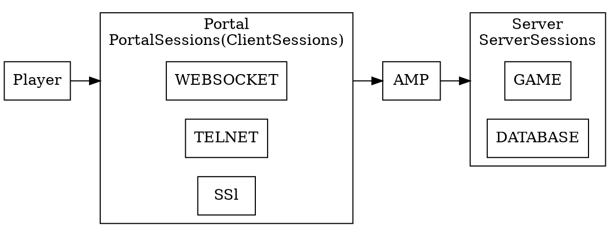
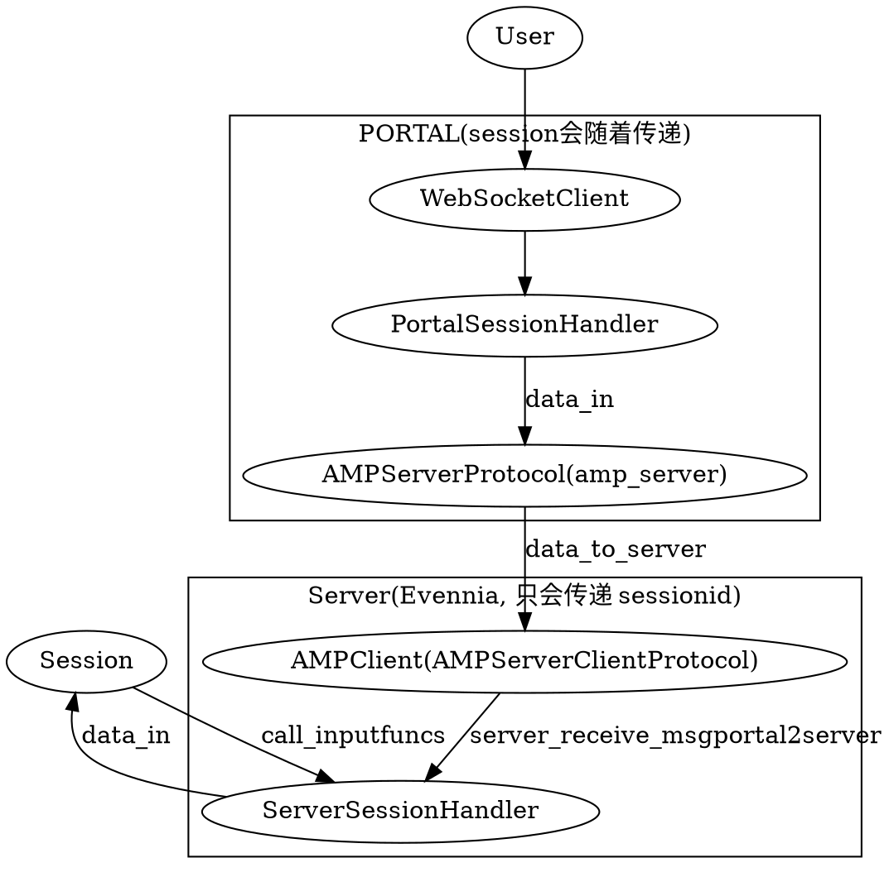
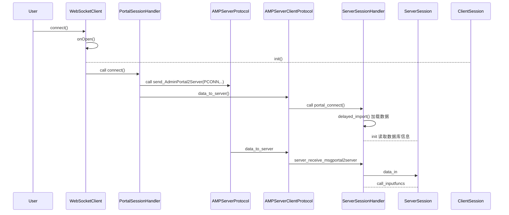
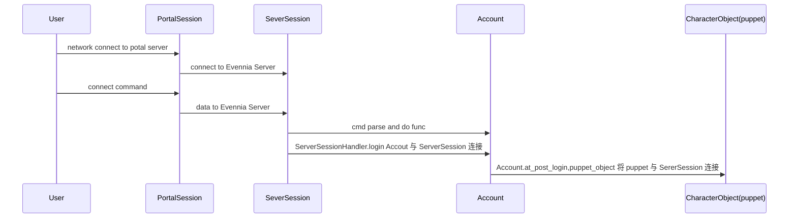
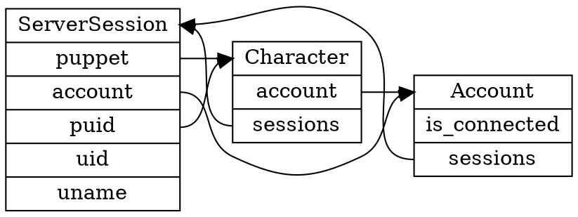

很抽象的，对连接建立到，将角色拉到游戏中，建立相关的属性，是如何实现这么一个过程的呢？有必要来研究一下。
这里我们就看一下用 websocket 连接时候的过程。
<!--more-->
在文章 我们已经大概知道了整个数据的流动过程。

一切都是从 websocket 服务器上的连接建立，然后 session 建立开始的。

# Portal 和 Server

整体上来看，整个 Evennia 分成两个进程， Portal Server ，两个进程都使用 twisted 来作为网络调度引擎，然后在两个进程内都开启了很多的服务：



这里面就涉及到一个比较重要的概念 **Sessions**，在 Evennia 中，一个 Session 代表了一个通信中的连接。每个 Session 对象都拥有相应的 **cmdset**，通常是 unlogined 。一个 Session 要边变成 logined 的，就必须通过账号密码的认证。在认证通过后，就会给 Session 关联上一个 Account 对象，然后这个 Account 个对象就可以控制多个 对象/角色。

其中 ，ServerSession 主要控制和游戏状态相关的内容，而 PortalSession 主要控制连接协议本身相关的东西。当一个网络连接建立的时候，即会建立一个  `PortalSession `。PortalSession 的一些通用的属性会通过 AMPServer 传递给 Game Server，此时就会建立一个 `ServerSession `。在 每个 PortalSession 和 ServerSession 有一一对应的关系，到达 PortalSession 的数据会镜像到 ServerSession。

Sessionhandlers 主要用来管理连接，我们有 PortalSessionHandler，ServerSessionHandler。

# EvenniaWebSocket

在 Potal 服务器中启动了 WebSocket 服务：

```py
                    # service/portal/portal.py
                    port = WEBSOCKET_CLIENT_PORT

                    class Websocket(WebSocketServerFactory):
                        "Only here for better naming in logs"
                        pass

                    factory = Websocket()
                    factory.noisy = False
                    factory.protocol = webclient.WebSocketClient
                    factory.sessionhandler = PORTAL_SESSIONS
                    websocket_service = internet.TCPServer(port, factory, interface=w_interface)
                    websocket_service.setName("EvenniaWebSocket%s:%s" % (w_ifacestr, port))
                    PORTAL.services.addService(websocket_service)
                    
```
这里的关键在于服务器的 factory 中，设置了一个 sessionhandler，也就是我们的 `PortalSessionHandler`。这里比较不好理解的是 twister 中的 internet.TCPServer 这么一个类到底是做了什么事情，他需要的三个参数  `port, factory, interface`，到底有什么意义呢？

就我们从现在看来，其实重要的还是 factory 这个参数，其指定了 protocol（应用层协议），sessionhandler，那么具体是如何工作的呢？

## internet.TCPServer

按照注释，TCPServer 会把参数原封不动动传递给 reactor.listen().

>They are as follows::
> 
>   TCPServer, TCPClient,
>   UNIXServer, UNIXClient,
>   SSLServer, SSLClient,
>   UDPServer,
>   UNIXDatagramServer, UNIXDatagramClient,
>   MulticastServer
> 
> These classes take arbitrary arguments in their constructors and pass
> them straight on to their respective reactor.listenXXX or
> reactor.connectXXX calls.

根据 [twisted文档的定义](https://twistedmatrix.com/documents/current/core/howto/servers.html)：

- Protocol 以异步的形式处理数据。处理从网络到达或者调用 Protocol 方法调用到达的数据。

也就是我们的数据最终都会叫给 我们这里的  `webclient.WebSocketClient` 而其又会将数据传递给 `PortalSessionHandler`。

这里可能看到 WebSocketClient 这个命令有点迷惑，实际上是这样的：

**此处的 WebSocket 冲动对外连接的 Server，但是其还需要连接至 Game Server 所以从 Game Server 的角度来看它其实是一个 Client 所以才会这样命名**

连接建立的时候， Session 建立，然后将数据传递给 Game Server。类的流转：



来看更清晰的图：




# 对象建立时序

## ServerSessionHandler

ServerSessionHandler 实际上管理了所有的 ServerSessions。

### portal_connect
我们这的，到连接建立的时候，Portal 会发送信息给 Server,这个时候就会建立 ServerSession:

```py
    # sessionhandler.ServerSessionHandler
    def portal_connect(self, portalsessiondata):
        delayed_import()
        global _ServerSession, _AccountDB, _ScriptDB

        sess = _ServerSession()
        sess.sessionhandler = self
        sess.load_sync_data(portalsessiondata)
        sess.at_sync()
        # validate all scripts
        _ScriptDB.objects.validate()
        self[sess.sessid] = sess
```

之后当我们用 `connect username password` 进行连接的时候，数据先到达 AMPClient，然后同样会到达  ServerSessionHandler。
### server_receive_msgportal2server
数据先到达  AmpClient ，在这里，会先从 Game Server 中根据 sessid 来获取对应的 Session，然后再交给 ServerSessionHandler。在这里，将  Evennia 中的 ServerSessionHandler 命令为 sessions 实在有点看起来很迷惑。不过看代码注释来看是为了兼容以前的代码：

```py
# sessionhandler.py
SESSION_HANDLER = ServerSessionHandler()
SESSIONS = SESSION_HANDLER  # legacy
```
```py
    # amp_client.AMPServerClientProtocol
    @amp.MsgPortal2Server.responder
    @amp.catch_traceback
    def server_receive_msgportal2server(self, packed_data):
        """
        Receives message arriving to server. This method is executed
        on the Server.

        Args:
            packed_data (str): Data to receive (a pickled tuple (sessid,kwargs))

        """
        sessid, kwargs = self.data_in(packed_data)
        session = self.factory.server.sessions.get(sessid, None)
        if session:
            self.factory.server.sessions.data_in(session, **kwargs)
        return {}
```
### data_in()

```py
     # sessionhandler.ServerSessionHandler
    def data_in(self, session, **kwargs):
        """
        将数据交给 Session 走一遍，Session 最终会调用下面个函数
        """
        if session:
            session.data_in(**kwargs)

    def call_inputfuncs(self, session, **kwargs):
        """
        Args:
            sessions (Session): Session.

        Kwargs:
            kwargs (any): Incoming data from protocol on
                the form `{"commandname": ((args), {kwargs}),...}`

        """

        # distribute incoming data to the correct receiving methods.
        if session:
            input_debug = session.protocol_flags.get("INPUTDEBUG", False)
            for cmdname, (cmdargs, cmdkwargs) in kwargs.items():
                cname = cmdname.strip().lower()
                try:
                    cmdkwargs.pop("options", None)
                    if cname in _INPUT_FUNCS:
                        _INPUT_FUNCS[cname](session, *cmdargs, **cmdkwargs)
                    else:
                        _INPUT_FUNCS["default"](session, cname, *cmdargs, **cmdkwargs)
                except Exception as err:
                    if input_debug:
                        session.msg(err)
                    log_trace()
```

## inputfuncs

根据文档定义，所有的输入函数都拥有一样的签名：

```python
   inputfunc(session, *args, **kwargs)
```

## connect命令

基本上大多数指令都会被封装成 `text` 输入函数进行发送：

```json
[text,{"cmd":"connect","args":{"playername":"gowa","password":"cccccc"}},{}]
```
`text` 输入函数，最终会将数据叫给 cmdhandler 进行处理：

```py
    cmdhandler(session, txt, callertype="session", session=session, **kwargs)
```

cmdhandler.py 最终会处理，将输入转换为命令，然后交给命令进行执行。

可以看到，对于一个命令，其调用者 caller 可能是 `obj, accout, session` 三种。

```py
# cmdhandler.py
    def _run_command(cmd, cmdname, args, raw_cmdname, cmdset, session, account):
        """
        Helper function: This initializes and runs the Command
        instance once the parser has identified it as either a normal
        command or one of the system commands.

        Args:
            cmd (Command): Command object
            cmdname (str): Name of command
            args (str): extra text entered after the identified command
            raw_cmdname (str): Name of Command, unaffected by eventual
                prefix-stripping (if no prefix-stripping, this is the same
                as cmdname).
            cmdset (CmdSet): Command sert the command belongs to (if any)..
            session (Session): Session of caller (if any).
            account (Account): Account of caller (if any).

        Returns:
            deferred (Deferred): this will fire with the return of the
                command's `func` method.

        Raises:
            RuntimeError: If command recursion limit was reached.

        """
        global _COMMAND_NESTING
        try:
            # Assign useful variables to the instance
            cmd.caller = caller
            cmd.cmdname = cmdname
            cmd.raw_cmdname = raw_cmdname
            cmd.cmdstring = cmdname  # deprecated
            cmd.args = args
            cmd.cmdset = cmdset
            cmd.session = session
            cmd.account = account
            cmd.raw_string = unformatted_raw_string
            # cmd.obj  # set via on-object cmdset handler for each command,
            # since this may be different for every command when
            # merging multuple cmdsets

            if hasattr(cmd, "obj") and hasattr(cmd.obj, "scripts"):
                # cmd.obj is automatically made available by the cmdhandler.
                # we make sure to validate its scripts.
                yield cmd.obj.scripts.validate()

            if _testing:
                # only return the command instance
                returnValue(cmd)

            # assign custom kwargs to found cmd object
            for key, val in kwargs.items():
                setattr(cmd, key, val)

            _COMMAND_NESTING[called_by] += 1
            if _COMMAND_NESTING[called_by] > _COMMAND_RECURSION_LIMIT:
                err = _ERROR_RECURSION_LIMIT.format(
                    recursion_limit=_COMMAND_RECURSION_LIMIT,
                    raw_cmdname=raw_cmdname,
                    cmdclass=cmd.__class__,
                )
                raise RuntimeError(err)

            # pre-command hook
            abort = yield cmd.at_pre_cmd()
            if abort:
                # abort sequence
                returnValue(abort)

            # Parse and execute
            yield cmd.parse()

            # main command code
            # (return value is normally None)
            ret = cmd.func()
            if isinstance(ret, types.GeneratorType):
                # cmd.func() is a generator, execute progressively
                _progressive_cmd_run(cmd, ret)
                yield None
            else:
                ret = yield ret

            # post-command hook
            yield cmd.at_post_cmd()

            if cmd.save_for_next:
                # store a reference to this command, possibly
                # accessible by the next command.
                caller.ndb.last_cmd = yield copy(cmd)
            else:
                caller.ndb.last_cmd = None

            # return result to the deferred
            returnValue(ret)

        except InterruptCommand:
            # Do nothing, clean exit
            pass
        except Exception:
            _msg_err(caller, _ERROR_UNTRAPPED)
            raise ErrorReported(raw_string)
        finally:
            _COMMAND_NESTING[called_by] -= 1
```

最终，执行命令对应的 `cmd.func()` 函数。

在 `commands.default.unloggedin` 中，定义了 `connect`此命令.


```py
# commands.default.unloggedin.CmdUnconnectedConnect
class CmdUnconnectedConnect(COMMAND_DEFAULT_CLASS):
    """
    connect to the game

    Usage (at login screen):
      connect accountname password
      connect "account name" "pass word"

    Use the create command to first create an account before logging in.

    If you have spaces in your name, enclose it in double quotes.
    """

    key = "connect"
    aliases = ["conn", "con", "co"]
    locks = "cmd:all()"  # not really needed
    arg_regex = r"\s.*?|$"

    def func(self):
        """
        Uses the Django admin api. Note that unlogged-in commands
        have a unique position in that their func() receives
        a session object instead of a source_object like all
        other types of logged-in commands (this is because
        there is no object yet before the account has logged in)
        """
        session = self.caller
        address = session.address

        args = self.args
        # extract double quote parts
        parts = [part.strip() for part in re.split(r"\"", args) if part.strip()]
        if len(parts) == 1:
            # this was (hopefully) due to no double quotes being found, or a guest login
            parts = parts[0].split(None, 1)

            # Guest login
            if len(parts) == 1 and parts[0].lower() == "guest":
                # Get Guest typeclass
                Guest = class_from_module(settings.BASE_GUEST_TYPECLASS)

                account, errors = Guest.authenticate(ip=address)
                if account:
                    session.sessionhandler.login(session, account)
                    return
                else:
                    session.msg("|R%s|n" % "\n".join(errors))
                    return

        if len(parts) != 2:
            session.msg("\n\r Usage (without <>): connect <name> <password>")
            return

        # Get account class
        Account = class_from_module(settings.BASE_ACCOUNT_TYPECLASS)

        name, password = parts
        account, errors = Account.authenticate(
            username=name, password=password, ip=address, session=session
        )
        if account:
            session.sessionhandler.login(session, account)
        else:
            session.msg("|R%s|n" % "\n".join(errors))

```
可以看到， connect 命令执行后，即会建立一个  Accout 对象，进行认证，通过后进入登录流程。

## ServerSessionHandler

### login

在这里，才会将我们的 ServerSession 与 Accout 相连接。

```python
    def login(self, session, account, force=False, testmode=False):
        if session.logged_in and not force:
            # don't log in a session that is already logged in.
            return

        account.is_connected = True

        # sets up and assigns all properties on the session
        session.at_login(account)

        # account init
        account.at_init()

        # Check if this is the first time the *account* logs in
        if account.db.FIRST_LOGIN:
            account.at_first_login()
            del account.db.FIRST_LOGIN

        account.at_pre_login()

        if _MULTISESSION_MODE == 0:
            # disconnect all previous sessions.
            self.disconnect_duplicate_sessions(session)

        nsess = len(self.sessions_from_account(account))
        string = "Logged in: {account} {address} ({nsessions} session(s) total)"
        string = string.format(account=account, address=session.address, nsessions=nsess)
        session.log(string)
        session.logged_in = True
        # sync the portal to the session
        if not testmode:
            self.server.amp_protocol.send_AdminServer2Portal(
                session, operation=SLOGIN, sessiondata={"logged_in": True, "uid": session.uid}
            )
        account.at_post_login(session=session)
        if nsess < 2:
            SIGNAL_ACCOUNT_POST_FIRST_LOGIN.send(sender=account, session=session)
        SIGNAL_ACCOUNT_POST_LOGIN.send(sender=account, session=session)
```

### ServerSession.at_login()

此事，才会将 ServerSession 与 Accout 相连接起来，不过此时，还没有 puppet 还没有角色连接起来。

```py
    def at_login(self, account):
        """
        Hook called by sessionhandler when the session becomes authenticated.

        Args:
            account (Account): The account associated with the session.

        """
        self.account = account
        self.uid = self.account.id
        self.uname = self.account.username
        self.logged_in = True
        self.conn_time = time.time()
        self.puid = None
        self.puppet = None
        self.cmdset_storage = settings.CMDSET_SESSION

        # Update account's last login time.
        self.account.last_login = timezone.now()
        self.account.save()

        # add the session-level cmdset
        self.cmdset = CmdSetHandler(self, True)
```
### account.at_init

Evennia 的默认对象是 DefaultAccout。
位于 `evennia.accouts.accouts` 中， at_init ，at_pre_login只是钩子函数，默认没有实现，我们定义自己的账号的时候可以此处做点事情。

### account.at_post_login

在这个钩子中，实现了角色的载入，我们暂时只看 _MULTISESSION_MODE == 0 的时候。

```py
    def at_post_login(self, session=None, **kwargs):
        """
        Called at the end of the login process, just before letting
        the account loose.

        Args:
            session (Session, optional): Session logging in, if any.
            **kwargs (dict): Arbitrary, optional arguments for users
                overriding the call (unused by default).

        Notes:
            This is called *before* an eventual Character's
            `at_post_login` hook. By default it is used to set up
            auto-puppeting based on `MULTISESSION_MODE`.

        """
        # if we have saved protocol flags on ourselves, load them here.
        protocol_flags = self.attributes.get("_saved_protocol_flags", {})
        if session and protocol_flags:
            session.update_flags(**protocol_flags)

        # inform the client that we logged in through an OOB message
        if session:
            session.msg(logged_in={})

        self._send_to_connect_channel(f"|G{self.key} connected|n")
        if _MULTISESSION_MODE == 0:
            # in this mode we should have only one character available. We
            # try to auto-connect to our last conneted object, if any
            try:
                self.puppet_object(session, self.db._last_puppet)
            except RuntimeError:
                self.msg("The Character does not exist.")
                return
        elif _MULTISESSION_MODE == 1:
            # in this mode all sessions connect to the same puppet.
            try:
                self.puppet_object(session, self.db._last_puppet)
            except RuntimeError:
                self.msg("The Character does not exist.")
                return
        elif _MULTISESSION_MODE in (2, 3):
            # In this mode we by default end up at a character selection
            # screen. We execute look on the account.
            # we make sure to clean up the _playable_characters list in case
            # any was deleted in the interim.
            self.db._playable_characters = [char for char in self.db._playable_characters if char]
            self.msg(
                self.at_look(target=self.db._playable_characters, session=session), session=session
            )
```

在self.puppet_object 中会将角色与 Accout 及 ServerSession 相互关联起来。这个过程就结束了。


## 时序图



# Accout, ServerSession, Character 关系



