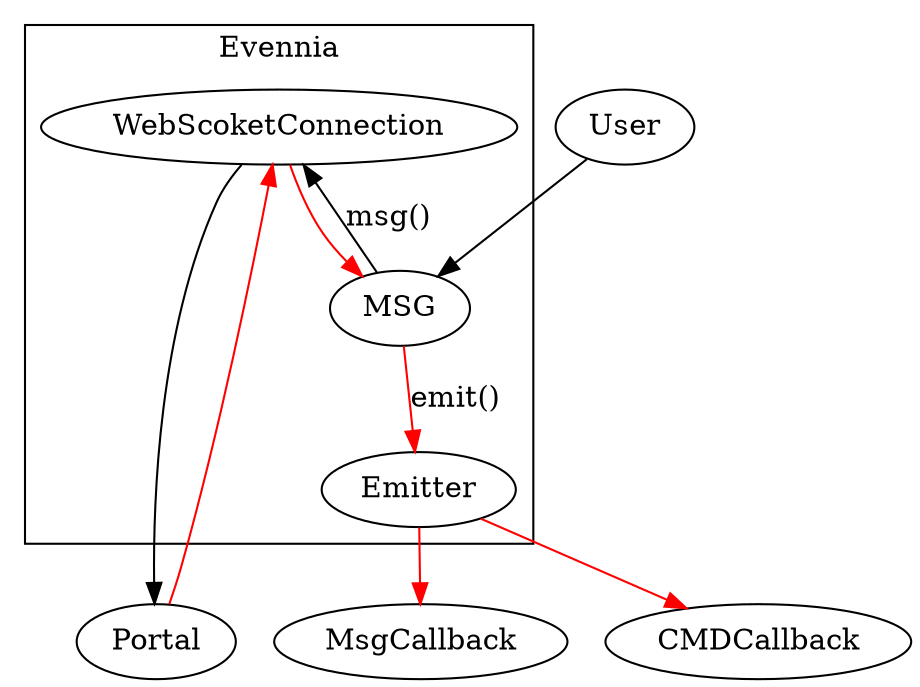

Eevenia 内建了对于 WebSocket 的支持，在浏览器上的时候就是使用其进行通信的。其本质是将我们的输入的文字，封装成为对应的 **输入函数**，**命令**，组成的 JSON 格式的数据，发送给服务端进行处理。现在我准备在 Cocos 上完成这个工作，所以来研究一下其实现。

<!--more-->

# 基本框架

在源码 [evennia.js](https://github.com/evennia/evennia/blob/master/evennia/web/webclient/static/webclient/js/evennia.js) 中，可以看到相关的信息。 Evenia 的客户端有两个主要的元素组成：

- **connection**。代表与服务器 *Portal* 的一个连接，可以往这个连接上发送消息。
- **emitter**。一个自定义的发射器，有默认实现。在 connection 收到消息后，会调用此发射器将数据进行 JSON 反序列号后发射出去。

其同时还定义了两个数据

- **cmdid**，命令序号，每发送一次消息，序号就会递增，主要是为了来进行与响应相对应。这个序号只有在我们 Evennia.msg() 的时候，指定了回调的情况下，能够将消息分发回去有用。
- **cmdmap**。以 cmdid 作为索引的结构，主要是为了用来记录某个 cmdid 的命令所对应的回调。当我们调用 Evennia 的时候设置了回调，那么就会被执行；而如果发送消息的时候，没有设置回调，那么就会将回调发送到 `emitter` 某种类型命令的回调去，如 `text`。


## init()

主要实现对于网络连接的初始化。默认情况下会有一个 *emitter, connection* 的实现，当然，我们也可以按照其格式自己实现相关的数据结构。

```js
        init: function(opts) {
            if (this.initialized) {
                // make it safe to call multiple times.
                return;
            }
            this.initialized = true;

            opts = opts || {};
            this.emitter = opts.emitter || new DefaultEmitter();

            if (opts.connection) {
               this.connection = opts.connection;
            }
            else if (window.WebSocket && wsactive) {
                this.connection = new WebsocketConnection();
            } else {
                this.connection = new AjaxCometConnection();
            }
            log('Evennia initialized.')
        }
```

初始化的时候调用应该类似：

```js
Evennia.init({emitter: em, connection: conn})
```


## msg()

当我们想要往服务器发送消息的时候调用此方法：

```js
        msg: function (cmdname, args, kwargs, callback) {
            if (!cmdname) {
                return;
            }
            if (kwargs) {
                kwargs.cmdid = cmdid++;
            }
            var outargs = args ? args : [];
            var outkwargs = kwargs ? kwargs : {};
            var data = [cmdname, outargs, outkwargs];

            if (typeof callback === 'function') {
                cmdmap[cmdid] = callback;
            }
            this.connection.msg(data);

        },
```

我们看到，消息的格式类似

```js
[str, [], {}]
```

的形式， str 指定的是要执行的命令，注意要与 **输入函数区别开来**，绝大部分消息的输入函数都是 `text`，而将命令作为输入函数的参数进行传递，如：

```json
["text",["connect gowa ccc"],{"cmdid":0}]
```

而后，这个消息就会被 Server 的 `text` 输入函数处理，构造 `connect` 命令执行。

## emit()

这个函数，用来将 Server 返回的数据进行发射出去。

```js
        emit: function (cmdname, args, kwargs) {
            if (kwargs.cmdid) {
                cmdmap[kwargs.cmdid].apply(this, [args, kwargs]);
                delete cmdmap[kwargs.cmdid];
            }
            else {
                this.emitter.emit(cmdname, args, kwargs);
            }
        },

```

我们看到，如果对于返回的消息中带有 *cmdid*，那么就会将消息发射至此 *cmdi*d  对应的回调函数内去。

而如果返回的消息不是针对某个 *cmdid*  的，那么就会将消息交由 `emitter` 进行处理，原封不动。

# DefaultEmitter

`Emitter` 的默认实现。其定义了一个数据结构 

- listeners。以命令作为索引，然后其值是对应的命令的消息处理器。对于找不到相应的消息处理器的，那么就会调用一个叫做 *default* 的消息处理器。

还定义了三个方法，我们实现 `Emitter` 的时候必须实现这三个方法：


- emit(cmdname, args, kwargs)：发射数据到我们相应的命令接收器。
- on(cmdname, listener)：添加指定类型消息的处理器。
- off(cmdname)：移除指定类型消息处理器。


# 消息图



