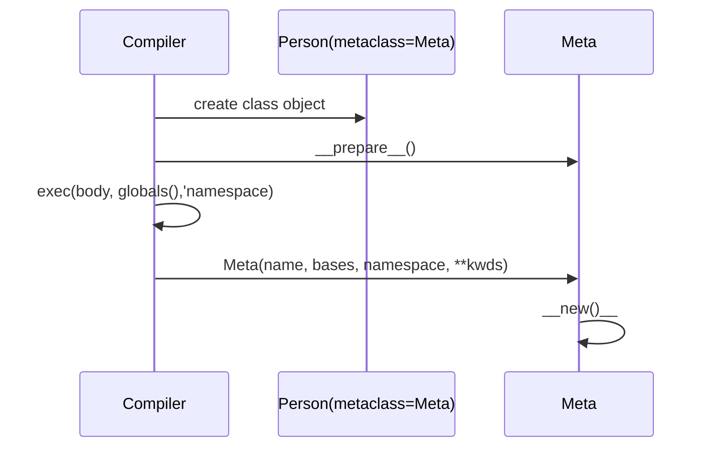

是在看到，某些地方用到了 *metaclass*  这个概念的时候，才想要来了解一下这个的，因为实在看不清楚代码最终的动向，结果是什么。为何要那样做。而且 Python 还是有点灵活和复杂的，而且我觉得，很多地方应该都不用到所谓 *metaclass* 这个概念的。

<!--more-->

# Objects, values, types

*Objects* 是 Python 对数据的抽象。所有 Python 程序中的数据都用 对象 或者 是 对象 间的关系来表示。

> 某种意义上说，按照冯·诺依曼（Von Neumann）的“存储程序计算机”模型，代码也由对象表示.

每个 对象  有一个*标识，类型和值*。一个 对象 的 标识 在建立后就永不会改变；我们可以把它想象为 对象 在内存中的地址。`is` 操作符会比较两个对象间的标识；`id()` 函数返回一个其标识的整型表示。

对象的 **类型** 决定了这个对象支持的 操作，同时也定义了此种类型的对象可能的值。`type()` 函数返回一个对象的类型（实际上也是一个对象）。和对象的标识一样，，一个对象的 *类型* 也是不可改变的。

某些对象的 *值* 可能会改变。值可以改变的对象被称作 *mutable（可变的）*；值在建立后就不可改变的被称作 *immutable*。（一个不可改变的容器对象，其内如果引用了个可改变的对象，当其引用的对象值变化时，这个时候容器对象会变化；但是这个容器依然被看作是不可变的，因为容器内的引用哪些对象是不可改变的。因此，不可变性严格的来说和有一个不可改变的值不一样，不可变性更加细微些）。一个对象的可变性通过其类型来决定；具体而言，*numbers, strings, truples* 是不可变的，而 *dict, list* 是可变的。

对象从来不会显示的销毁；然后，当他们不再可达的时候，将会被垃圾回收器回收。

# 类[对象]

事实上，我们常常说到类的时候，我们确切的说，应该是说的通过我们在代码内，定义了一个类，而 Python 根据我们的定义，建立的一个 **类对象**。**类对象**，只在遇到我们的定义的类代码时才会建立。

自定义的类型典型的是通过一个类的定义来建立。**类有一个通过字典对象来实现的命名空间。**类属性的引用会被转换到在此字典内进行查询，如 `C.x` 会被转换到 `C.__dict__["x']`（当然，这里有很多的 hook 来让我们定位属性）。当属性名称在此找不到的时候，就会继续在 父类进行查找。对于父类属性的查找使用  C3 method resolution order。关于这个 C3 MRO 的定义可以查看 [https://www.python.org/download/releases/2.3/mro/](https://www.python.org/download/releases/2.3/mro/)。

当一个类的属性引用（例如我们叫这个类 C）将会产生一个 **类方法对象** 时，其会被转换成一个 **实例方法对象**，此对象的 `__self` 属性是 C 。当其可能会产生一个 **静态方法对象**时，其将会被转换成一个被 **静态方法对象** 包装的对象。查看 [https://docs.python.org/3/reference/datamodel.html#descriptors](https://docs.python.org/3/reference/datamodel.html#descriptors) 来了解一下获取属性的其他方式，这可能会和从 `__dict` 的不同。

类属性的赋值会更新类的 `__dict`，而不是父类的。

特殊属性

- `__name__` 类名称
- `__module__` 类定义的模块
- `__dict__` 包含类命名空间的字典
- `__bases` 一个元组，包含了所有的父类
- `__doc__` 类的文档字符串，未定义的是 Node
- `__annotationsZ__`，可选的，一个字典，在类体执行的时候收集了变量的注解。

## 调用性

类[对象] 是可调用的。我们在代码内定义一个类，但是对于 Python 来说，其会将我们的定义转换一个对象，叫做 **类对象。一个** **类对象** 可以被调用来产生一个 **类实例**。

**类对象** 通常是表现得像是一个工厂函数，用来建立新的实例，但是对于 类的类型重写了 `__new()__` 方法是会有变化。调用类对象的参数会传递给 `__new__()`，典型的情况下，会又传递给 `__init__` 来初始化新的实例。

- `__new__()` 用来建立一个新实例对象
- `__init__()` 则用来初始化刚建立的实例对象

## 类的定义

如上所说，类的定义实际上会在运行时，由 Python 建立一个 **类对象**。

一个类定义也是一个可执行的 语句。

```
classdef    ::=  [decorators] "class" classname [inheritance] ":" suite
inheritance ::=  "(" [argument_list] ")"
classname   ::=  identifier
```

*inheritance* 通常会是一列表，表示要继承的父类，因此呢，这里面的每个项都会被看作是一个允许继承 **类对象**，没有 *inheritance* 的类默认是从 *object* 继承。

接下来，类的 *suite* 就会在一个新的 **执行帧** 内执行，使用的是一个新建立的本地命名空间和原始的全局命名空间。（通常，*suite* 会包含很多函数定义）。当 *suite* 执行结束，**执行帧** 会被丢弃，但是本地命名空间会保存。接着就会使用 *inheritance* 列表作为父类，和刚保存的本地命名空间作为属性字典来建立一个 **类对象**。

在类体内定义的属性顺序会在新间的类对象中的 `__dict__` 内保留。但是这只在类已经建立后和这些类是用上面的类定义语法定义时可靠。

**可以用 [metaclass](https://docs.python.org/3/reference/datamodel.html#metaclasses) 来自定义类的建立**

# 类实例

一个 **类实例** 通过调用一个 **类对象** 来建立。一个 **类实例** 有一个用字典来实现的命名空间，对于属性的引用会首先搜索这个字典。

当一个属性在字典内找不到时，但 **类实例** 的 **类[对象]** 有这么一个属性时，那么就使用类的属性来搜索。

如果找到的类属性是一个用户定义的函数对象，那么其会被转换成一个实力方法对象，此对象的 `__self__` 属性是实例本身。

静态方法和类方法对象也会被转换。

如果没有找到任何属性，但是 **类实例** 有一个 `__getattr__()` 方法，那么就会调用此方法。

属性的赋值和删除会更新 实例的字典，而不是一个类对象的字典。（这很自然，如果多个实例，都能更新类对象的字典就会引起混乱）如果类对象有 `__setattr__(), __delattr__()`，则会调用类对象的此两个方法，而不是直接更新实例的字典。

- `__dict__` 属性字典
- `__class__` 实例的类对象

# Metaclasses

默认情况下，类是通过 `type()` 函数建立的。类体（类定义语法中的 *suite*）会在一个新的执行帧中有一个新的命名空间来执行，同时类名被绑定 `type(name, base, namespace)` 返回的对象中。

类对象的建立过程可以通过在类的定义行传递 `metaclass` 关键字参数来自定义，或者通过继承一个已经有了这么一个参数的类来实现。在下面的例子中，*MyClass, MySubclass* 都是 *Meta* 的实例：

```python
class Meta(type):
    pass

class MyClass(metaclass=Meta):
    pass

class MySubclass(MyClass):
    pass
```

如果指定的了其他关键字参数都会传递给所有的 `metaclss` 操作中。

当一个类的定义被执行时，会按照以下的步骤：

1. MRO 项被解析
2. 决定合适的 metaclass
3. 准备类的命名空间
4. 执行类体
5. 建立类对象

## MRO 解析

如果在类的定义中包含了并不是 *type* 的一个父类，那么就会在此父类对象上执行 `__mro_entries__` 方法。如果有找到，那么就会以原始的父类的元组来调用。这个方法必须返回有类组成的元组，这将会替代定义中指定的父类被使用。这个元组可能为空，这样的情况下就使用类定义中的父类。

## 决定合适的 metaclass

一个类定义合适的 metaclass 按照如下顺序来决定：

- 未指定 bases 或没有显式指定 metaclass，那么就会使用 `type()`。
- 如果显式指定了 metaclass，且其不是一个 `type()` 的实例，那么就直接使用它。
- 如果显式指定的 metaclass 是一个 `type()` 的实例，或者定义了 bases，那么最派生的 metaclass 被使用。

最派生的metaclass 指的是：所有指定的 metaclass 的子类型。 这个子类型会通过显式指定的 metaclass 和所有 bases 的 metaclass 中进行选取。如果没有符合条件的 metaclass，将会抱出一个 *TypeError*。

## 准备类的命名空间

一旦合适的 metaclass 已经决定了，那么就开始准备命名空间。如果 metaclass 有一个 `__prepare__` 属性，那么就会以 `namespace = metaclass.__prepare__(name, bases, **kwds)` 的形式调用。

`__prepare__` 应该被实现为 *classmethod*，其返回的命名空间会传递给 `__new___` 使用。但是在类对象建立后，则会复制一份到类对象的 `__dict__` 里面去。

如果 metaclass 没有 `__prepare__` 属性，那么类的命名空间就是一个空的 *dict*。

## 执行类体

类体（类定义中的 suite）会被 `exec(body, globals(), namespace)` 来进行执行。这个普通的执行 `exec()` 关键不同处在于：当类定义是在一个函数中的时候，词法范围允许类体（含其类所有的方法）从当前的作用域和外部的作用语引用所有的名字。

然而，即使类定义在一个函数中，在此类中定义的方法依然不能看到在类作用域内定义的名字。类变量必须通过实例的定义个参数或类的方法来访问，或者使用隐式的词法作用域 `__class__` 引用，下一节会介绍。


## 建立类对象
当类的命名空间被执行类体所填充后，类对象通过调用 `metaclass(name, bases, namespace, **kwds)` 建立。

这个类对象才是会被以无参数的 `super()` 引用的那个。如果类主体中的任何方法引用`__class__`或`super`，则__class__是编译器创建的隐式闭包引用。这允许 `super()`  基于词法作用域正确的识别定义的类，而进行本地调用类或实例的时候，则是通过传递给 `super()` 的第一个参数来识别。

在 3.6 后，`__class__` 会传递给 metaclass 命名空间中的 `__classcell__`。如果有，那么必须传播到 `type.__new__` 调用，以便正确的初始化。

当使用默认的 `type` 或者最终调用 `type.__new__` 的 metaclass，在建立类对象后还会做以下的事情：

1. `type.__new__` 会收集类命名空间中定义__set_name __（）方法的所有描述符；
2. 所有的`__set_name__` 方法都会被在其定义的类对象和特定描述符的已赋值名称下执行。
3. `__init_subclass__() ` 新类的直接父类上以其 MRO 顺序调用。

在类对象建立后，其会被传递给类中包含的装饰器，其返回作为已定义的类绑定到本地的命名空间中。

如果一个类对象通过 `type.__new__,` 建立，作为名称空间参数提供的对象将被复制到新的有序映射，并且原始对象将被丢弃。新副本包装在只读代理中，该代理成为类对象的__dict__属性。

# 过程图



# 实例

我们来验证一下这个过程：

```python
class Meta(type):
    def __new__(name, bases, namespace, kwargs):
        print('create class object')
        return super().__new__(name,bases,namespace, kwargs)
    def __prepare__(name, bases, **kwds):
        print('prepare namespace')
        return {'a':1,'b':2}
class Person(metaclass=Meta):
        print('exec class body')
        pass

p = Person()
print(p.a)

```

```sh
prepare namespace
exec class body
create class object
1
```

# type()
实际上 `type()` 是一个类。他是一个重载的类，可以接收 1 个或者 3 个参数。

- 1 个参数时。返回给定 *对象* 的类型。返回的值是一个 **类对象**，通常会和 `object.__class__` 相同
- 3 个参数时。 返回一个新的 **类对象**。这是一个 `class` 语法的动态形式。

刚才的例子我们可以用 `type()` 来查看一下我们的类型：

```python
print(type(Person))
print(type(p))
print(type(Meta))
```
```sh
<class '__main__.Meta'>
<class '__main__.Person'>
<class 'type'>
```

# 总结

1. Python 在遇到 `class` 语法的时候会准备建立 **类对象**
2. 如果 `class` 定义的时候没有指定 `metaclass` ，那么会默认使用  `type()` 来建立。
3. 如果指定了 `metaclass`，那么就会调用  `metaclass.__prepare__(name,bases, **kwds)` 来建立命名空间。
4. Python 执行 类体代码
5. 调用 `metaclass(name, bases, namespace, **kwds)`来建立 **类对象**，最终实际上会调用到 `__new__()` 方法。

`metaclass` 是控制我们定义的类，在 Python 中的 **类对象** 是如何建立的。这通过控制命名空间和初始化来建立。

我们可以得出这么一个结论：

- **类对象** 用来建立类。
- **类对象** 却由 `metaclass` 来建立。
- 任何对象，由谁建立，那么他就是谁的实例。


# 几个特殊方法

## `__call__`

> 在 **类对象** 中定义了 `__call__`  方法，那么所有的 **类实例** 都可以用 `inst()` 的形式进行调用。

Person 是一个 **类对象**，其并没有定义 `__call__`，所以其实例是无法进行调用的。

> __call__ 这个方法是定义在类对象上的，能让类实例被调用。

而  Person 也是一个对象，其 **类对象** 是 `Meta`，`Meta` 继承自 `type()`，其拥有 `__call__`，所以可以调用。

```python
p = Person()
```

但是 

```python
p()
```

是不可行的。

想要 Person 的实例都可调用，则 Person 定义的时候，就必须加上 `__call__` 方法。

## `__new__`
用来建立一个新对象，这个时候对象并没有建立，所以其是一个 **类方法**，静态方法的意思。
## `__init__`
用来初始化一个对象，这个时候对象已经建立，所以可以接收一个 `self` 参数。