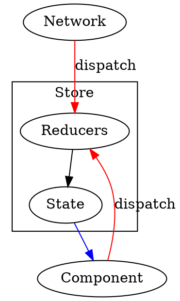
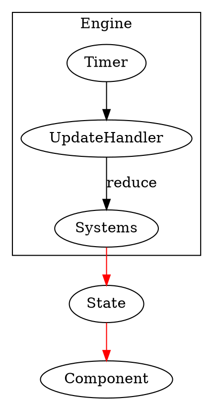

在之前的文章中就有说过，对于 Redux而言。其作为一个状态管理器，只允许我们通过 `reducer` 来修改 Store 里面的 State。然后，当状态改变后，交由 React[Native] 进行确定是否重新进行渲染。而今天看到了 [React Native Game Engine](https://github.com/bberak/react-native-game-engine) 如出一辙，不过那个是定时进行渲染罢了。

<!--more-->

# Redux



究其原理，React Redux 会通过 Provider ，将 Store 暴露给 React 的组件。

```js
  <Provider store={store}>
    <App />
  </Provider>
```

同时其提供了一个 `connect()`，使我们的组件能够与此 Store 连接起来。

```js
connect(
  mapStateToProps,
  mapDispatchToProps
)(Counter)
```

 在此过程中，我们可以把一部分 State 的内容进行选择，成为我们组件的 `props` 属性，同时，会将 `Store,dispatch` 的也映射过去，方便进行触发 `reducers`。

剩下的就交给 React 了。

# React Native Game Engine

这个所做的事情，大同小异了。抛开其包装的许多功能不说。首先其会设置一个定时器：

## Timer

```js
// GameEngine
    this.timer = props.timer || new DefaultTimer();
```

```js
// DefaultTimer
export default class DefaultTimer {
  constructor() {
    this.subscribers = [];
    this.loopId = null;
  }

  loop = time => {
    if (this.loopId) {
      this.subscribers.forEach(callback => {
        callback(time);
      });
    }

    this.loopId = requestAnimationFrame(this.loop);
  };

  start() {
    if (!this.loopId) {
      this.loop();
    }
  }

  stop() {
    if (this.loopId) {
      cancelAnimationFrame(this.loopId);
      this.loopId = null;
    }
  }

  subscribe(callback) {
    if (this.subscribers.indexOf(callback) === -1)
      this.subscribers.push(callback);
  }

  unsubscribe(callback) {
    this.subscribers = this.subscribers.filter(s => s !== callback)
  }
}

```

然后会在其内加上一个回调：

```js
// GameEngine
    this.timer.subscribe(this.updateHandler);
```

这样每次定时器到点，都会执行我们的回调。

## updateHandler

```js
  updateHandler = currentTime => {
    let args = {
      touches: this.touches,
      screen: this.screen,
      layout: this.layout,
      events: this.events,
      dispatch: this.dispatch,
      time: {
        current: currentTime,
        previous: this.previousTime,
        delta: currentTime - (this.previousTime || currentTime),
        previousDelta: this.previousDelta
      }
    };

    let newState = this.props.systems.reduce(
      (state, sys) => sys(state, args),
      this.state.entities
    );

    this.touches.length = 0;
    this.events.length = 0;
    this.previousTime = currentTime;
    this.previousDelta = args.time.delta;
    this.setState({ entities: newState });
  };
```

其关于在于：

```js
    let newState = this.props.systems.reduce(
      (state, sys) => sys(state, args),
      this.state.entities
    );
```

这段代码，会对所有我们传入的 `reducers` 进行依次调用：

```js
arr.reduce(callback( accumulator, currentValue[, index[, array]] )[, initialValue])
```

其结果，就是就当前的状态，获得一个新的状态，然后改变状态，最后交给 React 进行渲染。

## Array.prototype.reduce()

这个方法，会每数组中的每个元素执行一个由我们提供的 `reducer`，然后得出单个结果。其原型如下：

```js
arr.reduce(callback( accumulator, currentValue[, index[, array]] )[, initialValue])
```

对于我们的 `reducer`，其接收四个参数:

1. Accumulator(`acc`) 累加器
2. Current Value(`cur`) 当前值
3. Current Index(`index`) 当前索引
4. Source Array(`src`) 源数组

对于 `reducer` 执行后返回的结果，会存储在 `acc` 中，那么在多次迭代中会记录这个值。

## Reducer

回头看 GameEngine 中，对于 `systems` 的使用：

```js
    let newState = this.props.systems.reduce(
      (state, sys) => sys(state, args),
      this.state.entities
    );
```

可以把每个我们传入的 `sys` 看作是 Reducer。

```js
const MoveFinger = (entities, { touches }) => {
  touches.filter(t => t.type === "move").forEach(t => {
    let finger = entities[t.id];
    if (finger && finger.position) {
      finger.position = [
        finger.position[0] + t.delta.pageX,
        finger.position[1] + t.delta.pageY
      ];
    }
  });

  return entities;
};
```

这个只会根据 `touches` 来改变位置信息。



如果我们改造一下：

```dot
digraph {
subgraph cluster_store{
label=Store
Reducers  -> State[color=red]
Systems
}
subgraph cluster_engine{
label=Engine
UpdateHandler  -> GameComponent[style=dotted,label=setState]
Timer -> UpdateHandler
 UpdateHandler -> Systems[label=dispatch]
}
Systems -> State -> Component[color=red]
Network -> Reducers

Component -> State[label=connect]
GameComponent -> State[label=connect,style=dotted]
}
}
```

但是这样改造的后，Game Engine 内的组件可以使用 `connect` 的形式连接 Redux ，或者由 Game Engine 来 `connect`，然后向下传递，进行修改。