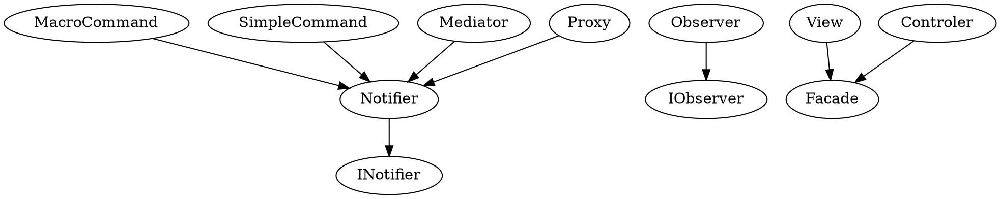
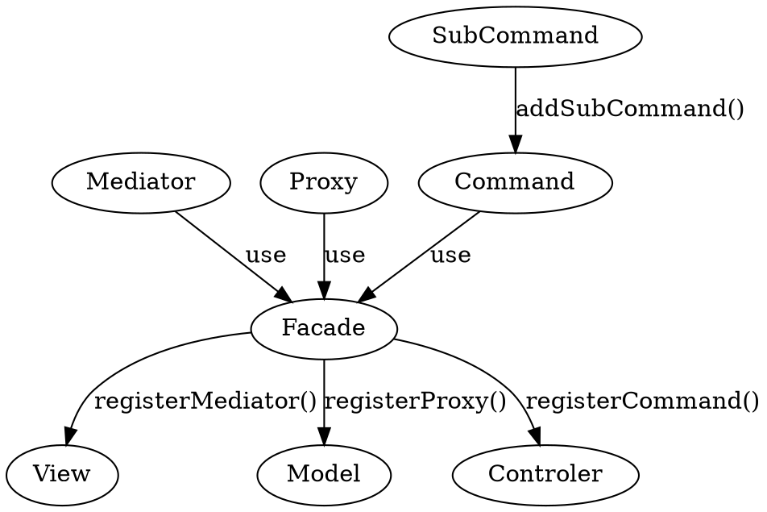
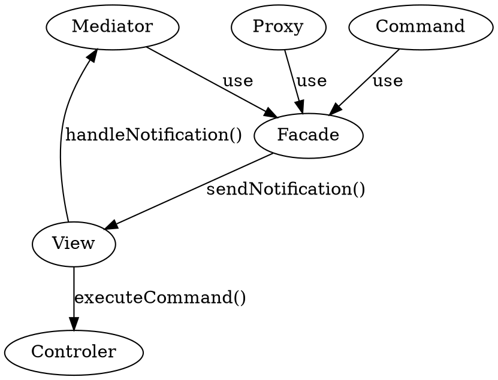

据说是在游戏开发的时候，利用 Cocos Creator 来做的时候，对于复杂的情况下，实际上没有一个比较完整的架构是会比较恼火的。所以看到很多人都用了 PureMVC 来进行做管理框架。而在之前所涉及的一个游戏中，也看到在 Cocos2D-lua 中有过 PureMVC-LUA 的实现来做的。。

<!--more-->

# 架构图


其中就用到来一个 Facade 模式，6 个角色。

# 核心组件

- View
- Model
- Controller

# 角色

- Facade 这个用来连接 Model, View, Controler，外部的组件（角色）不会直接访问 这三者，而是通过 Facade 来进行。**M/V/C** 及 Facade 都是单例的。
- View/Mediator。Mediator 会通过 Facade 注册到 View 中。由其负责管理其所引用的一个或多个 View Components ，而规范的来说，各个 View Components 会将其自身的一些 API 暴露给 Mediator。其主要职责：**是处理 View Component 派发的事件和系统其他部 分发出来的 Notification（通知）**。同时因为 Mediator 也会经常和 Proxy 交互，所以经常在 Mediator 的构造方法中取得 Proxy
- Model/Proxy。Proxy 会通过 Facade 注册到 Model 中，每个 Proxy 用来管理一部分数据。这里有一个原则就是：**Proxy 不监听 Notification，也永远不会被通知，因为 Proxy 并不关心 View 的状态。但是，Proxy 提供方法和属性让其它角色更新数据。 ** Proxy 应该是通过 Notification 的形式来通知 View 状态的变化。
- Controler/Command：Controller 保存所有 Command （类引用）的映射。Command 类是无状态的，只在需要时才被创建。 Command 可以获取 Proxy 对象并与之交互，发送 Notification，执行其他 的 Command。经常用于复杂的或系统范围的操作，如应用程序的“启动”和 “关闭”。应用程序的业务逻辑应该在这里实现。

# 通信

PureMVC 使用了一个观察者模式来进行相互之间的通信。你可以不用关心 PureMVC 的 Observer/Notification 机制是怎么实现的，它 已经在框架内部实现了。你只需要使用一个非常简单的方法从 Proxy, Mediator, Command 和 Facade 发送 Notification，甚至不需要创建一个 Notification 实例。

# 应用

实际上，多数时候，我们都不用管理 **M/V/C**，我们只需要自己实例化一个 Facede ，实现一些我们自己的逻辑。然后把重点聚焦于 **Mediator, Proxy, Command** 上就行了。

# 角色

## Mediator

通常，我们会将一个 Mediator 通过 Facade 来注册到 View 中，在注册的时候，我们会知道 Mediaotr 会关注哪些事件，并为其建立观察者。**当我们发送通知的时候，Mediator 回调是其实现的 handlerNotification 方法**

```js
// facade.js
Facade.prototype.registerMediator = function (mediator) {
  if (this.view != null) {
    this.view.registerMediator(mediator);
  }
};
```

```js
//View.js
View.prototype.registerMediator = function (mediator) {
  if (this.mediatorMap[mediator.getMediatorName()] != null) {
    return;
  }

  mediator.initializeNotifier(this.multitonKey);
  // register the mediator for retrieval by name
  this.mediatorMap[mediator.getMediatorName()] = mediator;

  // get notification interests if any
  var interests = mediator.listNotificationInterests();

  // register mediator as an observer for each notification
  if (interests.length > 0) {
    // create observer referencing this mediators handleNotification method
    var observer = new Observer(mediator.handleNotification, mediator);
    for (var i = 0; i < interests.length; i++) {
      this.registerObserver(interests[i], observer);
    }
  }

  mediator.onRegister();
};

View.prototype.registerObserver = function (notificationName, observer) {
  if (this.observerMap[notificationName] != null) {
    this.observerMap[notificationName].push(observer);
  } else {
    this.observerMap[notificationName] = [observer];
  }
};
```

对于每个 Mediator 所关心的事件，可以通过 `mediator.listNotificationInterests()` 来获取，然后为每个通知建立一个观察者，最终，则是会回调 `mediator.handleNotification()` 方法。

由于 Mediator 经常需要于 Proxy 交互，所以 Facade 提供了这么一个方法来获取 Proxy。**我们不应该向 Proxy 发送任何的 Notification，直接调用就是了**

```js
Facade.prototype.retrieveProxy = function (proxyName) {
  return this.model.retrieveProxy(proxyName);
};
```

## Command

这是一些我们实现一下游戏逻辑的地方。**应用程序的业务逻辑应该在这里实现。**同样，我们通过 Facade 来注册命令到 Controler。

```js
// facade.js
Facade.prototype.registerCommand = function (
  notificationName,
  commandClassRef
) {
  this.controller.registerCommand(notificationName, commandClassRef);
};
```

```js
// Controler.js
Controller.prototype.registerCommand = function (
  notificationName,
  commandClassRef
) {
  if (this.commandMap[notificationName] == null) {
    this.view.registerObserver(
      notificationName,
      new Observer(this.executeCommand, this)
    );
  }

  this.commandMap[notificationName] = commandClassRef;
};
```

我们看到，实际上，Command 的注册，也会在 View 中建立一个观察者。

也就是说，对于 listeners 和 Comannd 都是在 View 中进行引用的。

只不过，Command 会是在 Controler 的环境内，调用 controler.executeCommand() 方法，而对于 Mediator ，则是每个 Mediator 自己的 `handleNotification()` 方法。

## Notification

我们可以在 Mediaotr, Proxy, Command 中发送通知，但是只有 Mediator 会监听通知，进行回调。对于 Command 只会在有通知的时候，直接执行。具体而言就是 Command 的收到 Notifacation 的回调是 `controler.executeCommand()` 方法，而 Mediator 是其自己实现的 `handleNotification()`。

```js
// facade.js
Facade.prototype.sendNotification = function (notificationName, body, type) {
  this.notifyObservers(new Notification(notificationName, body, type));
};

Facade.prototype.notifyObservers = function (notification) {
  if (this.view != null) {
    this.view.notifyObservers(notification);
  }
};
```

```js
// View.js

View.prototype.notifyObservers = function (notification) {
  // SIC
  if (this.observerMap[notification.getName()] != null) {
    var observers_ref = this.observerMap[notification.getName()],
      observers = [],
      observer;

    for (var i = 0; i < observers_ref.length; i++) {
      observer = observers_ref[i];
      observers.push(observer);
    }

    for (var i = 0; i < observers.length; i++) {
      observer = observers[i];
      observer.notifyObserver(notification);
    }
  }
};
```

那么对于 Meditor 的回调：

```js
mediator.handleNotification.call(mediator, notification);
```

而对于 Command：

```js
controler.executeCommand(controler, notification);
```

也就是说，Command 会在 Controler 内执行，而对于 Mediator 的回调，是在其自己的环境内进行执行的。

```js
// controler.js

Controller.prototype.executeCommand = function (note) {
  var commandClassRef = this.commandMap[note.getName()];
  if (commandClassRef == null) return;

  var commandInstance = new commandClassRef();
  commandInstance.initializeNotifier(this.multitonKey);
  commandInstance.execute(note);
};
```

## MacroCommand

有两种类型的命令：

- MacroCommand 这个 Command 会执行多个 SubCommand。
- SimpleCommand 单一命令，直接调用 execute 方法进行执行。

典型的例子是在初始化的时候，执行一个初始化 Command ，而将对于注册 Proxy 等相关的 Commond 放到一个 MacroCommand 中去。

# 观察者模式

之前说道，puremvc 的内部实现了一个观察者模式。具体而言，在 ts 的实现中，就有两个接口：

- INotifier
- IObserver

他们的继承链如下：



可以看到，我们的 Command, Mediator, Proxy 都是通知者，可以发出通知，
而只有 View/Controler 内部，建立了多个观察者，所以前文说 Proxy 是不关心任何通知的。
据此而言，不应该存在任何命令或者通知来控制 Proxy/Model，而应该是直接调用各个 Proxy 暴露出来方法以获取数据就行了。

# 图





# 框架细节

下面来看一下 PureMVC 框架的类和接口；了解每个类的角色、责任和协作。

PureMVC 的目标非常的简单：让我们将代码分到三个独立的组件中：

- Model
- View
- Controller

在传统的 MVC 的模式中，应用被三个单例来实现。

第四个单例 `Facade` ，被设计为一个在应用间通信的单一接口。

- **Model** 缓存已命名的 **Proxies** 的引用，这些 Proxy 会暴露出 API 来操作 **数据模型**（包括从远程服务获取的数据）
- **View** 缓存已命名的 **Mediators** 适配和管理 **View Components** 来组成了用户的界面。
- **Controller** 维护对 **Commands** 类的命名映射，他们是无状态的，只在需要的时候建立。
- **Facade** 初始化和缓存核心元素（**Model, View, Controller**)，并提供用来访问核心元素的单一接口。

## Facade与Core

**Facade** 类让 **Proxies, Mediators, Commands** 这些应用中的元素彼此间以一种松散解耦的形式进行通信成为可能，而我们不需要导入或者直接通过框架的元素进行工作。

当我们建立一个实际的 **Facade** 实现时，核心的元素 “开箱可用”，通过 **Facade** 即可，而不需要了解太多的 API。

**Model, View, Controller** 分别实现了接口 **IModel, IView, IController**。而 **Facade** 实现了 **IFacade**，这个接口通过组合的形式实现了所有的核心接口。

### View, Mediators 和 View Components

**View** 被实现为一个单例，它缓存了所有的 **IMediators** 实例，并提供对这些实例的访问。

**Mediators** 帮助我们建立和重用已存的用户界面组件，而不需要向这些组件知道 PureMUVC 是什么。实际的 **Mediator** 必须实现 **IMediator** 接口，通常通过继承  **Mediator** 类来完成。

**View Components** 显示数据或接收用户的输入。一个 **Mediator** 用数据连接到一个 **View Components**，并与系统的其他部分进行通信。

当一个 **Mediator** 用一个 **View** 进行注册时，它将会被查询其感兴趣的 **Notification**。它必须返回一个它感兴趣的 **Notification** 名称数组。

因为必须实现 **IMediator** 接口，Mediaotr 将会有一个 `handleNotification` 方法。当用一个 `View` 进行注册时，一个 **Observer** 实例被构建出来被对返回的数组中的每个 **Notification** 进行注册。因此，每当 **Mediaotr**  所感兴趣的 **Notification** 被发送时就会调用 **Mediaor** 的 `handleNotification` 方法。

**Mediaotr** 核心类实现了 **INotifier** 所以会有一个 `sendNotification` 方法，以它的参数来构造 一个新的 **Notification**，接着用单例 **IFacade** 来进行发送。

**Mediaotr**  的保护属性 **facade** 被初始化为已注册的 **IFacade** 实例，所以 **Mediaotr**  必须在 **Facade** 初始化后完成。

## Model, Proxies 和数据对象

**Model** 被实现为一个单例，用来缓存 **IProxy** 实例并提供对它们的访问。

**Proxies** 帮助我们暴露数据结构和实体类（以及支持他们的域逻辑和服务），这将让我们的数据和实体很容易进行重用，在重构的时候也会对应用造成很小的影响。

我们可能会使用一个 **Proxy** 来简单的管理一个到本地数据对象的引用，通常情况下这会是使用同步方式来获取或设置数据。

**Proxy** 也可能封装了应用与远程服务获取或保存数据的交互，在这种情况下，我们可能调用 **Proxy** 的方法或者设置数据，并等待一个一步的 **Notification** 直到 **Proxy** 从远程服务获取到数据。

**Proxy** 核心类实现了 **INotifier** 所以会有一个 `sendNotification` 方法，以它的参数来构造 一个新的 **Notification**，接着用单例 **IFacade** 来进行发送。

**Proxy**  的保护属性 **facade** 被初始化为已注册的 **IFacade** 实例，所以 **Proxy**  必须在 **Facade** 初始化后完成。

##  Controller 与 Commands

**Controller** 实现为一个单例，维护了一个 **Notification** 到 **Commands** 引用间的映射。

**Command** 可能获取 **Proxies** 并进行交互、与  **Mediators** 通信、执行其他的 **Commands**。**Commands** 经常用来做负责的事情或系统层面的活动，如应用的启动和关闭。

初始化时（通过 **IFacade** 实现），**Controller** 会为每个 **Notification** 到 **Command** 的映射在 **View** 上注册一个合适的 **Observer**，这样每当任何注册后的 **Notification** 被广播时，**Controller**  的 `executeCommand` 就会被调用。

当 **Notifications** 被 **View** 广播时，**Controller** 初始化对应的 **Command** 类，并用 **Notification** 作为参数调用它的 `execute` 方法。

PureMVC 包含两个 **ICommand** 的实现，我们可以很方便的进行继承。两个都实现了 **INotifier**，因此都会拥有 `sendNotification` 方法和一个受保护的 **facade** 类（单例的 **IFacade** 实例）

- **SimpleCommand** 只有一个 `execute` 方法，接收 **Notification** 对象作为参数。
- **MacroCommand** 允许我们按序执行多个子命令，每个都会以 **Notification** 作为参数调用 `execute` 方法
- **MacroCommand** 在构造器中调用**initializeMacroCommand** 方法。我们可以在我们自己的子类中，调用  `addSubCommand` 来添加 **Command**。当然，我们可以添加 **SimpleCommand** 和 **MacroCommands**。

## View, Observer 与 Notification

**Proxies**, **Mediators** 和 **Commands** 相互间用一种松散解耦的、基于 **Notification** 广播的形式通信。

- Proxies 可能会广播，但不会监听 Notification
- Mediators 监听 Notification 也可能会广播 Notification
- Commands 被 Notification 触发，也有可能会广播 Notification

一个 **IObserver** 实例携带到一个希望被通知的对象的引用（Notify Context），当一个 **INotification** 被广播的时候，将会调用对象上的一个方法（ Notify 方法）。

**View** 有责任管理 **Notification** 名字到 **Observer** 列表的映射，并在有 **Notification**  发送时通知所有的 **Observers**。

