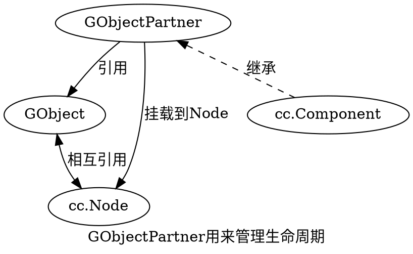
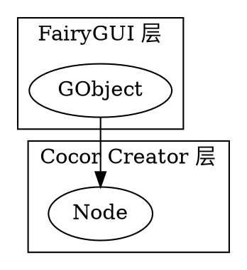
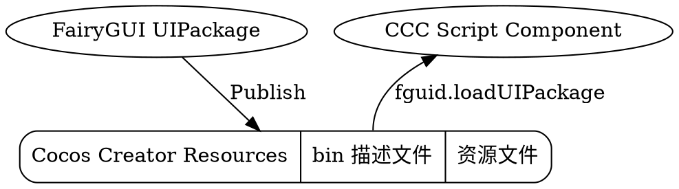
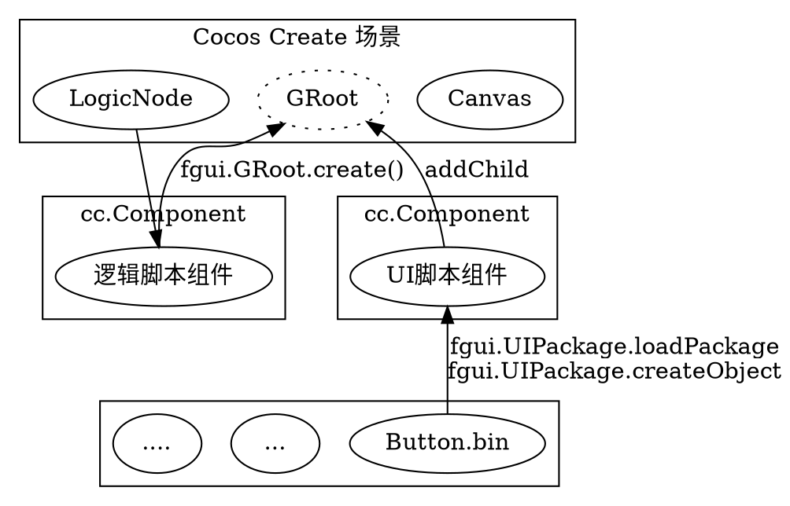
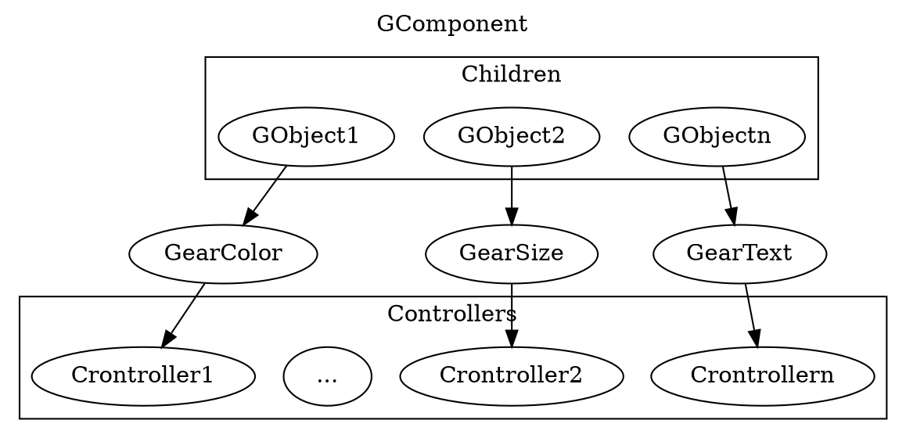

Cocos Creator 很不错，但是其内部的 UI 实在是非常的难用，之前是 Cocos 2dx 的时候还有一个 CocosStudio/Builder 可以用，但是后面就没有更新了，所以一直在寻找到底有没有一个可以简单的让我们编辑 UI 的东西存在，偶尔的看到的了 FairyGUI 这 个东西。但是网络上的文章都比较少啊。所以需要自己来进行了解。同时其还是一个跨平台的东西，对于 Unity 3d、白鹭等都有进行支持。

<!--more-->

[官方网站](https://www.fairygui.com) 是这里，其基本的原理，就是通过在 FairyGUI 内进行编辑，将相关的资源进行打包发布成 `bin` 二进制文件，然后由 FairyGUI 所编辑的 js 程序来进行解析，最终调用底层引擎平台的 API 来进行渲染。原理虽然简单，但是实现的话必须进行一下了解才行了。

# GObject 与 GComponent

在 FairyGUI 中，所有元素的根，都是 [GObject](https://www.fairygui.com/docs/guide/editor/object.html)。在 [github](https://github.com/fairygui/FairyGUI-cocoscreator) 上可以查看其源码。

由于其官方网站上的 API 文档是关于 C# 的，所以必须自己来抓一下 Cocos Creator 下的实现了。

## GObject

GObject 代表了一个 **元件**，在 FairyGUI 中，**元件** 指的是在舞台（场景？）上的组成元素，是所有对象的根。其他任何类型的元件实际上都是继承自 GObject。其本质，我认为是对 Cocos Creator 中的 cc.Node 的抽象和封装，其主要是为了操控一个节点的 _大小，位置，缩放，旋转_ 等属性。我们在编辑 UI 的过程中，实际上就是将我们对一个 FairyGUI 对象的定义，保存在一个 _xml_ 文件中，然后由 FairyGUI 程序进行加载为相应的 GObject 对象，再由引擎进行渲染。

OK 理解这一点，实际上就对整个机制的了解就差不多了。

对于 Cocos Creator 来说， GObject 实际上是对 `cc.Node` 的封装。

更确切一点的说法是，GObject 是一个 JS 对象，而在 cc.Node 对其进行了引用，但逻辑的触发，是由以 ccc 脚本组件的形式挂到 cc.Node 下面的 GObjectPartner 来实现的。



```js
// GObject.ts
        public constructor() {
            this._node = new cc.Node();
            this._node["$gobj"] = this;
            this._partner = this._node.addComponent(GObjectPartner);
        }
```

```js
    export class GObjectPartner extends cc.Component {
        public _emitDisplayEvents: boolean = false;

        public callLater(callback: Function, delay?: number): void {
            if (!cc.director.getScheduler().isScheduled(callback, this))
                this.scheduleOnce(callback, delay);
        }

        public onClickLink(evt: Event, text: string) {
            this.node.emit(Event.LINK, text, evt);
        }

        protected onEnable() {
            this.node["$gobj"].onEnable();

            if (this._emitDisplayEvents)
                this.node.emit(Event.DISPLAY);
        }

        protected onDisable() {
            this.node["$gobj"].onDisable();

            if (this._emitDisplayEvents)
                this.node.emit(Event.UNDISPLAY);
        }

        protected update(dt) {
            this.node["$gobj"].onUpdate(dt);
        }

        protected onDestroy() {
            this.node["$gobj"].onDestroy();
        }
    }
```

## 生命周期

我们知道 Cocos Creator 的生命周期是这样的：

```
onLoad -> onEnable -> start -> update -> lateUpdate -> onDisable -> onDestroy
```

- onLoad 节点首次激活时触发。比如所在的场景被载入，或者所在节点被激活的情况下
- onEnable 当组件的 enabled 属性从 false 变为 true 时，或者所在节点的 active 属性从 false 变为 true 时，会激活 onEnable 回调。倘若节点第一次被创建且 enabled 为 true，则会在 onLoad 之后，start 之前被调用。
- start 回调函数会在组件第一次激活前，也就是第一次执行 update 之前触发。start 通常用于初始化一些需要经常修改的数据，这些数据可能在 update 时会发生改变。
- update 每帧渲染前触发
- lateUpdate update 后，动画更新前执行
- onDisable 当组件的 enabled 属性从 true 变为 false 时，或者所在节点的 active 属性从 true 变为 false 时，会激活 onDisable 回调。
- onDestroy 当组件或者所在节点调用了 destroy()，则会调用 onDestroy 回调，并在当帧结束时统一回收组件。当同时声明了 onLoad 和 onDestroy 时，它们将总是被成对调用。也就是说从组件初始化到销毁的过程中，它们要么就都会被调用，要么就都不会被调用。

其中，onLoad 和 start 常常用于组件的初始化，只有在节点 activeInHierarchy 的情况下才能调用，并且最多只会被调用一次。
另外还有的不同是：

- 在节点激活时，onLoad 会立即调用，而 start 会在延迟调用。
- start 只有组件是 enable 时才会被调用，而 onLoad 都会被调用

因此， GObject 的入口逻辑，是当我们的将一个 GRoot 挂在 Scene 下时，添加节点的时候，开始进行回调到 GObject 中的逻辑的。

## GComponent

这个代表的是一个组件，实际上其也是直接继承自 GObject，只不过呢，其是作为一个基础的容器而存在的。其定义了几个比较关键的东西：

- \_children：保持对于一些 GObject 的引用。
- \_container：一个节点，作为 GComponent 所属节点下的直接子节点，用来容纳其他 **节点**。当 GComponent 添加对象到 \_children 的时候，会同时将此对象的节点添加 \_container 内。
- \_controllers：这是 FairyGUI 的核心功能。对组件的分页，按钮状态，属性变化进行了支持。

## GRoot

每个场景都会有一个 GRoot，实际上这也是一个继承自 GComponent 的对象，作为一个根容器的存在，用来容纳所有其他的元素。一般来说都会在场景加载的时候进行创建。

在 GRoot 创建的时候，会将 GRoot 底层对应的节点，自动的挂在 Scene 下面（Scene 实际上也是一个节点）。

```ts
        public static create(): GRoot {
            GRoot._inst = new GRoot();
            GRoot._inst.node.parent = cc.director.getScene();

            return GRoot._inst;
        }
```

不过当前，这个根节点是空的。我们要给它添加内容的话，就需要构造 FairyGUI 自己的组件上来了：

```js
let view:fgui.GComponent = fgui.UIPackage.createObject(“包名”, “组件名”).asCom;

//以下几种方式都可以将view显示出来：

//1，直接加到GRoot显示出来
fgui.GRoot.inst.addChild(view);

//2，使用窗口方式显示
aWindow.contentPane = view;
aWindow.show();

//3，加到其他组件里
aComponnent.addChild(view);
```

我们知道，一个 FairyGUI 实际上包含了：

- 一个 cc.Node
- 一个挂在 cc.Node 上的 cc.Component

FairGUI 就是通过自己封装的 GObject ，然后利用 cocos 的渲染机制来组合在一起的。

# 架构展示

我们知道，每个 FairyGUI 的元素实际上都是一个 GObject，而每个 GObject 底层都会用一个 **节点** 相关联



但实际上，真正工作的背后还是颇为复杂的。对于一个用 FairyGUI 编辑好的 UI 信息，在发布以后，会生成两部分的文件：

- _bin_ 描述文件，描述一个 UI 是什么样的
- _资源文件_，这些文件如图片，动画，等，将发布到引擎的资源目录，运行时进行加载。

对于每个 FairyGUI 编辑的包，我们的必须首先将包进行加载，然后才能使用。就如同 [这里](https://www.fairygui.com/docs/guide/sdk/creator.html) 所说的两种方式一样。其本质还，还是调用 `cc.loader.loadres` 来加载描述文件，然后解析描述文件中依赖的资源，继续进行加载。
然后再构造 GObject 对象，最终，添加到 GRoot 或者其他组件里面。

# 发布

FairyGUI 的每个 包（UIPackage）发布后，实际上，只是一个描述文件，和一些资源的集合，同时将这个描述文件和资源的集合都放到了 Cocos Creator 的资源目录下。我们如何使用这些资源，为其挂上事件，设置更新显示逻辑，还需要我们用代码进行描述。

一个典型的应用路径是：我们在 cc.Compoent 的组件脚本中，调用 fairygui 来加载这些描述文件，加载资源，构建 UI。



因此，这样就将美工 UI 的工作，和代码编辑的工作分开了来，不再进行耦合了。

对于程序来说，只需要在场景初始化中，加载一个个的 组件脚本，在组件脚本中来构建 UI 即可。

# 典型应用



操作方式一般是在 Cocos Creator 的场景中挂一个逻辑节点，用来加载 FairyGUI 的内容，构造 UI 等，这样就将控制权递交给了 FairyGUI 去了。

我们重点需要完成的，就是对于 UI 组件如何来利用 FairyGUI 的 UI 包了。

# Controler 控制器

GObject 没有 控制器，而 GComponent 有控制器。话说，这个是 FairyGUI 的核心，用其来实现一些比较复杂的功能。虽然，可以从 UI 编辑上来大体的看一下控制器的结构和内容，不过我还是更喜欢从代码上来查看。

粗略的来说，控制器可以用来让子元素根据统一的状态进行相应的改变。控制器只会引用 GComponent 的状态信息和控制器本身的页信息（ID，页名称），而对于每页内容的显示，交给子元件进行定义。

## GComponent

GComponent 拥有一个控制器数组：

```js
        public _controllers: Array<Controller>;
```

当对组件应用控制器的时候，本质上，就是**让组件中的所有子元素都响应控制器的改变，然后再运行控制器的动作**。

```js
        public applyController(c: Controller): void {
            this._applyingController = c;
            var child: GObject;
            var length: number = this._children.length;
            for (var i: number = 0; i < length; i++) {
                child = this._children[i];
                child.handleControllerChanged(c);
            }
            this._applyingController = null;

            c.runActions();
        }
```

## Gear

于是，代码就又走到了 GObject 内，实际上，从代码中发现，在设计之处，就为每个 GObject 设置了一个名叫 `_gear` 的数组，用来表示此 GObject 的某些属性将会被某种类型的 Gear 所影响。从 GearBase 里面可以看到，有 10 种 Gear 类型：

- GearDisplay 显示
- GearXY 位置
- GearSize 大小
- GearLook 外观
- GearColor 颜色
- GearAnimation 动画
- GearText 文本
- GearIcon 图标
- GearDisplay2 显示-2
- GearFontSize 字体大小

当应用一个控制器的时候，组件的子元素，就会对比，此控制器，是否与其 Gear 列表内的控制器相同，也就是说，子元素会保持会对一个控制器的引用，然后在应用控制器时执行相关类型的 Gear 函数：

```js
        public handleControllerChanged(c: Controller): void {
            this._handlingController = true;
            for (var i: number = 0; i < 10; i++) {
                var gear: GearBase = this._gears[i];
                if (gear != null && gear.controller == c)
                    gear.apply();
            }
            this._handlingController = false;

            this.checkGearDisplay();
        }
```

## Controller

控制器实际上非常简单，其只是保存了一个对于 GComponent 的状态信息，以及控制器本身的页 ID 列表，页名称列表：

```js
    export class Controller extends cc.EventTarget {
        private _selectedIndex: number = 0;
        private _previousIndex: number = 0;
        private _pageIds: Array<string>;
        private _pageNames: Array<string>;
        private _actions: Array<ControllerAction>;

        public name: string;
        public parent: GComponent;
        public autoRadioGroupDepth: boolean;
        public changing: boolean = false;

        private static _nextPageId: number = 0;
    }
```



也就是说，当我们对一个组件中的子元素 GObject 添加属性控制（Gear）的时候，我们同时会指定其关联的 Controller。然后呢，我们还会定义每个子元件，在每页的状态是如何的。这些信息都会保存在 bin 文件中。

当我们加载 bin 文件的时候，就会将我们设置的信息加载后进行处理。大体而言，就是在 GComponent 构造了各个子元素后，会调用子元素的 `setup_afterAdd` 方法，此时，就会读取出此 GObject 的 gears（Gear 类型索引，控制器索引），然后添加每页的显示信息。

如此，当 GComponent 应用 Controller 的时候，就会跟着变化了。

# 注意事项

1. [此处介绍](https://www.fairygui.com/docs/guide/editor/package.html) FairyGUI 是以包来组织 UI，但是不会自动解决依赖的问题，我们 UI 的依赖必须手动在建立之前进行加载，否则无法正常显示的。
