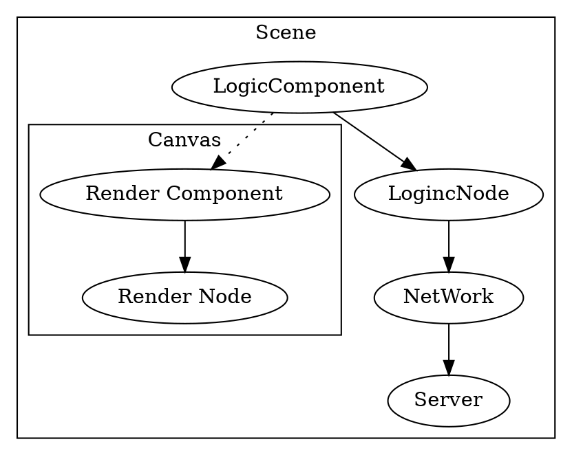
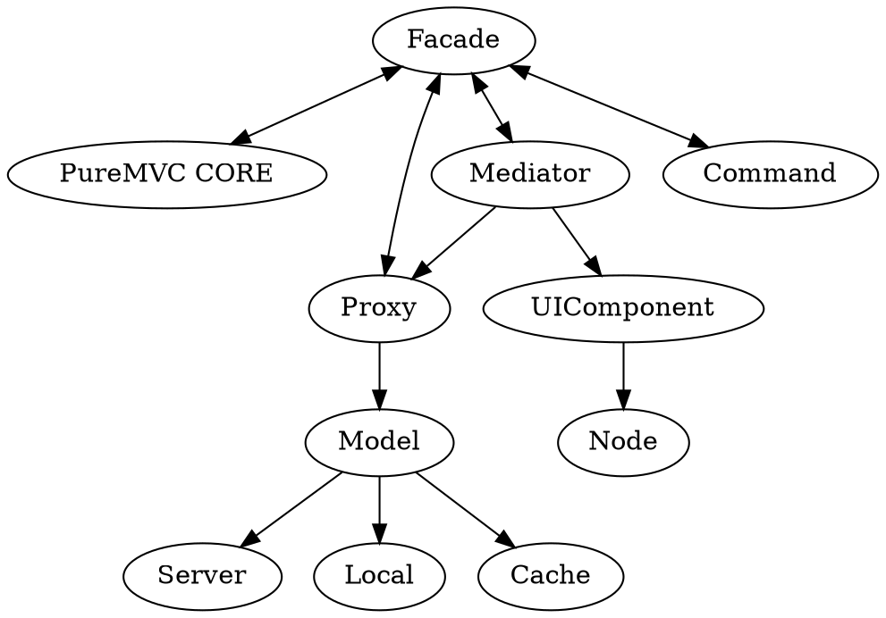
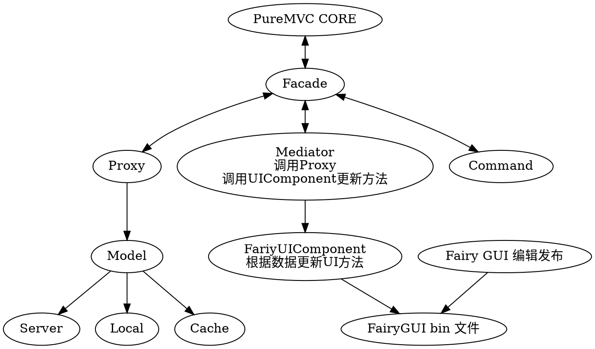
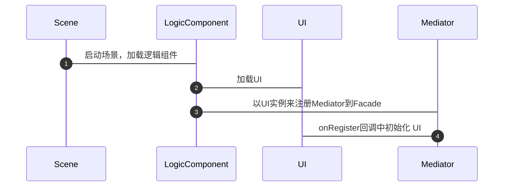

是时候做一个总结了。之前一直抱怨 Cocos Creator 的 UI 实在是太难用了，因此再找到了 PureMVC 和 FairyGUI 后，发现进行整合以后，虽然说代码的量会进行增加，但是进行了相当程度的解耦了。在文章  及  分别做了详细的介绍。

<!--more-->

# Cocos Creator 本身的架构

Cocos Creator 本身是一个 ECS 系统，以每个 cc.Node 节点作为容器（Entity），然后在每个 节点 上挂上不同的组件，来实现不同的功能。如 Cocos Creator 本身内置提供的 Label，Button，Layout 等都是这样做的。

Node 是一个载体，承载的组件，都是出 JS 形式写成的，节买会自动加载和执行其上挂了的组件。

我们可以在 Node 上挂载需要进行渲染的组件，或者单纯的逻辑组件，这些组件只有都是继承自 `cc.Component` 就行。事实上 Cocos Creator 本身，也是节点上承载的组件的不同，进行了分类：**UI 节点，渲染节点**。渲染节点包括：**Sprite，Label，ParticleSystem**，其他的都是 UI 节点了。

之后， Component 可以通过一些 API 来访问本节点上的其他 Component，或者 Scene 内的其他节点，及节点上的 Component。一般来说，我们都会将 UI 节点和 渲染节点放在 Canvas ，也方便进行多分辨率的适配。

实际上 Scene 也是一个 Node。

这样在游戏规模不大的时候其实没有什么问题，但事实上，UI，渲染的内容，实际上是与逻辑相关的，没有做到分层，因此我们引入 PureMVC。

# PureMVC

在这样的架构中，所有的信息都是用通知的形式进行交互，在 UI 和数据之间使用了一个 Mediator 来作为中间层，将 UI 和逻辑进行分开。 M V C 间的通信都是使用 Notification 来进行的。

现在，我们将 UI 也独立出来。

# PureMVC FairyGUI

因此，这种架构，重点就落到了 Proxy 和 Mediator ，UIComponent 上。

- Proxy 负责与数据模型的交互，然后发出通知。
- Mediaotr 负责关注相应的通知类型，进行响应，最终会调用到 UIComponent 中的关于 UI 逻辑的部分。
- FairyUIComponent 是由 FairyGUI 发布的 bin 文件，及组件源码（纯 JS）

# 一些需要了解和注意的要点

1. cocos creator 中的所有内容（脚本，渲染对象）都是挂在节点上的
2. 一个 UI 脚本组件，我们将其挂在节点上，当其也对自己添加组件的时候，实际上是添加到自身所属的节点上的。
3. fairygui 就是利用了第 2 点，将一个 GRoot 挂在了 Scenet 场景节点上。

因此，我们可以按照这么一个逻辑来进行开发。

1. cocos creator 启动，加载场景
2. 在场景上挂一个组件脚本，此脚本负责
   1. 初始化 puremvc
   2. 创建 fairygui.GRoot
   3. 加载 UI 组件，而 UI 组件又需要
3. 向 Facade 注册 Mediator

我们使用 FairyGUI 来做 UI 的话，渲染的速度应该是会比直接在 cocos creator 上挂再来慢一些。因为对于已经编辑好的场景，是直接读取文件进行渲染了；而 Fairy 还需要解析了它自身定义格式的二进制文件后，再转换到 cocos creator 上来进行渲染。

# 逻辑工作流程图

# 关于 JS 与 TS

 FairyGUI 生成的代码 是 TS 实现的，Cocos Creator 支持 TS，按照官方给的配置来看，是支持编译成 ES5 标准的 JS 代码，支持的特性包含： 

 - es2015
 - es2017
 - dom

 而对于 JS 的支持，集成了 babel 编译器，会将一部分的 ES6 特性翻译为 ES5，具体支持可参考：[https://babeljs.io/docs/learn-es2015/](https://babeljs.io/docs/learn-es2015/)
