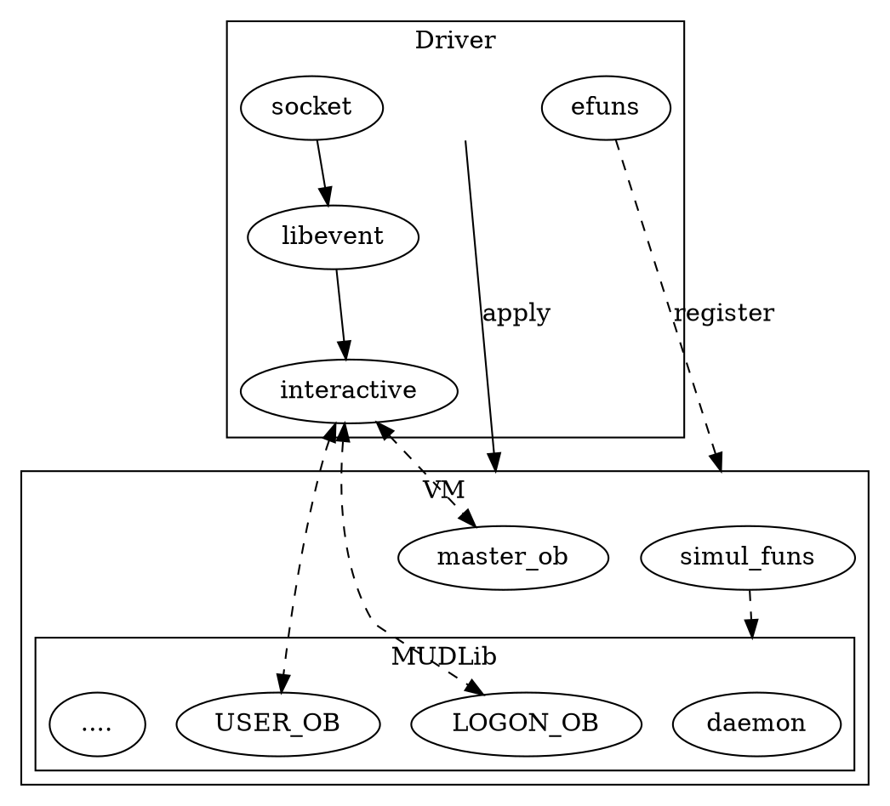
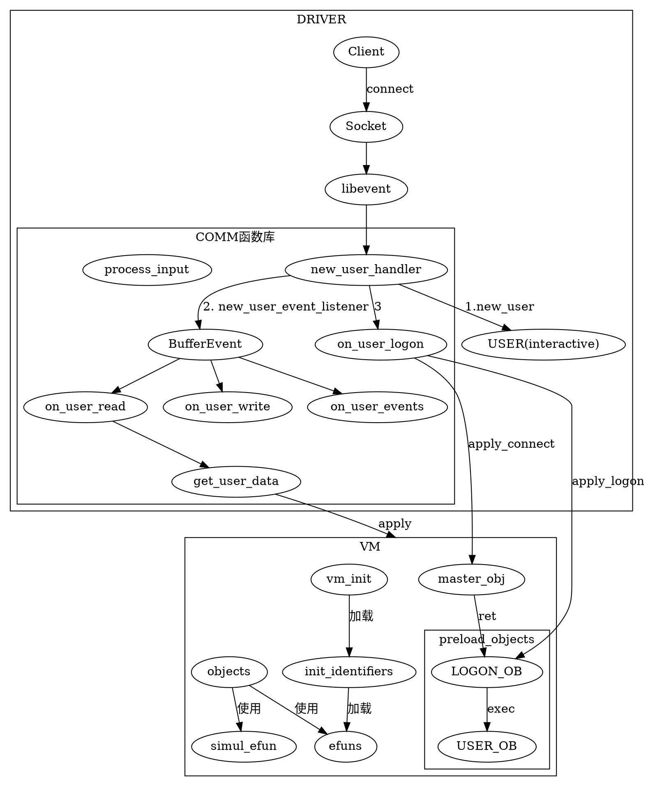

了解一下最经典的 MUD 架构实现。

<!--more-->

# fluffos/mudos

# driver_main

作为一个启动引导函数，用来初始化各种环境。

# init_main

`driver_main` 最先调用的就是 `init_main` 了。

主要工作还是：

1. 读取配置文件 `read_config(argv[i]);`
2. 初始化 *libevent* `auto base = init_backend();`
3. 初始化虚拟机 `vm_init()`

```cpp
struct event_base *init_main(int argc, char **argv) {
  init_locale();
  init_tz();

  print_sep();
  print_commandline(argc, argv);
  print_version_and_time();
  incrase_fd_rlimit();
  print_rlimit();
  print_sep();

  /* read in the configuration file */
  bool got_config = false;
  for (int i = 1; i < argc; i++) {
    if (argv[i][0] == '-') {
      // skip --flag val .
      if (argv[i][1] == '-') {
        i++;
      }
      continue;
    }
    read_config(argv[i]);
    got_config = true;
    break;
  }
  if (!got_config) {
    fprintf(stderr, "Usage: %s config_file\n", argv[0]);
    exit(-1);
  }

  debug_message("Initializing internal stuff ....\n");

  // Initialize libevent, This should be done before executing LPC.
  auto base = init_backend();
  init_dns_event_base(base);

  // Initialize VM layer
  vm_init();

  return base;
}

```

## init_backend

主要主要就是初始化 libevent 库，用来进行事件调度，当有事件触发事，执行对应的回调函数。

```cpp
event_base *init_backend() {
  event_set_log_callback(libevent_log);
  evdns_set_log_fn(libevent_dns_log);
#ifdef DEBUG
  event_enable_debug_mode();
#endif
#ifdef _WIN32
  evthread_use_windows_threads();
#else
  evthread_use_pthreads();
#endif
  g_event_base = event_base_new();
  debug_message("Event backend in use: %s\n", event_base_get_method(g_event_base));
  return g_event_base;
}

```

## vm_init

初始化一个虚拟机。这玩意用来干什么呢？我们看代码

```cpp
void vm_init() {
  boot_time = get_current_time();

  init_eval(); /* in eval.cc * 定时器/

  init_strings();     /* in stralloc.c 字符串 hash 表*/
  init_identifiers(); /* in lex.c 虚拟机有特殊意义的符号表，再加上 efun，相当于虚拟机自定义的内部函数*/
  init_locals();      /* in compiler.c 本地变量环境*/

  max_eval_cost = CONFIG_INT(__MAX_EVAL_COST__);
  set_inc_list(CONFIG_STR(__INCLUDE_DIRS__));

  add_predefines();
  reset_machine(1);

  set_eval(max_eval_cost);
}
```

### add_predefines

这个是一些预定义的变量。

# vm_start

这个时候开始启动虚拟机了.

主要工作：

1. 初始化仿真函数 `init_simul_efun` 从配置文件读取 `simulated efun file` 项
2. 初始化 master 对象 `init_master` 从配置文件读取 `master file` 项
3. 预加载对象 `preload_objects` 读取 `adm/etc/preload` 定义的项。这个时候上也是委托给 masterobj 来进行执行 `epilog(), preload()` 方法进行加载。

```cpp
void vm_start() {
  error_context_t econ;
  save_context(&econ);
  try {
    init_simul_efun(CONFIG_STR(__SIMUL_EFUN_FILE__));
    init_master(CONFIG_STR(__MASTER_FILE__));
  } catch (const char *) {
    debug_message("The simul_efun (%s) and master (%s) objects must be loadable.\n",
                  CONFIG_STR(__SIMUL_EFUN_FILE__), CONFIG_STR(__MASTER_FILE__));
    debug_message("Please check log files for exact error. \n");
    restore_context(&econ);
    pop_context(&econ);
    exit(-1);
  }
  pop_context(&econ);

  // TODO: move this to correct location.
#ifdef PACKAGE_MUDLIB_STATS
  restore_stat_files();
#endif

  preload_objects();
}
```

从这里可以窥见 LPC 是如何从一个文件，来构造对象的。

## init_simul_efun

首先，会检查文件是否存在，然后调用 `load_object(buff,1)` 函数。

```cpp
void init_simul_efun(const char *file) {
  char buf[512];
  object_t *new_ob;

  if (!file || !file[0]) {
    fprintf(stderr, "No simul_efun\n");
    return;
  }
  if (!filename_to_obname(file, buf, sizeof buf)) {
    error("Illegal simul_efun file name '%s'\n", file);
  }

  if (file[strlen(file) - 2] != '.') {
    strcat(buf, ".c");
  }

  new_ob = load_object(buf, 1);
  if (new_ob == nullptr) {
    fprintf(stderr, "The simul_efun file %s was not loaded.\n", buf);
    exit(-1);
  }
  set_simul_efun(new_ob);
}
```

## load_object

`load_object` 应该是一个灵魂函数了。其加载文件，然后编译文件。此函数位于 `vm/internal/simulate.cc` 中。其主要工作就是从一个文件加载一个对象，如果此文件继承了其他并没有加载到内存中的对象，那么就会想加载这个未继承的对象，再重新加载此文件。

## init_master

先构造一个 master 对象

```cpp
void init_master(const char *master_file) {
  char buf[512];
  object_t *new_ob;

  if (!filename_to_obname(master_file, buf, sizeof buf)) {
    error("Illegal master file name '%s'\n", master_file);
  }

  new_ob = load_object(buf, 1);
  if (new_ob == nullptr) {
    fprintf(stderr, "The master file %s was not loaded.\n", master_file);
    exit(-1);
  }
  set_master(new_ob);
}
```

然后设置为全局对象，并将 master_obj 可 apply 的函数读取出来，只有可以用 `apply_master_ob(fun,numargs)` 来进行调用

```cpp
void set_master(object_t *ob) {
#if defined(PACKAGE_UIDS) || defined(PACKAGE_MUDLIB_STATS)
  int first_load = (!master_ob);
#endif
  svalue_t *ret;

  get_master_applies(ob);
  master_ob = ob;  // from here on apply_master_ob returns -1 only as return from the apply

  /* Make sure master_ob is never made a dangling pointer. */
  add_ref(master_ob, "set_master");
#ifndef PACKAGE_UIDS
#ifdef PACKAGE_MUDLIB_STATS
  if (first_load) {
    // 'master::domain_file' should return an apropriate "domain" for each
    // file (directory), as such we should get the backbone domain by
    // asking for 'master::domain_file("/")'
    push_constant_string("/");
    ret = apply_master_ob(APPLY_DOMAIN_FILE, 1);
    if (ret == 0 || ret->type != T_STRING) {
      // we didn't got the expected value?
      // emit warning and fall back to old behavior
      debug_message(
          "%s() in the master file does not work, using 'BACKBONE' as fallback (see %s.4)\n",
          applies_table[APPLY_DOMAIN_FILE], applies_table[APPLY_DOMAIN_FILE]);
      set_backbone_domain("BACKBONE");
    } else {
      set_backbone_domain(ret->u.string);
    }
    // 'master::author_file' should return an apropriate "author" for each
    // file (directory), as such we should get the master author by
    // asking for 'master::author_file(__MASTER_FILE__)'
    push_malloced_string(add_slash(CONFIG_STR(__MASTER_FILE__)));
    ret = apply_master_ob(APPLY_AUTHOR_FILE, 1);
    if (ret == 0 || ret->type != T_STRING) {
      // we didn't got the expected value?
      // emit warning and fall back to old behavior
      debug_message(
          "%s() in the master file does not work, using 'NONAME' as fallback (see %s.4)\n",
          applies_table[APPLY_AUTHOR_FILE], applies_table[APPLY_AUTHOR_FILE]);
      set_master_author("NONAME");
    } else {
      set_master_author(ret->u.string);
    }
  }
#endif
#else
  ret = apply_master_ob(APPLY_GET_ROOT_UID, 0);
  if (!ret) {
    debug_message(
        "No function %s() in master object; possibly the mudlib doesn't want "
        "PACKAGE_UIDS to be defined.\n",
        applies_table[APPLY_GET_ROOT_UID]);
    exit(-1);
  }
  if (ret->type != T_STRING) {
    debug_message("%s() in master object does not work.\n", applies_table[APPLY_GET_ROOT_UID]);
    exit(-1);
  }
  if (first_load) {
    master_ob->uid = set_root_uid(ret->u.string);
    master_ob->euid = master_ob->uid;
#ifdef PACKAGE_MUDLIB_STATS
    // 'master::author_file' should return an apropriate "author" for each
    // file (directory), as such we should get the master author by
    // asking for 'master::author_file(__MASTER_FILE__)'
    push_malloced_string(add_slash(CONFIG_STR(__MASTER_FILE__)));
    ret = apply_master_ob(APPLY_AUTHOR_FILE, 1);
    if (ret == nullptr || ret->type != T_STRING) {
      // we didn't got the expected value?
      // emit warning and fall back to old behavior
      debug_message(
          "%s() in the master file does not work, using root_uid as fallback (see %s.4)\n",
          applies_table[APPLY_AUTHOR_FILE], applies_table[APPLY_AUTHOR_FILE]);
      set_master_author(master_ob->uid->name);
    } else {
      set_master_author(ret->u.string);
    }
#endif
    ret = apply_master_ob(APPLY_GET_BACKBONE_UID, 0);
    if (ret == nullptr || ret->type != T_STRING) {
      debug_message("%s() in the master file does not work\n",
                    applies_table[APPLY_GET_BACKBONE_UID]);
      exit(-1);
    }
    set_backbone_uid(ret->u.string);
#ifdef PACKAGE_MUDLIB_STATS
    // 'master::domain_file' should return an apropriate "domain" for each
    // file (directory), as such we should get the backbone domain by
    // asking for 'master::domain_file("/")'
    push_constant_string("/");
    ret = apply_master_ob(APPLY_DOMAIN_FILE, 1);
    if (ret == nullptr || ret->type != T_STRING) {
      // we didn't got the expected value?
      // emit warning and fall back to old behavior
      debug_message("%s() in the master file does not work, using bb_ui as fallback (see %s.4)d\n",
                    applies_table[APPLY_DOMAIN_FILE], applies_table[APPLY_DOMAIN_FILE]);
      set_backbone_domain(backbone_uid->name);
    } else {
      set_backbone_domain(ret->u.string);
    }
#endif
  } else {
    master_ob->uid = add_uid(ret->u.string);
    master_ob->euid = master_ob->uid;
  }
#endif
}
```


## preload_objects

这首先会获取需要进行预加载的文件列表（`epilog` 方法）。

然后应用 (`preload`)方法进行实际的加载。

```cpp
/* The epilog() in master.c is supposed to return an array of files to load.
 * The preload() in master object called to do the actual loading.
 */
void preload_objects() {
  // Legacy: epilog() has a int param to make it to avoid load anything.
  // I'm not sure who would use that.
  push_number(0);
  auto ret = safe_apply_master_ob(APPLY_EPILOG, 1);

  if ((ret == nullptr) || (ret == (svalue_t *)-1) || (ret->type != T_ARRAY)) {
    return;
  }

  auto prefiles = ret->u.arr;
  if ((prefiles == nullptr) || (prefiles->size < 1)) {
    return;
  }

  // prefiles (the global apply return value) would have been freed on next apply call.
  // so we have to increase ref here to make sure it is around.
  prefiles->ref++;

  debug_message("\nLoading preload files ...\n");

  for (int i = 0; i < prefiles->size; i++) {
    if (prefiles->item[i].type != T_STRING) {
      continue;
    }
    debug_message("%s...\n", prefiles->item[i].u.string);

    push_svalue(&prefiles->item[i]);
    set_eval(max_eval_cost);
    safe_apply_master_ob(APPLY_PRELOAD, 1);
  }
  free_array(prefiles);
} /* preload_objects() */

```


# init_user_conn

这函数没啥说的，就是监听套接字，然后把新连接事件交给 libevent 进行回调

```cpp
// comm.cc
// Listen on connection event
    auto conn = evconnlistener_new(
        g_event_base, new_user_handler, &i,
        LEV_OPT_REUSEABLE | LEV_OPT_CLOSE_ON_FREE | LEV_OPT_CLOSE_ON_EXEC, 1024, fd);
```

## new_user_handler/interactive_t

当用户连接后，那么就会初始化一个数据结构出来。这个数据结构，我更愿意把他叫做 `连接`，比如说当前的 C/S 架构里面会说的 `Session`。

而在 LPC 中，把他称为 `interactive_t`，表示一个可交互对象。

```cpp
// comm.cc
	auto user = new_user(port, fd, addr, addrlen); // 这个时候，实际上 user 这个数据结构的对象还是 master_obj
    new_user_event_listener(base, user); // 缓冲区事件回调设置
    if (user->connection_type == PORT_TELNET) {
      user->telnet = net_telnet_init(user);
      send_initial_telnet_negotiations(user);
    }

    event_base_once(
        base, -1, EV_TIMEOUT,
        [](evutil_socket_t fd, short what, void *arg) {
          auto user = reinterpret_cast<interactive_t *>(arg);
          on_user_logon(user);
        },
        (void *)user, nullptr);
```

```cpp
interactive_t *user_add() {
  auto user = reinterpret_cast<interactive_t *>(
      DMALLOC(sizeof(interactive_t), TAG_INTERACTIVE, "new_user_handler"));
  memset(user, 0, sizeof(*user));
  all_users.push_back(user);
  return user;
}
```

这个新的 User 结构（注意，这不是 VM 的对象），这个结构实际上代表了一玩家本身（连接，交互等）。注意与 Player 进行区别。

接着，就把用户调度到登录流程了。

## on_user_logon

在这里，会在 master_obj 上应用  `connect` 函数，这个函数的返回，由我们自己定义，在 lpctest 项目中，其会返回一个 `login.c` 对象。

接着就会调用 `login.c` 对象的 `LOGON` 方法，实现登录逻辑。然后将 User 绑定一个 Logon 对象 。

然后对这个 Logon 对象，apply logon 方法，让玩家从登录对象，转到游戏对象，然后，就将这个对象移动到游戏世界了。

```cpp
void on_user_logon(interactive_t *user) {
  set_command_giver(master_ob);
  master_ob->flags |= O_ONCE_INTERACTIVE;
  master_ob->interactive = user;

  /*
   * The user object has one extra reference. It is asserted that the
   * master_ob is loaded.  Save a pointer to the master ob incase it
   * changes during APPLY_CONNECT.  We want to free the reference on
   * the right copy of the object.
   */
  object_t *master, *ob;
  svalue_t *ret;

  master = master_ob;
  add_ref(master_ob, "new_user");
  push_number(user->local_port);
  set_eval(max_eval_cost);
  ret = safe_apply_master_ob(APPLY_CONNECT, 1);
  /* master_ob->interactive can be zero if the master object self
   destructed in the above (don't ask) */
  set_command_giver(nullptr);
  if (ret == nullptr || ret == (svalue_t *)-1 || ret->type != T_OBJECT || !master_ob->interactive) {
    debug_message("Can not accept connection from %s due to error in connect().\n",
                  sockaddr_to_string(reinterpret_cast<sockaddr *>(&user->addr), user->addrlen));
    if (master_ob->interactive) {
      remove_interactive(master_ob, 0);
    }
    return;
  }
  /*
   * There was an object returned from connect(). Use this as the user
   * object.
   */
  ob = ret->u.ob;
  ob->interactive = master_ob->interactive;
  ob->interactive->ob = ob;
  ob->flags |= O_ONCE_INTERACTIVE;
  /*
   * assume the existance of write_prompt and process_input in user.c
   * until proven wrong (after trying to call them).
   */
  ob->interactive->iflags |= (HAS_WRITE_PROMPT | HAS_PROCESS_INPUT);

  free_object(&master, "new_user");

  master_ob->flags &= ~O_ONCE_INTERACTIVE;
  master_ob->interactive = nullptr;
  add_ref(ob, "new_user");

  // start reverse DNS probing.
  query_name_by_addr(ob);

  set_command_giver(ob);

  set_prompt("> ");

  // Call logon() on the object.
  set_eval(max_eval_cost);
  ret = safe_apply(APPLY_LOGON, ob, 0, ORIGIN_DRIVER);
  if (ret == nullptr) {
    debug_message("new_user_handler: logon() on object %s has failed, the user is disconnected.\n",
                  ob->obname);
    remove_interactive(ob, false);
  } else if (ob->flags & O_DESTRUCTED) {
    // logon() may decide not to allow user connect by destroying objects.
    remove_interactive(ob, true);
  }
  set_command_giver(nullptr);
}
```

```c
/*****************************************************************************
Copyright: 2019, Mud.Ren
File name: login_ob.c
Description: 玩家登录连线对象
Author: xuefeng
Version: v1.0
Date: 2019-04-18
*****************************************************************************/
#define WELCOME "/system/etc/motd"

void setup(string arg)
{
    object from, to;

    if (!arg || arg == "")
    {
        write("ID不能为空，请重新输入：");
        input_to("setup");
    }
    else
    {
        from = this_object();
        to = new(USER_OB, arg);
        exec(to, from);
        // destruct(from);
    }
}

void logon()
{
    write(read_file(WELCOME));
    write("请输入你的ID：");
    input_to("setup");
}

```

再之后，如果用户进行输入了信息，那么就需要进行调度了。我们之前已经把 User 的回调设置为了 `on_user_read`。

## on_user_read

```cpp
void on_user_read(bufferevent *bev, void *arg) {
  auto user = reinterpret_cast<interactive_t *>(arg);

  if (user == nullptr) {
    fatal("on_user_read: user == NULL, Driver BUG.");
    return;
  }

  // Read user input
  get_user_data(user);

  // TODO: currently get_user_data() will schedule command execution.
  // should probably move it here.
}
```

这最终会让输入的指令执行起来。


# setup_signal_handlers

# backend

为 libevent 设置很多可事器事件来清理虚拟机内的内容：

```cpp
void backend(struct event_base *base) {
  clear_state();
  g_current_gametick = 0;

  // Register various tick events
  add_gametick_event(std::chrono::seconds(0), tick_event::callback_type(call_heart_beat));
  add_gametick_event(std::chrono::minutes(5), tick_event::callback_type(look_for_objects_to_swap));
  add_gametick_event(std::chrono::minutes(30),
                     tick_event::callback_type([] { return reclaim_objects(true); }));
#ifdef PACKAGE_MUDLIB_STATS
  add_gametick_event(std::chrono::minutes(60), tick_event::callback_type(mudlib_stats_decay));
#endif
  add_gametick_event(std::chrono::minutes(5),
                     tick_event::callback_type(call_remove_destructed_objects));

  // NOTE: we don't use EV_PERSITENT here because that use fix-rate scheduling.
  //
  // Schedule a repeating tick for advancing virtual time.
  // Gametick provides a fixed-delay scheduling with a guaranteed minimum delay for
  // heartbeats, callouts, and various cleaning function.
  g_ev_tick = evtimer_new(base, on_game_tick, &g_ev_tick);

  auto t = gametick_timeval();
  event_add(g_ev_tick, &t);

  try {
    event_base_loop(base, 0);
  } catch (...) {  // catch everything
    fatal("BUG: jumped out of event loop!");
  }
  // We've reached here meaning we are in shutdown sequence.
  shutdownMudOS(-1);
} /* backend() */
```

# 分层架构



# 架构图




# apply 与 efun

apply 是 VM 提供给 DRIVER 层使用的 API，用以操纵 VM 内的对象。更确切点说，他应该是一种机制，一种类似于基于函数的机制，通过在某个对象上绑定执行某个函数。

而 efuns 则是 DRIVER 提供给 VM 层使用的函数。相当于底层函数库。

sim_efuns 则是在 VM 层内用 LPC 封装好的函数库。

在 VM 内调用一个函数的时候，首先会从 sim_efunc 上去查找，查找不到才会去查找 efuns

