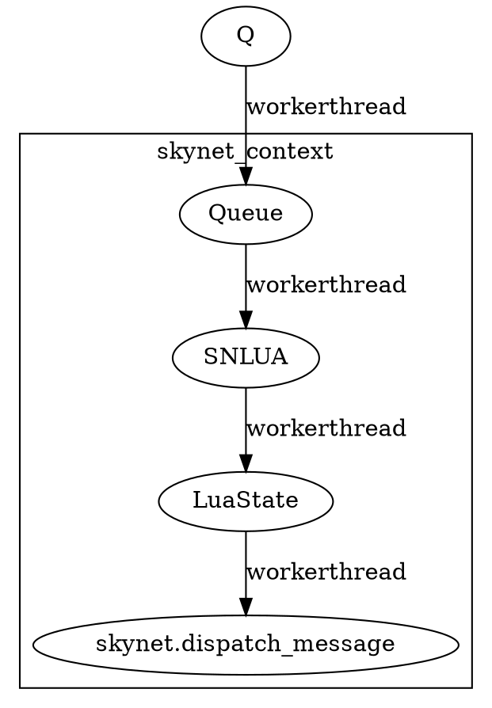

在 [Skynet 相关的文章](https://gowa.club/tags/Skynet/) 中，其实已经做了不少介绍，但是我觉得还缺少一些全局性的东西，不够整体的来进行了解。所以重新进行一下回顾。

<!--more-->

在  及  其实已经说得很多了。

Skynet 实际上，只是一个调度引擎，将消息分法到他同的 **服务** 去，同时，**服务** 间还可以相互进行通信。止不过，有的服务承载的是 **SNLUA** 虚拟机，所以可以由 Lua 来执行相关的逻辑罢了。

# 启动

在 Skynet 启动的时候，会依序执行下面的代码：

```c
	skynet_harbor_init(config->harbor);
	skynet_handle_init(config->harbor);
	skynet_mq_init();
	skynet_module_init(config->module_path);
	skynet_timer_init();
	skynet_socket_init();
	skynet_profile_enable(config->profile);

	struct skynet_context *ctx = skynet_context_new(config->logservice, config->logger);
	if (ctx == NULL) {
		fprintf(stderr, "Can't launch %s service\n", config->logservice);
		exit(1);
	}

	skynet_handle_namehandle(skynet_context_handle(ctx), "logger");

	bootstrap(ctx, config->bootstrap);

	start(config->thread);
```

# 服务

每个服务，实际上就是一个 `skynet_context` 结构体：

```c
struct skynet_context {
	void * instance;
	struct skynet_module * mod;
	void * cb_ud;
	skynet_cb cb;
	struct message_queue *queue;
	FILE * logfile;
	uint64_t cpu_cost;	// in microsec
	uint64_t cpu_start;	// in microsec
	char result[32];
	uint32_t handle;
	int session_id;
	int ref;
	int message_count;
	bool init;
	bool endless;
	bool profile;

	CHECKCALLING_DECL
};
```

所有的服务 `skynet_context` 结构都会存在在全局变量 **H** 中：

```c
static struct handle_storage *H = NULL;
struct handle_storage {
	struct rwlock lock;

	uint32_t harbor;
	uint32_t handle_index;
	int slot_size;
	struct skynet_context ** slot;

	int name_cap;
	int name_count;
	struct handle_name *name;
};
```

每当我们新建一个服务的时候，就会将服务自身注册到 **H** 中，每个服务自身，会持有其在 **H** 中的索引。

服务如何建立的可以看 

从 `skynet_context` 的结构中我们可以看到三个属性：

- `skynet_module` 表示此服务，所相关的动态库。

- `instance` 动态库的 `mod_create` 建立的，与服务自定的相关的一个数据结构而已。
- `queue` 此服务的消息队列

# 全局变量

- **H** 所有服务存储的地方
- **M** 所有具体动态库加载后的地方（我们叫他 **模块**）
- **Q** 全局消息队列，实际上这个保存的是每个**服务** 消息队列的链表
- **TI** 定时器
- **SOCKET_SERVER** 管理套接字相关的命令，转发收到的网络消息。

## socket_server

其内部有三个属性比较重要

- `recvctrl_fd` 接收控制命令
- `sendctrl_fd` 发送控制命令，与上面个文件描述形成管道
- `event_fd` 一个 `kqueue`

```c
	volatile uint64_t time;
	int recvctrl_fd;
	int sendctrl_fd;
	int checkctrl;
	poll_fd event_fd;
	int alloc_id;
	int event_n;
	int event_index;
	struct socket_object_interface soi;
	struct event ev[MAX_EVENT];
	struct socket slot[MAX_SOCKET];
	char buffer[MAX_INFO];
	uint8_t udpbuffer[MAX_UDP_PACKAGE];
	fd_set rfds;
};
```

# 消息分发



本质上，服务间的消息传递，就是将消息，通过 skynet 引擎提供的 API，然后递交到另外一个服务的 Queue 里面去，然后由工作线程拿出来进行处理。

> 简单说，可以把 skynet 理解为一个简单的操作系统，它可以用来调度数千个 lua 虚拟机，让它们并行工作。每个 lua 虚拟机都可以接收处理其它虚拟机发送过来的消息，以及对其它虚拟机发送消息。每个 lua 虚拟机，可以看成 skynet 这个操作系统下的独立进程，你可以在 skynet 工作时启动新的进程、销毁不再使用的进程、还可以通过调试控制台监管它们。skynet 同时掌控了外部的网络数据输入，和定时器的管理；它会把这些转换为一致的（类似进程间的消息）消息输入给这些进程。
