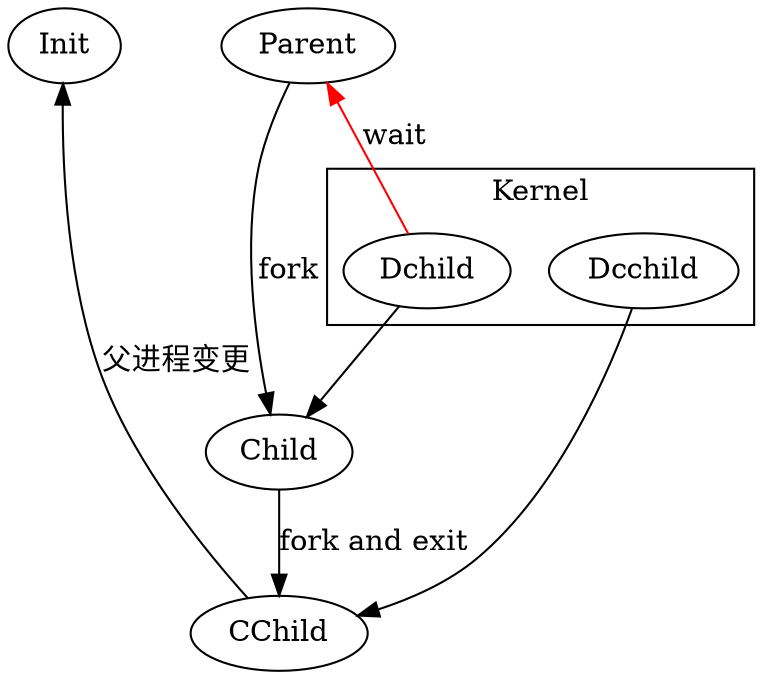

这个是好久以前看 APUE 的时候就看过了，不过最近在用 Python 做服务的时候，想着如何让其也能如同其他程序一样在后台运行而不会随着终端的退出而终止呢。所以又回顾来看了一下 UNIX 的进程模型。

<!--more-->

# 进程的产生

开始的时候，内核只有一个进程（或许是），所有的进程都为 ID 为 1 的这个进程产生。而产生进程，就是使用的 `fork` 这个调用来产生的。

在  也提到，实际上继承的产生，就是 `fork-exec` 这么一个过程。能让新建里的进程执行不同的程序这样。

`fork` 会调用一次，返回两次。调用 `fork` 的进程我们称其为 父进程，而 `fork` 产生的进程我们叫他子进程。这样， `fork` 在父进程中会返回子进程的进程 ID，而在子进程中返回 0。代码中就是以此来判断是执行在父进程中，还是在子进程中的。

# 进程是什么

对内核而言，进程，其实是一个数据结构。进程中一般都会有一个或多个线程，所谓线程，也就是会由内核调度执行的代码序列。内核被设计为，当一个进程结束的时候，会保留一下此进程的部分信息，供对此进程信息关心的其他进程所使用。

一般来说，作为一个进程产生的父进程，其有理由也有必要关心其子进程的运作信息。因此，`wait, waitpid` 函数族就是为了让父进程来获取子进程情况的一些函数调用。

一旦一个进程结束，但其父进程却也没有调用 `wait` 函数族中的一个来获取子进程最后在内核中的剩余信息，那么，这些信息就会一直保留，这是会出问题的。

因此，init 进程被设计为自动成为所有父进程已终止的进程的父进程，由其来进行子进程终止后的善后处理。这样就会避免了 **僵尸进程** 的产生。

# 两次 fork

事实上，一次 fork 就行了，为什么要两次呢？

这是为了让最早的进程不终止的情况下，其所产生的进程也不会成为僵尸进程。

# 模型

