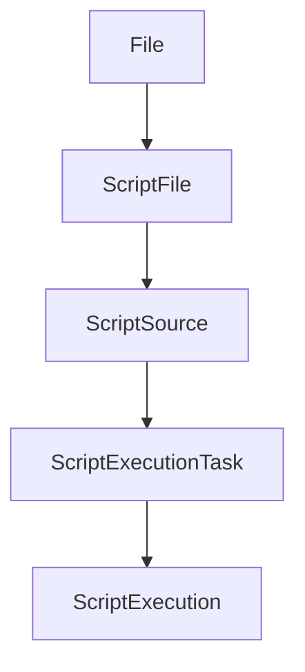

至于 AutoJs 是做什么的，就不多说了。具体可以查看[官方文档](https://hyb1996.github.io/AutoJs-Docs/)。这里来看一下，其在安卓上是如何跑起来的，有哪些关键的内容存在，一个脚本执行，都做了些什么。

<!--more-->

# 初始化

我们可以把源代码来下来看一下。

## 项目结构

项目下有几个模块，各承担不同的职责，分布的比较合理。

- app 这个模块是和安卓本身运行的 APP 相关的内容
- autojs 这个就是 AutoJS 核心模块。包括了 Rhino 这个 JavaScript 的 Java 实现，在安卓上的封装等内容。
- automator 针对控件操作的安卓 API
- common  一些通用的工具类，安卓控件
- inrt 在线打包工具

## AutoJs 对象

在 APP 启动的时候，就会初始化一个单例的 AutoJs 对象。

```java
// app/src/main/java/org/autojs/autojs/App.kt
    override fun onCreate() {
        super.onCreate()
        GlobalAppContext.set(this)
        instance = WeakReference(this)
        setUpStaticsTool()
        setUpDebugEnvironment()
        init()
    }

    private fun init() {
        ThemeColorManagerCompat.init(this, ThemeColor(resources.getColor(R.color.colorPrimary), resources.getColor(R.color.colorPrimaryDark), resources.getColor(R.color.colorAccent)))
        AutoJs.initInstance(this)
        if (Pref.isRunningVolumeControlEnabled()) {
            GlobalKeyObserver.init()
        }
        setupDrawableImageLoader()
        TimedTaskScheduler.init(this)
        initDynamicBroadcastReceivers()
    }

```

其实主要核心还是在 AutoJs 模块内的封装，然后在 APP 上面又加上了一个广播接收器和全局的脚本执行回调。

```java
//app/src/main/java/org/autojs/autojs/autojs/AutoJs.java
    public synchronized static void initInstance(Application application) {
        if (instance != null) {
            return;
        }
        instance = new AutoJs(application);
    }

    private AutoJs(final Application application) {
        super(application);
        getScriptEngineService().registerGlobalScriptExecutionListener(new ScriptExecutionGlobalListener());
        IntentFilter intentFilter = new IntentFilter();
        intentFilter.addAction(LayoutBoundsFloatyWindow.class.getName());
        intentFilter.addAction(LayoutHierarchyFloatyWindow.class.getName());
        LocalBroadcastManager.getInstance(application).registerReceiver(mLayoutInspectBroadcastReceiver, intentFilter);
    }

```


OK 我们来看看真正的 AutoJs 对象是如何初始化的

```java
//autojs/src/main/java/com/stardust/autojs/AutoJs.java
    protected AutoJs(final Application application) {
        mContext = application.getApplicationContext();
        mApplication = application;
        mLayoutInspector = new LayoutInspector(mContext);
        mUiHandler = new UiHandler(mContext);
        mAppUtils = createAppUtils(mContext);
        mGlobalConsole = createGlobalConsole();
        mNotificationObserver = new AccessibilityNotificationObserver(mContext);
        mActivityInfoProvider = new ActivityInfoProvider(mContext);
        mScriptEngineService = buildScriptEngineService();
        ScriptEngineService.setInstance(mScriptEngineService);
        init();
    }

```

构造了很多用来操纵 Android 的对象，其实这些暂时都不重要，重要的是其初始化了一个 ScriptEngineService。

## ScriptEngineService

```java
//autojs/src/main/java/com/stardust/autojs/AutoJs.java

    protected ScriptEngineService buildScriptEngineService() {
        initScriptEngineManager();
        return new ScriptEngineServiceBuilder()
                .uiHandler(mUiHandler)
                .globalConsole(mGlobalConsole)
                .engineManger(mScriptEngineManager)
                .build();
    }

```

## ScriptEngineManager

```java
//autojs/src/main/java/com/stardust/autojs/AutoJs.java
    protected void initScriptEngineManager() {
        mScriptEngineManager = new ScriptEngineManager(mContext);
        mScriptEngineManager.registerEngine(JavaScriptSource.ENGINE, () -> {
            LoopBasedJavaScriptEngine engine = new LoopBasedJavaScriptEngine(mContext);
            engine.setRuntime(createRuntime());
            return engine;
        });
        initContextFactory();
        mScriptEngineManager.registerEngine(AutoFileSource.ENGINE, () -> new RootAutomatorEngine(mContext));
    }

```

脚本引擎管理器 ScriptEngineManager 会注册两个引擎：

- LoopBasedJavaScriptEngine 常规操作。这个引擎每个 JS 源文件执行的时候会动态来生成。
- RootAutomatorEngine 后面这个引擎是针对 root 权限操作的。需要 `su` 命令。他会利用 `root_automator` 这个可执行程序来进行命令的执行。

## ScriptRuntime

对于 LoopBasedJavaScriptEngine 还需要一个脚本运行时。

```java
//autojs/src/main/java/com/stardust/autojs/AutoJs.java

    protected ScriptRuntime createRuntime() {
        return new ScriptRuntime.Builder()
                .setConsole(new ConsoleImpl(mUiHandler, mGlobalConsole))
                .setScreenCaptureRequester(mScreenCaptureRequester)
                .setAccessibilityBridge(new AccessibilityBridgeImpl(mUiHandler))
                .setUiHandler(mUiHandler)
                .setAppUtils(mAppUtils)
                .setEngineService(mScriptEngineService)
                .setShellSupplier(() -> new Shell(mContext, true)).build();
    }

```


## 总结

OK 到这个时候， AutoJs 对象就初始化完成了。我们有几个对象：

- ScriptEngineService 脚本引擎服务
- ScriptEngineManager 脚本引擎管理器
- LoopBasedJavaScriptEngine 这个是动态生成。
- RootAutomatorEngine 已经生成
- ScriptRuntime LoopBasedJavaScriptEngine 执行的时候生成

# 执行

## ScriptEngineService

对于每个 JS 文件，都会由 Scripts 这个单例类进行执行：




```java
//autojs/src/main/java/com/stardust/autojs/ScriptEngineService.java

    fun run(file: ScriptFile): ScriptExecution? {
        return try {
            AutoJs.getInstance().scriptEngineService.execute(file.toSource(),
                    ExecutionConfig(workingDirectory = file.parent))
        } catch (e: Exception) {
            e.printStackTrace()
            Toast.makeText(GlobalAppContext.get(), e.message, Toast.LENGTH_LONG).show()
            null
        }

    }
```

也就是将脚本文件，丢给 AutoJs 对象这个单例类中的 ScriptEngineService 进行执行。

```java
//autojs/src/main/java/com/stardust/autojs/ScriptEngineService.java

    public ScriptExecution execute(ScriptSource source, ExecutionConfig config) {
        return execute(new ScriptExecutionTask(source, null, config));
    }
    public ScriptExecution execute(ScriptExecutionTask task) {
        ScriptExecution execution = executeInternal(task);
        mScriptExecutions.put(execution.getId(), execution);
        return execution;
    }
    
```

### executeInternal

在这里会判断，ScriptExecutionTask 是否有监听，是否是 JS 代码，执行的模式（有没有UI），然后在选择构造成具体的执行对象，开个新线程，启动执行。

```java

private ScriptExecution executeInternal(ScriptExecutionTask task) {
        if (task.getListener() != null) {
            task.setExecutionListener(new ScriptExecutionObserver.Wrapper(mScriptExecutionObserver, task.getListener()));
        } else {
            task.setExecutionListener(mScriptExecutionObserver);
        }
        ScriptSource source = task.getSource();
        if (source instanceof JavaScriptSource) {
            int mode = ((JavaScriptSource) source).getExecutionMode();
            if ((mode & JavaScriptSource.EXECUTION_MODE_UI) != 0) {
                return ScriptExecuteActivity.execute(mContext, mScriptEngineManager, task);
            }
        }
        RunnableScriptExecution r;
        if (source instanceof JavaScriptSource) {
            r = new LoopedBasedJavaScriptExecution(mScriptEngineManager, task);
        } else {
            r = new RunnableScriptExecution(mScriptEngineManager, task);
        }
        new ThreadCompat(r).start();
        return r;
    }


```

*LoopedBasedJavaScriptExecution*  继承自 *RunnableScriptExecution*。

## **RunnableScriptExecution**

**RunnableScriptExecution** 的职责，是根据要执行的对象，来获取对应的引擎，比如 *LoopedBasedJavaScriptExecution* 就要动态的从 ScriptEngineManager 去找，如果没有，就新建，有的话就直接丢出来了。

### ScriptEngineManager.createEngineOfSourceOrThrow

脚本管理器，会根据脚本源类型来查找对应的引擎。对于我们的 `JavaScriptSource` 则会使用之前我们提供的函数来获取

```java
// autojs/src/main/java/com/stardust/autojs/engine/ScriptEngineManager.java
		@Nullable
    public ScriptEngine createEngine(String name, int id) {
        Supplier<ScriptEngine> s = mEngineSuppliers.get(name);
        if (s == null) {
            return null;
        }
        ScriptEngine engine = s.get();
        engine.setId(id);
        putProperties(engine);
        addEngine(engine);
        return engine;
    }

    @Nullable
    public ScriptEngine createEngineOfSource(ScriptSource source, int id) {
        return createEngine(source.getEngineName(), id);
    }

    @NonNull
    public ScriptEngine createEngineOfSourceOrThrow(ScriptSource source, int id) {
        ScriptEngine engine = createEngineOfSource(source, id);
        if (engine == null)
            throw new ScriptEngineFactory.EngineNotFoundException("source: " + source.toString());
        return engine;
    }

```

这里较为重要的，我们的提供给 JavaScriptSource 用的函数，会将一个运行事，放到环境中：

```java
        mScriptEngineManager.registerEngine(JavaScriptSource.ENGINE, () -> {
            LoopBasedJavaScriptEngine engine = new LoopBasedJavaScriptEngine(mContext);
            engine.setRuntime(createRuntime());
            return engine;
        });

//autojs/src/main/java/com/stardust/autojs/engine/JavaScriptEngine.java
    public void setRuntime(ScriptRuntime runtime) {
        if (mRuntime != null) {
            throw new IllegalStateException("a runtime has been set");
        }
        mRuntime = runtime;
        mRuntime.engines.setCurrentEngine(this);
        put("runtime", runtime);
    }

```


```java
// autojs/src/main/java/com/stardust/autojs/execution/LoopedBasedJavaScriptExecution.java
    public Object execute() {
        mScriptEngine = mScriptEngineManager.createEngineOfSourceOrThrow(getSource(), getId());
        mScriptEngine.setTag(ExecutionConfig.getTag(), getConfig());
        return execute(mScriptEngine);
    }

    private Object execute(ScriptEngine engine) {
        try {
            prepare(engine);
            Object r = doExecution(engine);
            Throwable uncaughtException = engine.getUncaughtException();
            if (uncaughtException != null) {
                onException(engine, uncaughtException);
                return null;
            }
            getListener().onSuccess(this, r);
            return r;
        } catch (Throwable e) {
            onException(engine, e);
            return null;
        } finally {
            Log.d(TAG, "Engine destroy");
            engine.destroy();
        }
    }

    private void prepare(ScriptEngine engine) {
        engine.setTag(ScriptEngine.TAG_WORKING_DIRECTORY, getConfig().getWorkingDirectory());
        engine.setTag(ScriptEngine.TAG_ENV_PATH, getConfig().getPath());
        engine.init();
    }

    protected Object doExecution(ScriptEngine engine) {
        engine.setTag(ScriptEngine.TAG_SOURCE, getSource());
        getListener().onStart(this);
        Object result = null;
        long delay = getConfig().getDelay();
        int times = getConfig().getLoopTimes();
        if (times == 0) {
            times = Integer.MAX_VALUE;
        }
        long interval = getConfig().getInterval();
        sleep(delay);
        ScriptSource source = getSource();
        for (int i = 0; i < times; i++) {
            result = execute(engine, source);
            sleep(interval);
        }
        return result;
    }

```

这里我们看到，`prepare` 会对引擎进行初始化。而 `doExecution` 让引擎去进行执行，在我们的  LoopedBasedJavaScriptExecution 会重写这个方法。

### LoopBasedJavaScriptEngine.init()

```java
//autojs/src/main/java/com/stardust/autojs/engine/LoopBasedJavaScriptEngine.java
    @Override
    public void init() {
        LooperHelper.prepare();
        mHandler = new Handler();
        super.init();
    }

//autojs/src/main/java/com/stardust/autojs/engine/RhinoJavaScriptEngine.kt

    override fun init() {
        thread = Thread.currentThread()
        ScriptableObject.putProperty(mScriptable, "__engine__", this)
        initRequireBuilder(context, mScriptable)
        try {
            context.executeScriptWithContinuations(initScript, mScriptable)
        } catch (e: IllegalArgumentException) {
            if ("Script argument was not a script or was not created by interpreted mode " == e.message) {
                initScript.exec(context, mScriptable)
            } else {
                throw e
            }
        }
    }
    private val initScript: Script
        get() {
            return sInitScript ?: {
                try {
                    val reader = InputStreamReader(mAndroidContext.assets.open("init.js"))
                    val script = context.compileReader(reader, SOURCE_NAME_INIT, 1, null)
                    sInitScript = script
                    script
                } catch (e: IOException) {
                    throw UncheckedIOException(e)
                }
            }()
        }

```

这事就会调用我们的位于 assets 里面的 `init.js` 脚本了。

### RootAutomatorEngine.init()

```java
//autojs/src/main/java/com/stardust/autojs/engine/RootAutomatorEngine.java
    @Override
    public void init() {
        mThread = Thread.currentThread();
    }

```

这个没干什么特别的事情。

## LoopedBasedJavaScriptExecution

这种类型的执行，交给引擎后，最终会给到 `RhinoJavaScriptEngine` 进行执行

```java
//autojs/src/main/java/com/stardust/autojs/engine/RhinoJavaScriptEngine.kt 
    public override fun doExecution(source: JavaScriptSource): Any? {
        var reader = source.nonNullScriptReader
        try {
            reader = preprocess(reader)
            val script = context.compileReader(reader, source.toString(), 1, null)
            return if (hasFeature(ScriptConfig.FEATURE_CONTINUATION)) {
                context.executeScriptWithContinuations(script, mScriptable)
            } else {
                script.exec(context, mScriptable)
            }
        } catch (e: IOException) {
            throw UncheckedIOException(e)
        }

    }

```

OK,剩下的都是 Java 层面的问题了。


# Java 开发给 JS 的 API

## init.js

这个文件，会在我们的的 `LoopBasedJavaScriptEngine` 初始化的时候执行我们来看看它做了什么。

最重要的是，初始化运行时：

```js
runtime.init();
```

```java
    public void init() {
        if (loopers != null)
            throw new IllegalStateException("already initialized");
        threads = new Threads(this);
        timers = new Timers(this);
        loopers = new Loopers(this);
        events = new Events(uiHandler.getContext(), accessibilityBridge, this);
        mThread = Thread.currentThread();
        sensors = new Sensors(uiHandler.getContext(), this);
    }

```

## importClass

这个是比较强大的的了，可以导入使用任何 Java 内的类。这个是 Rhino 提供的。具体参考 Mozila[连接](https://developer.mozilla.org/zh-CN/docs/Mozilla/Projects/Rhino/Scripting_Java)

```java
https://developer.mozilla.org/zh-CN/docs/Mozilla/Projects/Rhino/Scripting_Java
```

```java
//rhino1.7.12/src/org/mozilla/javascript/ImporterTopLevel.java
    private Object js_importClass(Object[] args)
    {
        for (int i = 0; i != args.length; i++) {
            Object arg = args[i];
            if (!(arg instanceof NativeJavaClass)) {
                throw Context.reportRuntimeError1(
                    "msg.not.class", Context.toString(arg));
            }
            importClass((NativeJavaClass)arg);
        }
        return Undefined.instance;
    }

    private Object js_importPackage(Object[] args)
    {
        for (int i = 0; i != args.length; i++) {
            Object arg = args[i];
            if (!(arg instanceof NativeJavaPackage)) {
                throw Context.reportRuntimeError1(
                    "msg.not.pkg", Context.toString(arg));
            }
            importPackage((NativeJavaPackage)arg);
        }
        return Undefined.instance;
    }

    private void importPackage(NativeJavaPackage pkg)
    {
        if(pkg == null) {
            return;
        }
        synchronized (importedPackages) {
            for (int j = 0; j != importedPackages.size(); j++) {
                if (pkg.equals(importedPackages.get(j))) {
                    return;
                }
            }
            importedPackages.add(pkg);
        }
    }

    private void importClass(NativeJavaClass cl)
    {
        String s = cl.getClassObject().getName();
        String n = s.substring(s.lastIndexOf('.')+1);
        Object val = get(n, this);
        if (val != NOT_FOUND && val != cl) {
            throw Context.reportRuntimeError1("msg.prop.defined", n);
        }
        //defineProperty(n, cl, DONTENUM);
        put(n, this, cl);
    }

```

