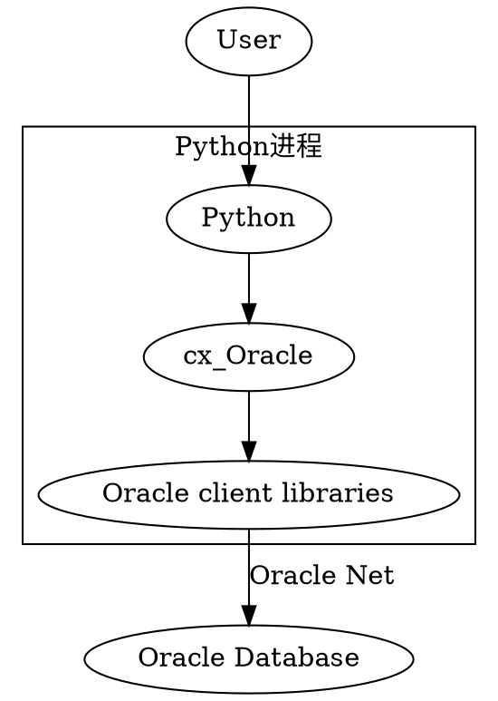

因为业务系统中用的数据库还是 Oracle 9i，因此，当我使用 sqlplus 或者是 cx_oracle 连接的时候，经常会报 connect to this version is not supported。这是因为，对于 9i 以下的版本，客户端 12 以上就不再支持了，必须使用 11 版本的，最后支持 9i 的版本就是 `11.0.2.4`了。o

<!--more-->

# instanctclient

[官方下载地址](https://www.oracle.com/database/technologies/instant-client/macos-intel-x86-downloads.html)
[官方安装教程](https://www.oracle.com/database/technologies/instant-client/macos-intel-x86-downloads.html#ic_osx_inst)
[关于 client 版本与 Oracle 版本的对应关系](https://www.cnblogs.com/fengaix6/p/10822030.html)
[cx_Oracle 关于版本对应的说明](https://cx-oracle.readthedocs.io/en/latest/user_guide/installation.html#oracle-client-and-oracle-database-interoperability)
最后一个链接需要登录和支持才能打开，所以从博客让链接一下了。
可以看到，对于 Oracle 9i/9.2.0 ，就只有 11.2 才会支持了。

# cx_Oracle

[关于 cx_Oracle 的介绍](https://cx-oracle.readthedocs.io/en/latest/user_guide/introduction.html)
从其架构来看：



因此，最终还是需要走到 Oracle 的客户端来进行连接，我会出现版本不支持的提示，就是因为的安装的客户端版本不匹配了。

对于 cx_Oracle 的版本支持，也有相关的描述：

https://cx-oracle.readthedocs.io/en/latest/user_guide/installation.html

> Version 19, 18 and 12.2 client libraries can connect to Oracle Database 11.2 or greater. Version 12.1 client libraries can connect to Oracle Database 10.2 or greater. Version 11.2 client libraries can connect to Oracle Database 9.2 or greater.

## Python2 支持

对于 Python2 最后一个支持的版本是 7.3.0 因此就只能用这个了哦。

Python 3.5 以上可以使用 cx_Oracle 8.0 版本，8.0 版本支持的客户端版本为 `19, 18, 12, and 11.2 `

虽然很不喜欢 Python2 ，但是现在的服务器 CentOS 基本都是自带的 python2 也没有办法了。

## 内网环境 Python2 安装 cx_Oracle

[参考这里](https://cx-oracle.readthedocs.io/en/latest/user_guide/installation.html#installing-cx-oracle-without-internet-access)
[还有这里](https://cx-oracle.readthedocs.io/en/latest/user_guide/installation.html#install-using-source-from-pypi)

## 使用示例

```python
import cx_Oracle

# Connect as user "hr" with password "welcome" to the "orclpdb1" service running on this computer.
connection = cx_Oracle.connect("hr", "welcome", "localhost/orclpdb1")

cursor = connection.cursor()
cursor.execute("""
        SELECT first_name, last_name
        FROM employees
        WHERE department_id = :did AND employee_id > :eid""",
        did = 50,
        eid = 190)
for fname, lname in cursor:
    print("Values:", fname, lname)
```

我们可以使用 `print(cx_Oracle.clientversion())` 来打印客户端的版本
