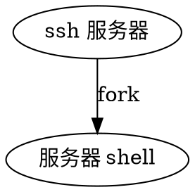

在 APUE 中曾经看过。但并未相依了解。如今，在 macOS 上没有一个好用的 SSH 客户端工具，所以就萌生了将配置文件写好，然后用命令行进行自动的查找账号密码，自动切换到 root 的功能。找了很多工具，都不是很好用。

<!--more-->

# expect

实际上，可以用 pexpect 这个 Python 来做，但是代码比较坑，而且切换到交互模式总是会卡住，为什么迟迟不解决呢。所以放弃了

# sshpass

这个个只支持一个密码进行登录，然后不会自动切换，所以需要进行改造一下，这就需要了解 伪终端的原理。

# 终端

终端这个概念实际上是个计算机一起出生的。为什么呢，因为对于一个计算机机，你需要与它进行交互，给他下达指令，做事情，那么你就得有一个媒介和通道撒，这玩意就是终端了。

# 工作流程图

