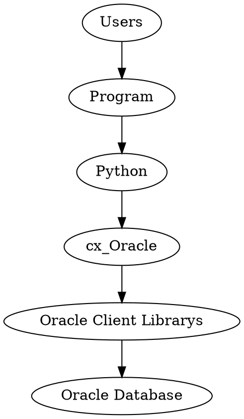

由于工作中经常需要到查询 MySQL 的操作，有的时候，把固定的操作做成命令行的话就会方便多了。不过，我们涉及的数据库多为 Oracle 和 MySQL。因此只需要在这两种之中进行选择就行了。

# Oracle

这个没有什么好讲的，采用 [cx_oracle](https://github.com/oracle/python-cx_Oracle) 就行了，官方出品，就是精品了。但是需要注意的是，对于高版本版本，库已经不带 native 的代码了，需要你自己去安装 oracle instant client。

> cx_Oracle 7.3 是最后一个支持 python 2  版本。
> 11.2 的 Client 才能连接 11 以后的数据库哦。比如我们用的 9i 。
> 因此，instantclient 选择 11.2 好了

<!--more-->
安装就没有什么好说的：

1. `pip install cx_oracle`，安装后你会发现，其实它就是一个动态库。因此想要补全什么的，都是不能的。
2. 手动在 Oracle 网站选择  Oracle instant client ，然后把库放在一个可以找到的地方.

安装之后，打印一下自己的客户端版本

```py
import cx_Oracle
print cx_Oracle.clientversion()
```




# MySQL 

这个可以选择的就多了。

- [MySQLdb-svn/MySQLdb1/MySQLdb2](https://github.com/farcepest/MySQLdb1) 这些都是传统的古老的 MySQLdb 系列了，只支持 Python 2。c 模块的封装。
- [MysqlClient](https://github.com/PyMySQL/mysqlclient) 从 MySQLdb1 fork 而来
- [mysql connector](https://dev.mysql.com/doc/connector-python/en/connector-python-introduction.html) MySQL 官方出品，纯 Python 库。

ORM:

- SQLalchemy 很重的东西，用起来麻烦哦。
- DJango 这个是是 Django 框架自带的 ORM，用起来简单些。
- Peewee 和 DJango 类似，但不支持表单迁移。
