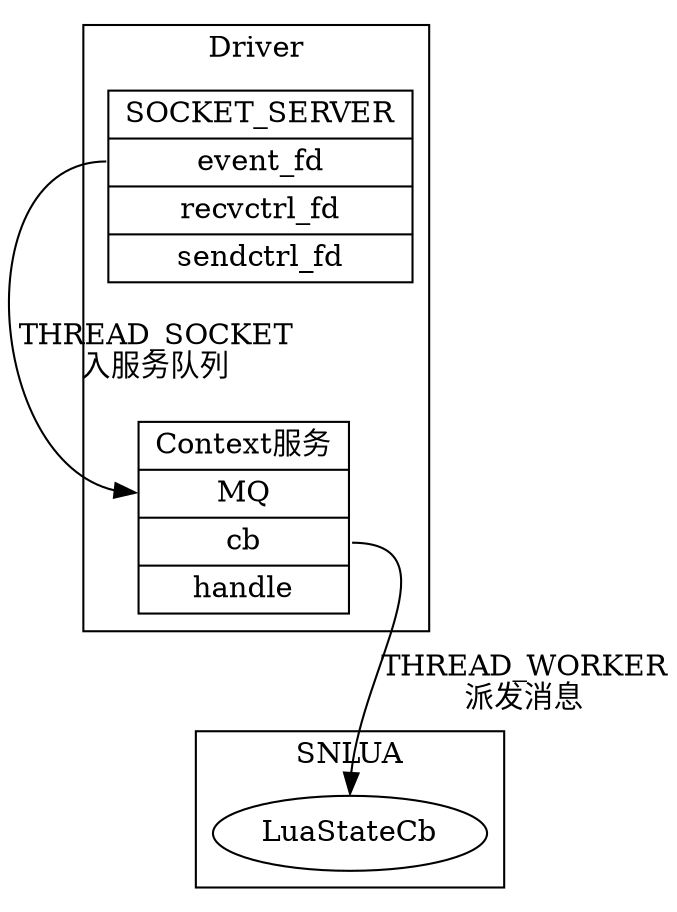

Skynet 中，其实提供了常规的 套接字 功能，如监听，连接，发送数据等，其中包含了几个模块，现在我们就来看一下它是如何实现的。比如`snax.gateserver` 就是利用这个功能来实现的。

<!--more-->

# 整体架构



# SOCKET_SERVER

引擎初始化的时候建立 SOCKET_SERVER，由它来对外进行与 socket 相关的功能。

```c
// skynet_start.c
void
skynet_start(struct skynet_config * config) {

  ...
	skynet_socket_init();
	start(config->thread);
  ...
}

static void
start(int thread) {
  ...
	create_thread(&pid[0], thread_monitor, m);
	create_thread(&pid[1], thread_timer, m);
	create_thread(&pid[2], thread_socket, m);
  ...
}
```

```c
// socket_server.c
// 这里保存了对所有 socket 结构的结构 socket 是对 OS 文件描述符的包装
struct socket_server {
	volatile uint64_t time;
	int recvctrl_fd;
	int sendctrl_fd;
	int checkctrl;
	poll_fd event_fd;
	int alloc_id;
	int event_n;
	int event_index;
	struct socket_object_interface soi;
	struct event ev[MAX_EVENT];
	struct socket slot[MAX_SOCKET];
	char buffer[MAX_INFO];
	uint8_t udpbuffer[MAX_UDP_PACKAGE];
	fd_set rfds;
};

void
skynet_socket_init() {
	SOCKET_SERVER = socket_server_create(skynet_now());
}

struct socket_server *
socket_server_create(uint64_t time) {
	int i;
	int fd[2];
	poll_fd efd = sp_create(); // poll fd ，套接字线程会轮询这上面的事件
	if (sp_invalid(efd)) {
		skynet_error(NULL, "socket-server: create event pool failed.");
		return NULL;
	}
	if (pipe(fd)) { // 一个管道，用来发送控制命令，套接字线程会先处理这上面的指令
		sp_release(efd);
		skynet_error(NULL, "socket-server: create socket pair failed.");
		return NULL;
	}
	if (sp_add(efd, fd[0], NULL)) {
		// add recvctrl_fd to event poll
		skynet_error(NULL, "socket-server: can't add server fd to event pool.");
		close(fd[0]);
		close(fd[1]);
		sp_release(efd);
		return NULL;
	}

	struct socket_server *ss = MALLOC(sizeof(*ss));
	ss->time = time;
	ss->event_fd = efd;
	ss->recvctrl_fd = fd[0];
	ss->sendctrl_fd = fd[1];
	ss->checkctrl = 1;

	for (i=0;i<MAX_SOCKET;i++) {
		struct socket *s = &ss->slot[i];
		s->type = SOCKET_TYPE_INVALID;
		clear_wb_list(&s->high);
		clear_wb_list(&s->low);
		spinlock_init(&s->dw_lock);
	}
	ss->alloc_id = 0;
	ss->event_n = 0;
	ss->event_index = 0;
	memset(&ss->soi, 0, sizeof(ss->soi));
	FD_ZERO(&ss->rfds);
	assert(ss->recvctrl_fd < FD_SETSIZE);

	return ss;
}
```

# 启动套接字

我们以 connect 一个服务来看一下这个过程，对 skynet 内 SOCKET_SERVER 的操作，其实在 `lua_socket.c` 里面进行了封装。

```c
// lua_socket.c
static int
lconnect(lua_State *L) {
	size_t sz = 0;
	const char * addr = luaL_checklstring(L,1,&sz);
	char tmp[sz];
	int port = 0;
	const char * host = address_port(L, tmp, addr, 2, &port);
	if (port == 0) {
		return luaL_error(L, "Invalid port");
	}
	struct skynet_context * ctx = lua_touserdata(L, lua_upvalueindex(1));
	int id = skynet_socket_connect(ctx, host, port);
	lua_pushinteger(L, id);

	return 1;
}
```

我们看到，实际上，我们在打开一个套接字的时候，实际上把一个服务的上下文 `skynet_context` 也传递了过去，这样，在有消息到来的时候，才知道把消息派发到哪一个服务去。

```c
// skynet_socket.c
int
skynet_socket_connect(struct skynet_context *ctx, const char *host, int port) {
	// 获取 context 结构在全局 Handle 中的 ID
	uint32_t source = skynet_context_handle(ctx);
	return socket_server_connect(SOCKET_SERVER, source, host, port);
}

这里，会向 SOCKET_SERVER 的控制命令管道发送指令。
int
socket_server_connect(struct socket_server *ss, uintptr_t opaque, const char * addr, int port) {
	struct request_package request;
	// opaque 就是 handle,服务 ID的代表
	int len = open_request(ss, &request, opaque, addr, port);
	if (len < 0)
		return -1;
	send_request(ss, &request, 'O', sizeof(request.u.open) + len);
	return request.u.open.id;
}
```

# 套接字线程工作

在套接字线程中，会调用 epoll 来查看文件描述符上面发生的事件。
这个函数做的事情有点多，我们一个一个来看。

```c
int
socket_server_poll(struct socket_server *ss, struct socket_message * result, int * more) {
	for (;;) {
		if (ss->checkctrl) {
			if (has_cmd(ss)) {
				int type = ctrl_cmd(ss, result); // 执行控制指令
				if (type != -1) {
					clear_closed_event(ss, result, type);
					return type;
				} else
					continue;
			} else {
				ss->checkctrl = 0;
			}
		}
		if (ss->event_index == ss->event_n) {
			ss->event_n = sp_wait(ss->event_fd, ss->ev, MAX_EVENT);
			ss->checkctrl = 1;
			if (more) {
				*more = 0;
			}
			ss->event_index = 0;
			if (ss->event_n <= 0) {
				ss->event_n = 0;
				if (errno == EINTR) {
					continue;
				}
				return -1;
			}
		}
		struct event *e = &ss->ev[ss->event_index++];
		struct socket *s = e->s;
		if (s == NULL) {
			// dispatch pipe message at beginning
			continue;
		}
		struct socket_lock l;
		socket_lock_init(s, &l);
		switch (s->type) {
		case SOCKET_TYPE_CONNECTING:
			return report_connect(ss, s, &l, result);
		case SOCKET_TYPE_LISTEN: {
			int ok = report_accept(ss, s, result);
			if (ok > 0) {
				return SOCKET_ACCEPT;
			} if (ok < 0 ) {
				return SOCKET_ERR;
			}
			// when ok == 0, retry
			break;
		}
		case SOCKET_TYPE_INVALID:
			skynet_error(NULL, "socket-server: invalid socket");
			break;
		default:
			if (e->read) {
				int type;
				// 转发 TCP 消息
				if (s->protocol == PROTOCOL_TCP) {
					type = forward_message_tcp(ss, s, &l, result);
				} else {
					type = forward_message_udp(ss, s, &l, result);
					if (type == SOCKET_UDP) {
						// try read again
						--ss->event_index;
						return SOCKET_UDP;
					}
				}
				if (e->write && type != SOCKET_CLOSE && type != SOCKET_ERR) {
					// Try to dispatch write message next step if write flag set.
					e->read = false;
					--ss->event_index;
				}
				if (type == -1)
					break;
				return type;
			}
			if (e->write) {
				// 发送套接字的 缓冲区
				int type = send_buffer(ss, s, &l, result);
				if (type == -1)
					break;
				return type;
			}
			if (e->error) {
				// close when error
				int error;
				socklen_t len = sizeof(error);
				int code = getsockopt(s->fd, SOL_SOCKET, SO_ERROR, &error, &len);
				const char * err = NULL;
				if (code < 0) {
					err = strerror(errno);
				} else if (error != 0) {
					err = strerror(error);
				} else {
					err = "Unknown error";
				}
				force_close(ss, s, &l, result);
				result->data = (char *)err;
				return SOCKET_ERR;
			}
			if(e->eof) {
				force_close(ss, s, &l, result);
				return SOCKET_CLOSE;
			}
			break;
		}
	}
}
```

## 控制指令

`ctrl_cmd` 就会执行我们的控制指令了，对于我们的 `connect` 请求，会打开一个套接字，具体指令过程不说，而要关注在套接字打开后，会将此套接字封装在一个 skyent_socket 结构中，同时添加到 pollfd 中去：

```c
// socket_server.c
// 对 OS 的文件描述符进行包装
static struct socket *
new_fd(struct socket_server *ss, int id, int fd, int protocol, uintptr_t opaque, bool reading) {
	struct socket * s = &ss->slot[HASH_ID(id)];
	assert(s->type == SOCKET_TYPE_RESERVE);

	if (sp_add(ss->event_fd, fd, s)) { // 就是这里了添加到了 polldf 中去
		s->type = SOCKET_TYPE_INVALID;
		return NULL;
	}

	s->id = id;
	s->fd = fd;
	s->reading = true;
	s->writing = false;
	s->sending = ID_TAG16(id) << 16 | 0;
	s->protocol = protocol;
	s->p.size = MIN_READ_BUFFER;
	s->opaque = opaque; // 套接字与一个服务ID相关联
	s->wb_size = 0;
	s->warn_size = 0;
	check_wb_list(&s->high);
	check_wb_list(&s->low);
	s->dw_buffer = NULL;
	s->dw_size = 0;
	memset(&s->stat, 0, sizeof(s->stat));
	if (enable_read(ss, s, reading)) {
		s->type = SOCKET_TYPE_INVALID;
		return NULL;
	}
	return s;
}
```

我们看到 `sp_add(ss->event_fd, fd, s)` 将文件描述符，以及 skynet 自己封装的一个数据结构传递给了 pollfd 相关的一些操作。

## 套接字消息的取出

我们在 `socket_server_poll` 函数中看到，会调用 `sp_wait()` 来检查一下套接字上发生的事件。不过，它将事件转换成了 skynet 自己的包装，返回事件中包含了一个 `skynet_socket` 结构。

```c
//socket_kqueue.h
static int
sp_wait(int kfd, struct event *e, int max) {
	struct kevent ev[max];
	int n = kevent(kfd, NULL, 0, ev, max, NULL);

	int i;
	// 在 macOS 上，将 kevent 转成 skynet 自己的 event 结构出去
	// 这里的 ev[i].udata 是我们之前用 sp_add 添加过去的 skynet 的 socket ，一个对 文件描述符的包装
	for (i=0;i<n;i++) {
		e[i].s = ev[i].udata;
		unsigned filter = ev[i].filter;
		bool eof = (ev[i].flags & EV_EOF) != 0;
		e[i].write = (filter == EVFILT_WRITE) && (!eof);
		e[i].read = (filter == EVFILT_READ);
		e[i].error = (ev[i].flags & EV_ERROR) != 0;
		e[i].eof = eof;
	}

	return n;
}
```

然后根据这个套接字结构中的 opaque 就知道是与哪个服务相关联的消息了，就可以放到消息队列去，交给工作线程派发过去了。


#socketchannel