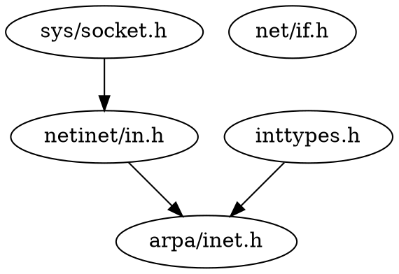

最近在用 C 做 Socket 编程的时候，看到需要很多分散在各处的头文件，为什么就不能放在一起呢？因为 Socket 大多是系统提供的 API，而不是 C 标准库提供的 API，很是纳闷，因此来仔细的了解一下先。

<!--more-->

# 定义机构

在 [http://www.opengroup.org/onlinepubs/9699919799/idx/head.html](http://www.opengroup.org/onlinepubs/9699919799/idx/head.html) 对这些头文件进行了定义，同时我们在 wiki 也能看到。[https://en.wikibooks.org/wiki/C_Programming/POSIX_Reference](https://en.wikibooks.org/wiki/C_Programming/POSIX_Reference)。

# 头文件列表

| 头文件             | 英文描述                                                          | 中文描述                                                                                                                                                                                                                                                                                                                                                                                                                                                                                                                                                                                                                                                                                                                                                                                                |
| ------------------ | ----------------------------------------------------------------- | ------------------------------------------------------------------------------------------------------------------------------------------------------------------------------------------------------------------------------------------------------------------------------------------------------------------------------------------------------------------------------------------------------------------------------------------------------------------------------------------------------------------------------------------------------------------------------------------------------------------------------------------------------------------------------------------------------------------------------------------------------------------------------------------------------- |
| **aio.h**          | Asynchronous input and output.                                    | 异步 IO                                                                                                                                                                                                                                                                                                                                                                                                                                                                                                                                                                                                                                                                                                                                                                                                 |
| **arpa/inet.h**    | Definitions for internet operations.                              | 网络操作定义。主要定义了 `in_port_t, in_addr_t,INET_ADDRSTRLEN,INET6_ADDRSTRLEN`，这几个在 `<netinet.in.h>` 中需要。定义宏或函数 `uint32_t htonl(uint32_t); uint16_t htons(uint16_t); uint32_t ntohl(uint32_t); uint16_t ntohs(uint16_t);` 定义 `<inttypes.h>` 中需要的 `uint32_t, uint16_t`。定义函数 `in_addr_t inet_addr(const char *); char *inet_ntoa(struct in_addr); const char *inet_ntop(int, const void *restrict, char *restrict, socklen_t); int inet_pton(int, const char *restrict, void *restrict);`。Include 了此文件也就包含了 `<netinet/in.h>、<inttypes.h>`。                                                                                                                                                                                                                        |
| **cpio.h**         | Magic numbers for the cpio archive format.                        | cpio 归档格式的幻数。                                                                                                                                                                                                                                                                                                                                                                                                                                                                                                                                                                                                                                                                                                                                                                                   |
| **dirent.h**       | Allows the opening and listing of directories.                    | 打开和列出目录                                                                                                                                                                                                                                                                                                                                                                                                                                                                                                                                                                                                                                                                                                                                                                                          |
| **fcntl.h**        | File opening, locking and other operations.                       | 文件打开、锁定和其他操作。                                                                                                                                                                                                                                                                                                                                                                                                                                                                                                                                                                                                                                                                                                                                                                              |
| **fmtmsg.h**       | Message display structures.                                       | 消息显示结构。                                                                                                                                                                                                                                                                                                                                                                                                                                                                                                                                                                                                                                                                                                                                                                                          |
| **fnmatch.h**      | Filename-matching types.                                          | 文件名匹配类型                                                                                                                                                                                                                                                                                                                                                                                                                                                                                                                                                                                                                                                                                                                                                                                          |
| **ftw.h**          | File tree traversal.                                              | 文件树遍历                                                                                                                                                                                                                                                                                                                                                                                                                                                                                                                                                                                                                                                                                                                                                                                              |
| **glob.h**         | Pathname pattern-matching types.                                  | 路径名模式匹配类型                                                                                                                                                                                                                                                                                                                                                                                                                                                                                                                                                                                                                                                                                                                                                                                      |
| **grp.h**          | User group information and control.                               | 用户组信息和控制                                                                                                                                                                                                                                                                                                                                                                                                                                                                                                                                                                                                                                                                                                                                                                                        |
| **iconv.h**        | Codeset conversion facility.                                      | 编码转换特性。                                                                                                                                                                                                                                                                                                                                                                                                                                                                                                                                                                                                                                                                                                                                                                                          |
| **langinfo.h**     | Language information constants.                                   | 语言信息常量                                                                                                                                                                                                                                                                                                                                                                                                                                                                                                                                                                                                                                                                                                                                                                                            |
| **libgen.h**       | Definitions for pattern matching functions.                       | 模式匹配函数的定义。                                                                                                                                                                                                                                                                                                                                                                                                                                                                                                                                                                                                                                                                                                                                                                                    |
| **monetary.h**     | Monetary types.                                                   | 货币类型。                                                                                                                                                                                                                                                                                                                                                                                                                                                                                                                                                                                                                                                                                                                                                                                              |
| **mqueue.h**       | Message queues (REALTIME).                                        | 消息队列（实时）                                                                                                                                                                                                                                                                                                                                                                                                                                                                                                                                                                                                                                                                                                                                                                                        |
| **ndbm.h**         | Definitions for ndbm database operations.                         | ndbm 数据库操作定义。                                                                                                                                                                                                                                                                                                                                                                                                                                                                                                                                                                                                                                                                                                                                                                                   |
| **net/if.h**       | Sockets local interfaces.                                         | 套接字本地接口。定义 `**if_nameindex**` 结构，定义 `IF_NAMESIZE` 常量， 定义函数 `void if_freenameindex(struct if_nameindex *); char *if_indextoname(unsigned, char *); struct if_nameindex *if_nameindex(void); unsigned if_nametoindex(const char *);`。                                                                                                                                                                                                                                                                                                                                                                                                                                                                                                                                              |
| **netdb.h**        | Definitions for network database operations.                      | 网络数据库操作定义。                                                                                                                                                                                                                                                                                                                                                                                                                                                                                                                                                                                                                                                                                                                                                                                    |
| **netinet/in.h**   | Internet address family.                                          | 网络地址族定义。定义 `**in_port_t**, in_addr_t`（与 `<inttypes.h>` 中的 `uint16_t, uint32_t` 相等。定义 `**sa_family_t**`（`<sys/socket.h>` 需要）。定义 `uint8_t, uint32_t` 这和`<inttypes.h>` 中的一致。包含 `<netinet/in.h>` 会让 `<sys/socket.h>, <inttypes.h>` 中的符号都可用。定义 `in_addr` 结构，它最少包含了 `in_addr_t s_addr` 成员。定义 `sockaddr_in` 结构，最少包含成员：`sa_family_t sin_family AF_INET. in_port_t sin_port Port number. struct in_addr sin_addr IP address. ` `sin_port, sin_addr` 都应该是网络字节序。定义结构 `**in6_addr**， **sockaddr_in6**`。定义常量：`IPPROTO_IP, IPPROTO_IPV6, IPPROTO_ICMP, IPPROTO_RAW, IPPROTO_TCP, IPPROTO_UDP, INADDR_ANY, INADDR_BROADCAST, INET_ADDRSTRLEN,INET6_ADDRSTRLEN, IPV6_JOIN_GROUP等`。包含这个文件，让 `<arpa/inet.h>` 可用。 |
| **netinet/tcp.h**  | Definitions for the Internet Transmission Control Protocol (TCP). | TCP 协议的一些定义。其实就定义了一个 `TCP_NODELAY`。                                                                                                                                                                                                                                                                                                                                                                                                                                                                                                                                                                                                                                                                                                                                                    |
| **nl_types.h**     | Data types.                                                       | 数据类型。                                                                                                                                                                                                                                                                                                                                                                                                                                                                                                                                                                                                                                                                                                                                                                                              |
| **poll.h**         | Definitions for the poll() function.                              | 定义 `poll` 函数。                                                                                                                                                                                                                                                                                                                                                                                                                                                                                                                                                                                                                                                                                                                                                                                      |
| **pthread.h**      | Defines an API for creating and manipulating POSIX threads.       | 定义 POSIX 线程相关东西。                                                                                                                                                                                                                                                                                                                                                                                                                                                                                                                                                                                                                                                                                                                                                                               |
| **pwd.h**          | Passwd (user information) access and control.                     | 密码（用户信息）访问和控制。                                                                                                                                                                                                                                                                                                                                                                                                                                                                                                                                                                                                                                                                                                                                                                            |
| **regex.h**        | Regular expression matching types.                                | 正则式匹配类型                                                                                                                                                                                                                                                                                                                                                                                                                                                                                                                                                                                                                                                                                                                                                                                          |
| **sched.h**        | Execution scheduling.                                             | 执行调度                                                                                                                                                                                                                                                                                                                                                                                                                                                                                                                                                                                                                                                                                                                                                                                                |
| **search.h**       | Search tables.                                                    | 搜索表。                                                                                                                                                                                                                                                                                                                                                                                                                                                                                                                                                                                                                                                                                                                                                                                                |
| **semaphore.h**    | Semaphores.                                                       | 信号量                                                                                                                                                                                                                                                                                                                                                                                                                                                                                                                                                                                                                                                                                                                                                                                                  |
| **spawn.h**        | Create a new process to run an executable program.                | 建立一个新进程来执行程序。                                                                                                                                                                                                                                                                                                                                                                                                                                                                                                                                                                                                                                                                                                                                                                              |
| **strings.h**      | String operations.                                                | 字符串操作。C 标准中是 <string.h>`int ffs(int); int strcasecmp(const char *, const char *); int strcasecmp_l(const char *, const char *, locale_t); int strncasecmp(const char *, const char *, size_t); int strncasecmp_l(const char *, const char *, size_t, locale_t);`                                                                                                                                                                                                                                                                                                                                                                                                                                                                                                                              |
| **stropts.h**      | STREAMS interface (STREAMS).                                      | 流接口。                                                                                                                                                                                                                                                                                                                                                                                                                                                                                                                                                                                                                                                                                                                                                                                                |
| **sys/ipc.h**      | Inter-process communication (IPC).                                | 进程间通信                                                                                                                                                                                                                                                                                                                                                                                                                                                                                                                                                                                                                                                                                                                                                                                              |
| **sys/mman.h**     | POSIX memory management declarations.                             | POSIX 内存管理声明                                                                                                                                                                                                                                                                                                                                                                                                                                                                                                                                                                                                                                                                                                                                                                                      |
| **sys/msg.h**      | POSIX message queues.                                             | POSIX 消息队列                                                                                                                                                                                                                                                                                                                                                                                                                                                                                                                                                                                                                                                                                                                                                                                          |
| **sys/resource.h** | Definitions for XSI resource operations.                          | XSI 资源操作定义                                                                                                                                                                                                                                                                                                                                                                                                                                                                                                                                                                                                                                                                                                                                                                                        |
| **sys/select.h**   | Select types.                                                     | select 操作。                                                                                                                                                                                                                                                                                                                                                                                                                                                                                                                                                                                                                                                                                                                                                                                           |
| **sys/sem.h**      | POSIX semaphores.                                                 | POSIX 信号量                                                                                                                                                                                                                                                                                                                                                                                                                                                                                                                                                                                                                                                                                                                                                                                            |
| **sys/shm.h**      | XSI shared memory facility.                                       | XSI 共享内存特性。                                                                                                                                                                                                                                                                                                                                                                                                                                                                                                                                                                                                                                                                                                                                                                                      |
| **sys/socket.h**   | Main sockets header.                                              | 主要的套接字头文件。                                                                                                                                                                                                                                                                                                                                                                                                                                                                                                                                                                                                                                                                                                                                                                                    |
| **sys/stat.h**     | File information (stat et al.).                                   | 文件信息。                                                                                                                                                                                                                                                                                                                                                                                                                                                                                                                                                                                                                                                                                                                                                                                              |
| **sys/statvfs.h**  | VFS File System information structure.                            | VFS 文件系统信息结构。                                                                                                                                                                                                                                                                                                                                                                                                                                                                                                                                                                                                                                                                                                                                                                                  |
| **sys/time.h**     | Time and date functions and structures.                           | 时间和日期函数与结构                                                                                                                                                                                                                                                                                                                                                                                                                                                                                                                                                                                                                                                                                                                                                                                    |
| **sys/times.h**    | File access and modification times structure.                     | 文件访问和修改的时间结构                                                                                                                                                                                                                                                                                                                                                                                                                                                                                                                                                                                                                                                                                                                                                                                |
| **sys/types.h**    | Various data types used elsewhere.                                | 很多的数据类型。                                                                                                                                                                                                                                                                                                                                                                                                                                                                                                                                                                                                                                                                                                                                                                                        |
| **sys/uio.h**      | Definitions for vector I/O operations.                            | 向量 I/O 操作定义                                                                                                                                                                                                                                                                                                                                                                                                                                                                                                                                                                                                                                                                                                                                                                                       |
| **sys/un.h**       | Definitions for UNIX domain sockets.                              | UNIX 域套接字定义                                                                                                                                                                                                                                                                                                                                                                                                                                                                                                                                                                                                                                                                                                                                                                                       |
| **sys/utsname.h**  | uname and related structures.                                     | uname 和相关的结构                                                                                                                                                                                                                                                                                                                                                                                                                                                                                                                                                                                                                                                                                                                                                                                      |
| **sys/wait.h**     | Status of terminated child processes.                             | 结束子进程的状态。                                                                                                                                                                                                                                                                                                                                                                                                                                                                                                                                                                                                                                                                                                                                                                                      |
| **syslog.h**       | Definitions for system error logging.                             | 系统错误日志定义。                                                                                                                                                                                                                                                                                                                                                                                                                                                                                                                                                                                                                                                                                                                                                                                      |
| **tar.h**          | Magic numbers for the tar archive format.                         | tar 归档格式幻数定义                                                                                                                                                                                                                                                                                                                                                                                                                                                                                                                                                                                                                                                                                                                                                                                    |
| **termios.h**      | Allows terminal I/O interfaces.                                   | 允许终端 I/O 接口                                                                                                                                                                                                                                                                                                                                                                                                                                                                                                                                                                                                                                                                                                                                                                                       |
| **trace.h**        | Tracing.                                                          | 跟踪                                                                                                                                                                                                                                                                                                                                                                                                                                                                                                                                                                                                                                                                                                                                                                                                    |
| **ulimit.h**       | ulimit commands.                                                  | ulimit 命令                                                                                                                                                                                                                                                                                                                                                                                                                                                                                                                                                                                                                                                                                                                                                                                             |
| **unistd.h**       | Various essential POSIX functions and constants.                  | 很多重要的 POSIX 函数和常量，如 `read, write`。                                                                                                                                                                                                                                                                                                                                                                                                                                                                                                                                                                                                                                                                                                                                                         |
| **utime.h**        | File access and modification times.                               | 文件访问和修改时间                                                                                                                                                                                                                                                                                                                                                                                                                                                                                                                                                                                                                                                                                                                                                                                      |
| **utmpx.h**        | User accounting database definitions.                             | 用户审计数据库定义                                                                                                                                                                                                                                                                                                                                                                                                                                                                                                                                                                                                                                                                                                                                                                                      |
| **wordexp.h**      | Word-expansion types.                                             | 单词扩展类型。                                                                                                                                                                                                                                                                                                                                                                                                                                                                                                                                                                                                                                                                                                                                                                                          |

# 与 C 重叠或相关的头文件

| 头文件         | 英文描述                                            | 中文描述               |
| -------------- | --------------------------------------------------- | ---------------------- |
| **assert.h**   | Verify program assertion.                           | 断言                   |
| **complex.h**  | Complex arithmetic.                                 | 复数                   |
| **ctype.h**    | Character types.                                    | 字符类型               |
| **fenv.h**     | Floating-point environment.                         | 浮点数环境             |
| **float.h**    | Floating types.                                     | 浮点类型               |
| **inttypes.h** | Fixed size integer types.                           | 定长整型               |
| **iso646.h**   | Alternative spellings.                              | 可选的单词             |
| **limits.h**   | Implementation-defined constants.                   | 实现定义的常量         |
| **locale.h**   | Category macros.                                    | 区域宏                 |
| **math.h**     | Mathematical declarations.                          | 数学声明               |
| **setjmp.h**   | Stack environment declarations.                     | 栈环境声明             |
| **signal.h**   | Signals.                                            | 信号                   |
| **stdarg.h**   | Handle variable argument list.                      | 变长参数列表           |
| **stdbool.h**  | Boolean type and values.                            | 布尔类型和值           |
| **stddef.h**   | Standard type definitions.                          | 标准类型定义           |
| **stdint.h**   | Integer types.                                      | 整型                   |
| **stdio.h**    | Standard buffered input/output.                     | 标准缓冲 I/O           |
| **stdlib.h**   | Standard library definitions.                       | 标准库定义             |
| **string.h**   | String operations.                                  | 字符串操作             |
| **tgmath.h**   | Type-generic macros.                                | 泛型宏                 |
| **time.h**     | Time types.                                         | 时间类型               |
| **wchar.h**    | Wide-character handling.                            | 宽字符操作             |
| **wctype.h**   | Wide-character classification and mapping utilities | 宽字符分类和映射工具集 |

# 网络编程相关的几个头文件

- `arpa/inet.h` 网络操作的定义。主要定义几个函数：

  ```c
  uint32_t htonl(uint32_t);
  uint16_t htons(uint16_t);
  uint32_t ntohl(uint32_t);
  uint16_t ntohs(uint16_t);
  
  
  in_addr_t    inet_addr(const char *);
  char        *inet_ntoa(struct in_addr);
  const char  *inet_ntop(int, const void *restrict, char *restrict,
                   socklen_t);
  int          inet_pton(int, const char *restrict, void *restrict);
  ```

  

- `net/if.h` 套接字本地接口，但是一般我们都不会用这个。

- `netinet/in.h` 网络地址族。定义了和网络地址相关的内容如地址结构、端口结构等。

  ```c
  in_port_t
  in_addr_t
  sa_family_t
  struct in_addr{
    in_addr_t  s_addr
  }
  struct sockaddr_in{
  sa_family_t     sin_family   AF_INET. 
  in_port_t       sin_port     Port number. 
  struct in_addr  sin_addr     IP address. 
  }
  
  struct in6_addr{
    uint8_t s6_addr[16]
  }
  
  struct sockaddr_in6{
  sa_family_t      sin6_family    AF_INET6. 
  in_port_t        sin6_port      Port number. 
  uint32_t         sin6_flowinfo  IPv6 traffic class and flow information. 
  struct in6_addr  sin6_addr      IPv6 address. 
  uint32_t         sin6_scope_id  Set of interfaces for a scope. 
  }
  还会定义给 `setsockopt()` `getsockopt()` 使用的常量：
  IPPROTO_IP
  IPPROTO_IPV6
  IPPROTO_ICMP
  IPPROTO_RAW
  IPPROTO_TCP
  IPPROTO_UDP
  ```

  

- `sys/socket.h` 套接字的主要头文件。

- `inttypes.h` 定义一些基本类型。



实际上，套接字相关的，我们只需要包含 `<arpa/inet.h>` 就行了哦。

有几个比较蛋疼的结构：

```c
#include <netinet/in.h>
/*
 * Socket address, internet style.
 * 套接字地址，网络风格。
 */
struct sockaddr_in {
	__uint8_t       sin_len;
	sa_family_t     sin_family;
	in_port_t       sin_port;
	struct  in_addr sin_addr;
	char            sin_zero[8];
};
```

```c
#include <sys/socket.h>
/*
 * [XSI] Structure used by kernel to store most addresses.
 * [XSI] 内核用来存储大多数地址的结构
 */
struct sockaddr {
	__uint8_t       sa_len;         /* total length */
	sa_family_t     sa_family;      /* [XSI] address family */
	char            sa_data[14];    /* [XSI] addr value (actually larger) */
};
```

`sockaddr` 和 `sockaddr_in` 实际上字节数一样的，不过因为历史原因，内核用 `sockaddr` 来保存很多类型的地址，而不仅仅是网络地址，所以对于有些函数，我们必须得强制转换过去才能使用。

一般情况下，我们如果要系统调用返回的结构都是 sockaddr 类型，传递的时候也需要传递这个类型，如：

`getaddrinfo` 返回的 `addrinfo` 结构中就是 `sockaddr` 结构，

`connect` 函数需要接收的也是一个 `sockaddr` 结构。

```c
int
     connect(int socket, const struct sockaddr *address, socklen_t address_len);
```

