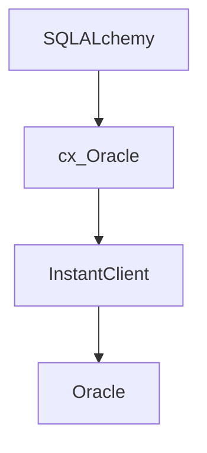

在使用 Python 制作程序，连接 Oracle 数据库获取数据的过程中，出现了几个非常诡异和迷惑的问题，最终发现了解决的思路。

<!--more-->

# 环境

Python: 3.7.9

SQLAlchemy:1.3.23

cx_Oracle：8.1.0

Oracle服务器：9.2.0

Oralce InstantClient: 11.2.0.4

# 逻辑结构



SQLAlchemy 使用 cx_Oracle 来连接数据库，而 cx_Oracle 底层又使用了 InstantClient 中的 dbapi 来与数据库交互。


# 表现

我使用 SQLAlchemy ORM 来查询一个表的时候，会出现错误：

```
ORA-03115: 不支持的网络数据类型或表示法
ORA-03115: unsupported network datatype or representation
```

在网络上对这个问题的解决方法，和说明其实不多，根据官方的定义：

```
A user bind or define, or an Oracle function, is not supported by this heterogeneous Net8 connection.
一个用户绑定或定义、或一个 Oracle 函数并不被这个 heterogeneous Net8 连接所支持。
Action: Upgrade the older version of Oracle and try again.
动作：更新老版本的 Oracle 并重试。
```


我不很是明白这个问题出现的原因，但很明显，对于一个生产库，升级数据库不是一个好的选择。


# 回顾

回顾一下我的使用过程，之前，在未使用 SQLAlchemy 时，直接使用  cx_oracle 的 API 进行执行查询的时候，却并没有出现这个问题，因此我怀疑，这应该是一个用户绑定出了问题？


## 表的定义

对于表的定义，我使用了。[sqlacodegen](https://github.com/agronholm/sqlacodegen) 来出数据库反射出来模型数据，结果如下：

```python
class RadDetail(Base):
    __tablename__ = 'rad_detail'

    userid = Column(NUMBER(8, 0, False), primary_key=True)
    service_type = Column(VARCHAR(50))
    account_info = Column(VARCHAR(255))
    framed_protocol = Column(VARCHAR(50))
    framed_ip_address = Column(VARCHAR(50))
    framed_ip_netmask = Column(VARCHAR(50))
    idle_timeout = Column(NUMBER(15, 0, False))
    _class = Column('class', VARCHAR(128))
    session_timeout = Column(NUMBER(15, 0, False))
    cisco_avpair = Column(VARCHAR(50))
    ip_type = Column(NUMBER(asdecimal=False), server_default=text("0"))
    assign_ip_pool = Column(NUMBER(asdecimal=False))
    start_time = Column(NUMBER(asdecimal=False))
    end_time = Column(NUMBER(asdecimal=False))
```

## 逐字段测试

当我采用如下查询的时候，是有问题的：

```python
from sqlalchemy.orm import sessionmaker
from sqlalchemy import create_engine
import cx_Oracle

old = cx_Oracle.makedsn('localhost', 1521, service_name='bims')
SessionOLD = sessionmaker(bind=OLD)()
SessionOLD.query(RadDetail).one_or_none()
```

而当我选择逐个字段进行测试，当我测试到字段 `ip_type` 的时候，就出错了：

```python
SessionOLD.query(RadDetail.ip_type).one_or_none()
```

我仔细审视了其他正常工作的字段，发觉了一个问题：

**ip_type** 的 字段定义成 NUMBER ，和正常工作的字段不同：

```python
NUMBER(15, 0, False) # 正常工作
NUMBER(asdecimal=False) # 无法工作
```


# SQLAlchemy 对 Number 的定义

```python
class NUMBER(sqltypes.Numeric, sqltypes.Integer):
    __visit_name__ = "NUMBER"

    def __init__(self, precision=None, scale=None, asdecimal=None):
        if asdecimal is None:
            asdecimal = bool(scale and scale > 0)

        super(NUMBER, self).__init__(
            precision=precision, scale=scale, asdecimal=asdecimal
        )

    def adapt(self, impltype):
        ret = super(NUMBER, self).adapt(impltype)
        # leave a hint for the DBAPI handler
        ret._is_oracle_number = True
        return ret

    @property
    def _type_affinity(self):
        if bool(self.scale and self.scale > 0):
            return sqltypes.Numeric
        else:
            return sqltypes.Integer
```

- precision 代表了有效的数字位数
- scale 小数点位数
- asdecimal 是否作为 Python 的 Decimal 对象转换，若为否则转换为 float

因此，在我们生成的定义中，将会把 `ip_type` 转换成 float 数值，而不是 Decimal，那么实际上在 Oracle 中这又是什么样的？问题的所在其实就在这里。

看到最终的代码异常是在这里抛出：

```python
dbapi_cursor.fetchall()
```

在这里，我们的转换出来的字段定义期待将 `ip_type` 转换成一个浮点数，而不是 Decimal。

我想这是因为 cx_oracle 调用 dbapi 的时候，无法将 NUMBER 转成 float 吧。

# cx_oracle

在 SQLALchemy 中，看到设置了一个 `outputhandler`，当没有设置精度和小数点位数的时候会转换成 ` cx_Oracle.NATIVE_FLOAT`，而这个与 [DB_TYPE_BINARY_DOUBLE](https://cx-oracle.readthedocs.io/en/latest/api_manual/module.html?highlight=NATIVE_FLOAT#cx_Oracle.DB_TYPE_BINARY_DOUBLE) 是一个意思。


而从这个 [测试上看出](https://www.cnblogs.com/kerrycode/p/6957574.html)，对于一个不指定精度和 scale 的 NUMBER，他的小数点位数是不固定的，因此无法转换成固定精度和小数点位数的 `float` ，所以，后面我将 `asdecimal=True` 这样，就可以正常的执行了，这过据  SQLALchemy 说， Decimal 性能有点低，可以用 `cdecimal` 来进行替代。
