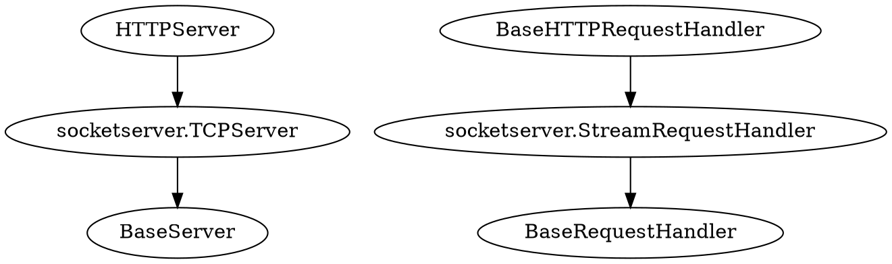

因为是简单的业务，并发不高，所以就用 Python 的 HTTP Server 来做了一个简单的接口。但是在使用的过程中，会发现接口会时不时的阻塞住，甚至于将其他线程与阻塞住了，用 CTRL+C 可以结束阻塞，并抛出一个异常，然后可继续往下执行。

<!--more-->

# 现象

整个程序阻塞，`CTRL+C` 结束线程后继续往下执行。此时会抛出异常：

```
ConnectionAbortedError: [WinError 10053] 你的主机中的软件中止了一个已建立的连接。
```

这个报告的意思是，我们的程序，中止了一个已建立的连接。

# 原因

通过这个原因推测，是我们的 `CTRL+C` 中止了一个连接。我查看了一下代码，可能阻塞的地方在于：

```python
        data = self.rfile.read(length)
```

# 先从工作的机制说起

首先，我们的 `HTTPServer` 来作为服务器的，它的继承线如下：



实际上，就是一个 TCPServer，它需要一个 Hanlder 来处理连接上的数据：

```python
    def __init__(self, server_address, RequestHandlerClass, bind_and_activate=True):
        """Constructor.  May be extended, do not override."""
        BaseServer.__init__(self, server_address, RequestHandlerClass)
        self.socket = socket.socket(self.address_family,
                                    self.socket_type)
        if bind_and_activate:
            try:
                self.server_bind()
                self.server_activate()
            except:
                self.server_close()
                raise
```

在构造的时候，我传递了一个 `BaseHTTPRequestHandler` 过去。

之后，我就使用了 ` APISERVER.serve_forever()` 来开始服务。

当有连接过来的时候，就会将请求交给处理器去处理：

```python
# BaseServer
    def _handle_request_noblock(self):
        """Handle one request, without blocking.

        I assume that selector.select() has returned that the socket is
        readable before this function was called, so there should be no risk of
        blocking in get_request().
        """
        try:
            request, client_address = self.get_request()
        except OSError:
            return
        if self.verify_request(request, client_address):
            try:
                self.process_request(request, client_address)
            except Exception:
                self.handle_error(request, client_address)
                self.shutdown_request(request)
            except:
                self.shutdown_request(request)
                raise
        else:
            self.shutdown_request(request)

    def process_request(self, request, client_address):
        """Call finish_request.

        Overridden by ForkingMixIn and ThreadingMixIn.

        """
        self.finish_request(request, client_address)
        self.shutdown_request(request)
    def finish_request(self, request, client_address):
        """Finish one request by instantiating RequestHandlerClass."""
        self.RequestHandlerClass(request, client_address, self)
```

对于 TCPServer 来说，它的 `get_request` 返回的是一个套接字，和客户端的地址：

```python
#TCPServer
    def get_request(self):
        """Get the request and client address from the socket.

        May be overridden.

        """
        return self.socket.accept()
```


## BaseRequestHandler

这一个做的事情比较简单，设置一个处置的逻辑过程，具体的实现细节就交给了子类去实现：

```python
// BaseRequestHandler
    def __init__(self, request, client_address, server):
        self.request = request
        self.client_address = client_address
        self.server = server
        self.setup()
        try:
            self.handle()
        finally:
            self.finish()
```

## StreamRequestHandler

对于流式的请求处理，在获得了 `accept` 返回的套接字后，会设置一下超时（可选），在套接字上建立读写缓冲。

```python
# StreamRequestHandler
    rbufsize = -1
    wbufsize = 0
    # A timeout to apply to the request socket, if not None.
    timeout = None

    # Disable nagle algorithm for this socket, if True.
    # Use only when wbufsize != 0, to avoid small packets.
    disable_nagle_algorithm = False

    def setup(self):
        self.connection = self.request
        if self.timeout is not None:
            self.connection.settimeout(self.timeout)
        if self.disable_nagle_algorithm:
            self.connection.setsockopt(socket.IPPROTO_TCP,
                                       socket.TCP_NODELAY, True)
        self.rfile = self.connection.makefile('rb', self.rbufsize)
        if self.wbufsize == 0:
            self.wfile = _SocketWriter(self.connection)
        else:
            self.wfile = self.connection.makefile('wb', self.wbufsize)
```

### socket.makefile

```python
# socket
    def makefile(self, mode="r", buffering=None, *,
                 encoding=None, errors=None, newline=None):
        """makefile(...) -> an I/O stream connected to the socket

        The arguments are as for io.open() after the filename, except the only
        supported mode values are 'r' (default), 'w' and 'b'.
        """
        # XXX refactor to share code?
        if not set(mode) <= {"r", "w", "b"}:
            raise ValueError("invalid mode %r (only r, w, b allowed)" % (mode,))
        writing = "w" in mode
        reading = "r" in mode or not writing
        assert reading or writing
        binary = "b" in mode
        rawmode = ""
        if reading:
            rawmode += "r"
        if writing:
            rawmode += "w"
        raw = SocketIO(self, rawmode)
        self._io_refs += 1
        if buffering is None:
            buffering = -1
        if buffering < 0:
            buffering = io.DEFAULT_BUFFER_SIZE
        if buffering == 0:
            if not binary:
                raise ValueError("unbuffered streams must be binary")
            return raw
        if reading and writing:
            buffer = io.BufferedRWPair(raw, raw, buffering)
        elif reading:
            buffer = io.BufferedReader(raw, buffering)
        else:
            assert writing
            buffer = io.BufferedWriter(raw, buffering)
        if binary:
            return buffer
        text = io.TextIOWrapper(buffer, encoding, errors, newline)
        text.mode = mode
        return text

```

这个方法的作用，是将一个套接字与一个流相关联。

对于我们在`StreamRequestHandler` 里面返回的将会是：

- rfile: io.BufferedReader
- wfile: io.BufferedWriter

## BaseHTTPRequestHandler

对于请求的处理逻辑，是放在此类的 `handle` 方法内：

```python
# BaseHTTPRequestHandler
    def handle(self):
        """Handle multiple requests if necessary."""
        self.close_connection = True

        self.handle_one_request()
        while not self.close_connection:
            self.handle_one_request()
    def handle_one_request(self):
        """Handle a single HTTP request.

        You normally don't need to override this method; see the class
        __doc__ string for information on how to handle specific HTTP
        commands such as GET and POST.

        """
        try:
            self.raw_requestline = self.rfile.readline(65537)
            if len(self.raw_requestline) > 65536:
                self.requestline = ''
                self.request_version = ''
                self.command = ''
                self.send_error(HTTPStatus.REQUEST_URI_TOO_LONG)
                return
            if not self.raw_requestline:
                self.close_connection = True
                return
            if not self.parse_request():
                # An error code has been sent, just exit
                return
            mname = 'do_' + self.command
            if not hasattr(self, mname):
                self.send_error(
                    HTTPStatus.NOT_IMPLEMENTED,
                    "Unsupported method (%r)" % self.command)
                return
            method = getattr(self, mname)
            method()
            self.wfile.flush() #actually send the response if not already done.
        except socket.timeout as e:
            #a read or a write timed out.  Discard this connection
            self.log_error("Request timed out: %r", e)
            self.close_connection = True
            return


```

我们看到，在此，先解析了请求的头信息，然后就把剩下的交给了对应的方法响应函数来处理，如 `do_POST`。

我们在方法内调用了类似：

```
self.rfile.readline(65537)
self.rfile.read(buff)
self.wfile.write(buff)
```

这样的处理，这有可能会造成阻塞。

那么，在 `self.rfile.readline(65537)` 这个获取 HTTP 请求第一行的时候也可能会阻塞。

同时，在 `parse_requests` 中，会调用 

```python
            self.headers = http.client.parse_headers(self.rfile,
                                                     _class=self.MessageClass)
```

来解析流上的头，这也有可能会阻塞。

最后，`read` 消息体也会阻塞，这就很蛋疼了。