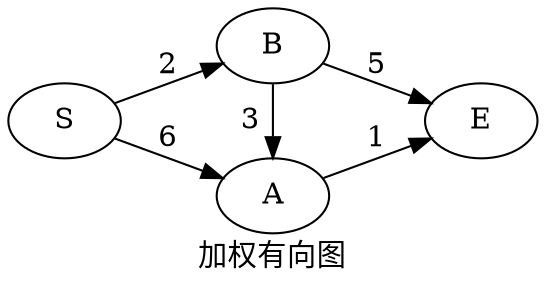
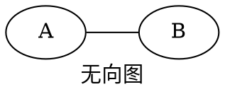
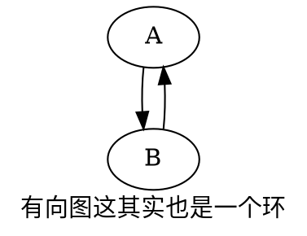

算法图解中简单的介绍了两个算法：广度搜索优先和狄克斯特拉算法。用来查找最短路径，这个指的不是物理意义上的最短路径，后文便知。

<!--more-->

# 问题



现在要解决从 S 到 E 最短路径的问题，如何最短的时间到达 E，图中的数字代表了需要消耗的时间。

# 图

一个图用来代表二维平面内的连接，上面例子中，圆的代表了 **节点(Node)**，箭头代表了 **边(Edge)**，数字代表了**权重(Weight)**。

无向图，其实就是节点间有两条边：



其实它等于：



# 广度优先算法

这个算法解决两个问题：

1. S 到 E 有没有最短路径
2. S 到 E 的最短路径是什么

实际上就是解决例子中，如何经过最少的节点来达到 E。

# 狄克斯特拉算法

这个问题要解决的是如何通过最的时间从 S 到达 E。
它包括 4 个步骤：

1. 找出开销最小的节点（这里的开销是时间）。
2. 更新起点到此节点各邻居的开销。
3. 重复 1，2，直到所有节点已经处理完毕。
4. 计算最终路径

通过代码来说明：

```python
# 定义图中节点和节点间的关系、开销
graph = {}
graph['S'] = {}
graph['S']['A'] = 6
graph['S']['B'] = 2

graph['A'] = {}
graph['A']['E'] = 1

graph['B'] = {}
graph['B']['E'] = 5
graph['B']['A'] = 3

graph['E'] = {}

# 存储节点 S 到各节点的开销
costs = {}
costs['A'] = 6
costs['B'] = 2
costs['E'] = float('inf')  # 暂不知到终点的开销，假设为无穷大

# 存储各节点的父节点，用来形成路径
parents = {}
parents['A'] = 'S'
parents['B'] = 'S'
parents['E'] = None

# 存储已经处理过的节点，避免重复处理
processed = []

# 定义一个查找节点开销表中查找未处理的开销最小的节点
def find_lowest_cost_node(costs):
    lowest_cost = float('inf')
    lowest_cost_node = None
    for node in costs:
        cost = costs[node]
        if cost < lowest_cost and node not in processed:
            lowest_cost = cost
            lowest_cost_node = node
    return lowest_cost_node


# 下面开始进行处理

# 找到一个开销最小的节点
node = find_lowest_cost_node(costs)
while node:
    cost = costs[node]  # 起点到当前节点的开销
    neighbors = graph[node]  # 当前节点的邻居
    for n in neighbors.keys():
        new_cost = cost + neighbors[n]  # 起点到当前节点邻居节点的开销
        if new_cost < costs[n]:  # 经此节点，到邻居节点的开销更小
            costs[n] = new_cost
            parents[n] = node  # 前往邻居节点的父节点设置为当前节点
    processed.append(node)
    node = find_lowest_cost_node(costs)
path = []
# 从 E 节点遍历节点路径
s = 'E'
path.append(s)
while True:
    if s not in parents:
        break
    s = parents[s]
    path.insert(0, s)
print('->'.join(path))

```

这个算法在有负权边的时候，会失效，这时候需要使用：贝尔曼-福德算法

这些代码在实际运用中不会这样搞，而是只需要传递一个 _图，开始节点，终止节点_ 就能返回结果来，改造一下：

```python
graph = {
    'S': {'A': 5, 'B': 2},
    'A': {'C': 4, 'D': 2},
    'B': {'A': 8, 'D': 7},
    'C': {'E': 3, 'D': 6},
    'D': {'E': 1},
    'E': {},
}


def do(graph: dict, s, e):
    costs = {}
    parents = {}
    processed = []
    parents[e] = None
    costs[e] = float('inf')

    def find_lowest_cost_node(costs):
        '''
        查找当前节点中开销最小的
        '''
        lowest_cost = float('inf')
        lowest_cost_node = None
        for node in costs:
            cost = costs[node]
            if cost < lowest_cost and node not in processed:
                lowest_cost = cost
                lowest_cost_node = node
        return lowest_cost_node

    def find_path(parents):
        '''
        查找路径
        '''
        path = []
        node = e
        path.append(node)
        while True:
            if node not in parents:
                break
            node = parents[node]
            path.insert(0, node)
        print('->'.join(path))

    # 从开始节点开始
    for n, v in graph[s].items():
        parents[n] = s
        costs[n] = v
    # 找到一个开销最小的节点
    node = find_lowest_cost_node(costs)
    while node:
        cost = costs[node]  # 起点到当前节点的开销
        neighbors = graph[node]  # 当前节点的邻居
        for n in neighbors.keys():
            new_cost = cost + neighbors[n]  # 起点到当前节点邻居节点的开销
            if n not in costs:  # 此节点没有到达过，那就使用当前节点来计算
                parents[n] = node
                costs[n] = new_cost
            if new_cost < costs[n]:  # 经此节点，到邻居节点的开销更小
                costs[n] = new_cost
                parents[n] = node  # 前往邻居节点的父节点设置为当前节点
        processed.append(node)
        node = find_lowest_cost_node(costs)
    find_path(parents)


do(graph, 'S', 'E')
```
