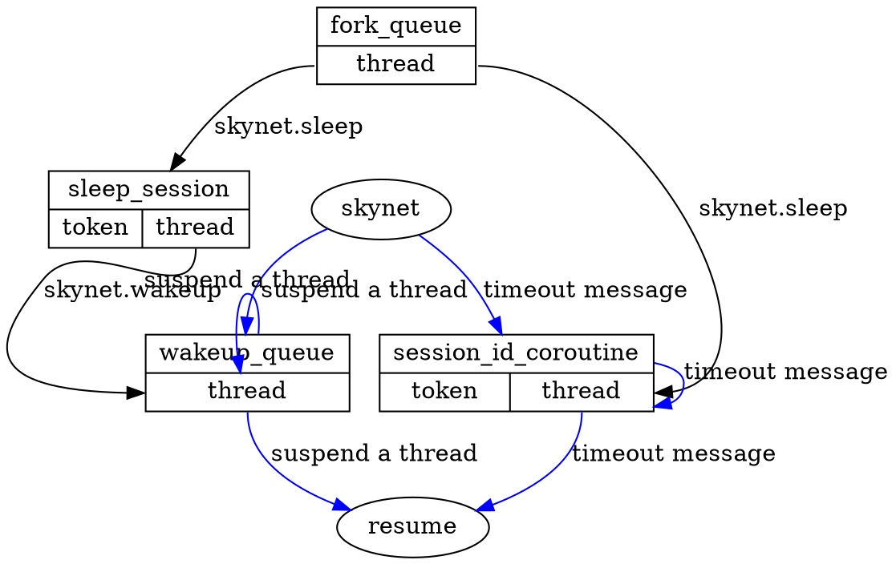

在系列文章中，我们已经知道，每个服务，用一个 snlua 加再 Lua 虚拟机来承载。用消息触发其逻辑（请求消息、定时器消息），但如果我还要做其他事情呢？又该怎么办？

<!--more-->


# 服务

服务分为三个阶段：

1. 加载，由 snlua 调用 `skynet/lualib/loader.lua` 来进行加载，按照 Lua 的逻辑进行执行。
2. 初始化。体现在 skynet.start 设置的函数被执行。而这，并不是紧跟 加载阶段完成的，而是会让出线程占用，设置一个定时器来完成。这个阶段，如果我们用 skynet.init 注册了一些函数，这些函数会先于 start 函数而执行。
3. 工作。

# skynet.start

对于一个 Lua 服务，是由 loader 来加载，并进行执行我们的服务脚本。

在服务脚本中，只有调用了 skynet.start 后，服务才会正式开始工作。为什么会这样？这是因为 skynet.start 才会设置这个 snlua 的 Lua 层的的回调为 `skynet.dispatch_message`。

```lua
function skynet.start(start_func)
    c.callback(skynet.dispatch_message)
    init_thread = skynet.timeout(
                      0, function()
            skynet.init_service(start_func)
            init_thread = nil
        end)
end
```

我们看到，实际上，主线程在这个时候，它让出了执行，而是设置了一个 0 的定时器，再进行真正调用我们设置的 start_func。这就是为什么，我们如果在脚本内，直接调用一些 skynet 的 阻塞 API 会让服务启动不起来的原因，因为我们写在 skynet.start 外的代码，是在加载阶段执行的。

这样，在第一个消息到来，也就是 timeout 的消息到来后，就会进行先调用分发函数，然后再进行初始化。

# skynet.dispatch_message

```lua
function skynet.dispatch_message(...)
	local succ, err = pcall(raw_dispatch_message,...)
	while true do
		if fork_queue.h > fork_queue.t then
			-- queue is empty
			fork_queue.h = 1
			fork_queue.t = 0
			break
		end
		-- pop queue
		local h = fork_queue.h
		local co = fork_queue[h]
		fork_queue[h] = nil
		fork_queue.h = h + 1

		local fork_succ, fork_err = pcall(suspend,co,coroutine_resume(co))
		if not fork_succ then
			if succ then
				succ = false
				err = tostring(fork_err)
			else
				err = tostring(err) .. "\n" .. tostring(fork_err)
			end
		end
	end
	assert(succ, tostring(err))
end

```

这个函数有很多值得说到的地方，首先，对于 `raw_dispatch_message` 是用来处理我们收到的消息的，在处理的过程中：

		1. 对于其他服务请求，会新建一个协程进行处理
		2. 对于响应，会在发送请求的协程上进行处理。

处理完毕后，则会将那个协程给挂起。

然后，会在一个while 循环中，会将 fork 出来的协程全部调用一遍。

为什么会在有消息的时候来出发对于 fork 的执行？因为 skynet 的服务是被动式的，无论定时器还是请求或是响应，都需要这些消息进行驱动，我们 fork 协程，也是在这些消息的处理逻辑中设置的，因此用消息来驱动，并无不可。

对于 fork 出来的协程，执行完毕即会调用  `suspend`，来将其挂起。

# 协程的状态和返回值

https://blog.codingnow.com/2015/12/skynet_coroutine.html

要往下，就不能不说协程的几个返回状态，skynet 对标准的 coroutine 库进行了封装，放到了 `skynet.coroutine` 中， API 完全一致。标准的协程状态有：

- running 执行中
- suspended 挂起
- normal 活跃，但是并未执行（在协程内 resume 了其他协程）
- dead 执行完毕，或出错

skynet 添加了一个状态：

- blocked 协程被底层框架挂起，但不可以由引用层 resume。

  >这个状态类似于 "normal" ，是 skynet 框架下的一个特例。因为 skynet 框架下两个独立的请求消息处理流程可视为并行的处理线程。线程之间数据是共享的，也意味着一条线程创建的 coroutine 对象对另一线程可见，也可以调用 resume 。而 "blocked" 状态可以阻止错误的 resume 调用。


skynet，要求所有的协程在 yield 都时候都要显式给出返回值：

- BREAK skynet.wakeup 唤醒
- SUSPEND 所有主动让出的协程都返回这个状态
- QUIT 执行完毕了，这个只在 skynet.exit 的时候看到有使用，表示服务退出。
- USER。使用 skynet.coroutine 的时候才会用到

# skynet.fork

在这里，我不再称呼 fork 出来的叫做协程了，我把它将做 Lua 的线程，LUA_TTHREAD。

对于我们 fork 出来的线程，如果我们在里面什么也不做，那么执行完毕，即返回。这体现不出了强大之处。

我们还可以让出 fork 出来的线程，或是用在一个死循环类，进行睡眠等待后继续执行；或者是直接等待，直到被唤醒。

## skynet.sleep 定时唤醒

此函数，实际上是注册了一个定时器，然后定时器 ID 与当前的线程相关联，并为此睡眠的会话设置一他 token （默认就是 thread 结构），然后挂起（SUSPEND）。这样，当定时器发来消息（ RESPONSE） 时，即调度此线程执行；同样，我们也可以使用  skynet.wakeup 来将此线程唤醒。

## skynet.yield

就是 skynet.sleep(0)。

## skynet.wait 手动唤醒

当前线程挂起，直到被 skynet.wakeup 唤醒。唤醒的线程会进入一个队列，wakeup_queue中，在这个队列中的线程，会在我们 suspend 一个线程的时候，进行执行。

# 概览图



# DEMO

我已经放在[这里](https://github.com/Gowa2017/skynetdemo.git) 了