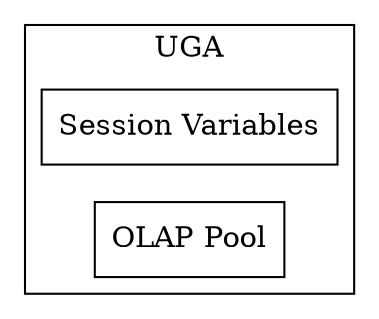

ORACLE数据库服务器由物理存储的数据库及一个数据库实例组成(包括分配的内存区域、运行的进程等)。多数时候我们管理数据库并不再在意它的物理架构，而只在意它的逻辑架构。但是，对物理架构的了解会让你更容易进行管理好数据库。
<!--more-->

一个 **RDBMS** 的特点是如 *table, view, indexes* 这些逻辑的数据结构与物理存储结构相分离。因为物理和逻辑结构的分离，我们可以不影响逻辑数据结构的访问就能管理物理存储。例如，重命名一个数据库文件而不更改存储在其内的表名。

# 数据库与实例
 **数据库**：指的是一系列存储在操作系统文件系统内的，用来存储数据的，按一定格式进行组织的文件。这些文件，当然，可以独立于一个数据库的实例而存在。  
 **数据库实例**：一个实例就是一系列用来管理数据库文件的内存结构。这个实例由一个共享的内存区域，我们称其为 **系统全局区域（SGA）**，和一系列的后台进程组成。一个实例可以独立于数据库文件而存在。
 下面是一个数据库和实例的图。对于每个连接到此实例的用户连接，应用通过一个 **客户端进程** 来运行。每个客户端进程都与其自己的服务端进行相关联。服务器进程有其自己的私有的会话内存，通常会被叫做 **程序全局区域（PGA）**。


一个数据库可以从物理和逻辑两个角度来进行看待。物理数据是在操作系统层面可以看到的数据。逻辑数据，比如说 表，只有对数据库才会有意义。一个 SQL 语句可以列出一个 Oracle 数据库中的表，而一个操作系统的命令则不行。

# 数据存储结构

关系数据库一个最重要的任务就是数据存储。

## 物理存储结构

物理的数据库结构就是存储数据的文件。当我们执行 `CREATE DATABASE` SQL 语句的时候，就会创建如下文件。

### Data files and temp files

每个库有一个或多个物理 **数据文件(data file)**，包括了数据库中的所有数据。它是操作系统上的一个物理文件，由 Oracle 数据库进行创建，包含了类似表和索引这样的数据。**临时文件**属于一个临时的表空间。他们由Oracle 按其自己的格式进行写入，而不能被其他程序进行读取。
可以通过 `v$datafile dba_data_files` 进行查看

### Control files
每一个 Oracle 数据库都有控制文件（control file）。其会跟踪数据库的物理组件。
可以通过`v$controlfile`进行查看。
### Online redo log files
每一个 Oracle 数据库都有在线重做日志（online redo log），包含两个或多个在线重做日志文件（online redo log files）的集合。在线重做日志（redo log）由重做条目（或者称作重做记录（redo records）） 构 成 ， 其 中记录了所有数据的改变。 在数据恢复操作中，在线重做日志是最重要的。
相关视图：`v$log v$logfile`
### 存档重做日志文件(archived Redo Log)
对比Online，这是将一个或多个充满了的Online Log进行离线存储，数据库运行在ARCHIVELOG  mode下由archiving进程处理

而一个 **数据库实例** 指的是一系列管理这些数据文件的数据结构。

## 逻辑存储结构
数据库的逻辑存储结构从大到小依次可为：表空间->段->区->数据块。  
每个数据库都会分配一个表空间。    
表空间至少包含一个数据文件(data file)。表空间是段逻辑上的容器。  
段则是区的集合，用来分配给用户的对象、撤销数据(undo data)、临时数据。  
数据库在表空间中使用数据段(data segment)来保存表中数据。一个段包含由数据块(data blocks)组成的扩展区(extents)。  

- Data blocks: 最好的粒度级别，Oracle 数据库的数据就是存在在这 Data blocks里面的。一个 Data block 对应了磁盘上的特定数量的字节。
- Extents：表示特定数量连续的 Data Blocks，在一次内存分配中就能获得，主要用来存储特定类型的信息。
- Segments：为一个用户对象（如表或索引）、**撤销数据 **或临时数据分配的一系列的 Extents。
- Tablespaces：Segment 的逻辑容器。每个表空间都最好包含一个数据文件。

# 数据库实例结构

一个 Oracle 数据库（这里指的是广义上的数据库文件及实例） 使用内存结构和进程来管理以及访问这些这个数据库。所以我内存结构都存在于运行 RDBMS 计算机的主存中。

当一个应用连接到 Oracle 数据库的时候，他们被连接到一个数据库实例上。这个实例通过 SGA　外分配其他的内存区域，在后台进程外启动新的进程来提供服务，

## Oracle 数据库进程

Oracle 拥有以下类型的进程：

- **Client 进程**：这个进程主要用来运行一个应用程序或者是Oracle 工具的代码。大多数情况下这个和数据库都不在一个计算机上。
- **Background 进程**：这些进程合并了本来可以由为每个客户端进程运行的多个Oracle数据库程序处理的功能。后台进程会异步的进行 I/O 和监控其他的 Oracle 数据库进程来提供更好的并行度，以提供更好的性能和可靠性。
- **Server 进程**：这些进程与客户端进程进行通信，并与 Oracle 数据库进行交互来填充满请求区。

### 后台进程

后台进程会进行一些操作数据库需要的维护任务以及最大化多用户的性能。

每个后台进程都有一个独立的任务，但是会与其他进程一切工作。如， **LGWR** 进程会从 **redo log buffer** 写出数据到 **online redo log**。当一个充满了的日志文件准备好被归档时，**LGWR** 会向另外一个进程发出信号，让它来归档此文件。

当数据库实例启动的时候会自动的建立后台进程。一个实例可能会有很多的后台进程，但并不是在每个实例中都会全部存在。下面的查询会列出数据库上运行的后台进程：

```sql
SELECT PNAME
FROM V$PROCESS
WHERE PNAME IS NOT NULL ORDER BY PNAME;

```

### Process Monitor Process (PMON)

PMON 会监控其他后台进程并在 Server 或者  dispatcher 异常中止的时候进行恢复。PMON 负责清理数据库的缓存区和释放 Client 进程使用的资源。例如，PMON 会重置活跃的 **transaction table** 的状态，释放不再需要的 **locks**及从活跃进程列表中移除进程的ID。

PMON 也会将实例与 dispatcher 进程的消息注册到 **Oracle Net listener** 中去。当一个实例启动时， PMON 会尝试一下 listener 是否运行。如果运行就把相关的参数传递过去，如果没有运行，那么就会阶段性的进行重试。

### System Monitor Process (SMON)

负责很多系统级的清理工作。包括：

- 实例启动时，如果有必要，进行一下实例的恢复。在 Oracle RAC 中，一个实例的 SMON 进程可以为一个失败的实例进行实例恢复。
- 恢复在实例恢复旗舰因为文件阅读或者表空间错误跳过的事务。SMON 会在表空间或文件重新上线的时候恢复这些事务。
- 清理未使用的临时段。例如，Oracle 数据库会在建立索引的时候分配扩展。当操作失败了，SMON 就会清理这些临时的空间。
- 合并 **字典-管理** 的表空间的连续扩展。

SMON 会间段性的检查是否需要干这些工作。当然，其他进程也可以在发生错误的时候调用一下 SMON 进程。

### Database Writer Process (DBWn)

将缓存区的内容（修改过的）写入到数据文件中。

多数情况下一个 进程（DWB0）就够了，但是我们可以配置更多的的写进程——DBW[1-9a-j]——这样如果在我们的数据库修改文件很严重的情况下就可以提供写的性能。不过配置的附家进程在单核处理器上是不实用的。

DBWn 进程会在以下条件下将脏的缓冲区写入到磁盘：

- 当一个 Server 进程在扫描了一定阈值的缓冲区后还没有找到干净的缓冲区时就会像 DBWn 发出信息，让他写出去。DBWn 会执行其他过程时，可能的话，会异步的写出脏的缓冲区。
- DBWn 会定时的写出缓冲区来前移 **checkpoint**，**checkpoint** 是 **redo thread**  的位置，实例的恢复将会从此处开始。checkpoint 的日志位置是通过缓冲区缓存中最老的脏缓冲区来决定的。

在多数情况下，DBWn 所写出的块在磁盘上都是分散的。因此，这个写出的速度将会比 LGWR 写到连续的区域更慢。可能的话，DBWn 会尝试进行多块写入（提供效率）。多块写入的数量，由操作系统来决定。

### Log Writer Process (LGWR)

管理  **redo log buffer**。LGWR 会将这个缓冲区内连续的一段写到 redo log 去。把这个和修改数据库缓冲区，分散的写出脏缓冲区到磁盘，快速连续写出到 redo log，这样提供了数据库的性能。


在下面的循环中，LWGR 会自其上次写出时以来复制到缓冲区的所有项：

- 用户 commit 事务
- online redo log 进行了 switch
- LGWR 距上次写出已经过去了3秒
- redo log 缓冲区 1/3 满了，或者有 1MB 的缓存数据 。
- DBWn 必须写出数据到磁盘
  - 在 DBWn 能写出脏缓冲区前，与此缓冲区变化相关的 redo 记录必须写到磁盘。（**wirte-ahead protocol**）。如果 DBWn 发现有的 redo 记录还没有写入，其就会向 LGWR　发出信号，让其进行写出，并等待其返回，然后再继续进行写出数据 。

**LGWR 与 commits**。Oracle 数据库使用一个 **fast commit** 算法来提高性能。当用户提交一个 `COMMIT` 语句，这个事务会被分配一个 **system change number(SCN)**。LGWR 会在 redo log buffer 里面放入一个提交记录，并立即将此记录，SCN，事务的 redo 项一起写到磁盘。

redo log buffer 是环形的。LGWR 从 redo log buffer 缓冲区中写出 redo 项时，Server 进程就可以复制新的项到已写出的项上面去了。LGWR 通常写出足够快来保证缓冲区总是可用的。

### Checkpoint Process (CKPT)

**CKPT** 进程会用 **检查点** 信息来更新控制文件和数据文件的头，通知DBWn 来进行写出。检查点信息包括了：检查点位置，SCN，在线重做日志中的开始恢复的位置等。它不会向数据文件写出数据 ，或向重做日志文件写出日志。


### Manageability Monitor Processes (MMON and MMNL)

### Recoverer Process (RECO)

## 实例内存结构

Oracle 数据库因为不同的目的进行建立和使用内存：如程序代码内存，用户间数据共享内存，每个已连接用户的私有区域。以下几种内存区域会与一个实例相关：

- System Global Area(SGA)：一组包含数据的共享内存结构，控制一个数据库实例的信息。SGA  的组件包括 **cached data blocks(缓存数据库）** 和 **shared SQL areas（共享SQL区域）**。
- Program Global Area(PGA)：一个 Server 或 后台进程的内存区域。PGA 只有此进程可访问。每个 Server/后台 进程都有自己的 PGA。
- User Global Area (UGA)：用用户 Session 相关。
- Software code areas：存储运行中的或者将要运行的代码。


### Oracle Database Memory Management

### Overview of the User Global Area



### Overview of the Program Global Area

### Overview of the System Global Area

SGA 是一个可读/写的内存区域，与 Oracle 后台进程一起，组成了数据库实例。

每个数据库实例都有其自己的 SGA。启动时会自动分配，关闭时会自动销毁。我们可以用 SQL*Plus 来看一下：

```
SQL> startup
ORACLE instance started.

Total System Global Area 4865392640 bytes
Fixed Size		    3720696 bytes
Variable Size		 1073744392 bytes
Database Buffers	 3774873600 bytes
Redo Buffers		   13053952 bytes
Database mounted.
Database opened.
```

他有几个很重要的组件：

- Database Buffer Cache
- Redo Log Buffer
- Shared Pool
- Large Pool
- Java Pool
- Streams Pool
- Fixed SGA

#### Database Buffer Cache

数据库缓冲区嘛，就是一个内存区域，用来存储从数据文件读取的数据块。用缓冲区主要是为了达到以下目标：

- 优化物理 I/O
  - 数据库会更新存在在此缓冲区内的数据块，将变更所产生的元数据 存储在到 redo log buffer 里面去。在 `COMMIT` 后，数据库会立刻将重做缓冲区写到磁盘，但是并不会立即写出数据缓冲区的变更到磁盘。而是通过 **database writter(DBWn)**来在后台进行 **懒写出**。
- 经常访问的数据留在缓冲区，不常用的就写到文件去。

#### Redo Log Buffer

环形，用来记录描述对数据库进行变更的重做项。**重做项**包含了用来进行重建，重做，DML/DDL，所必要的信息。数据库对数据库文件应用重做项来重建丢失的改变。

Oracle 数据库的进程会从用户空复制重做项到重做日志缓冲区。重做项在此缓冲区内是连续的空间。LGWR 将此缓冲区内的内容写到活跃的在线重做日志文件中。


